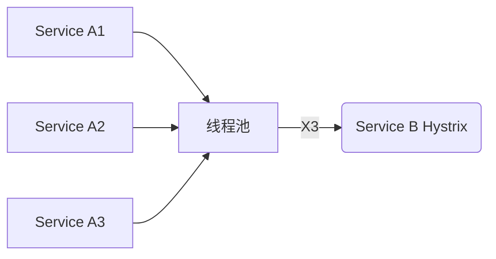
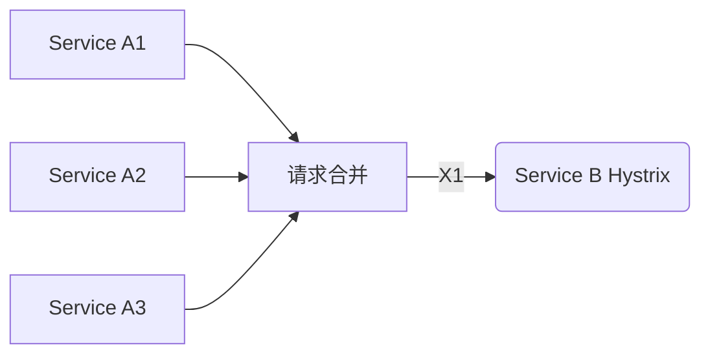
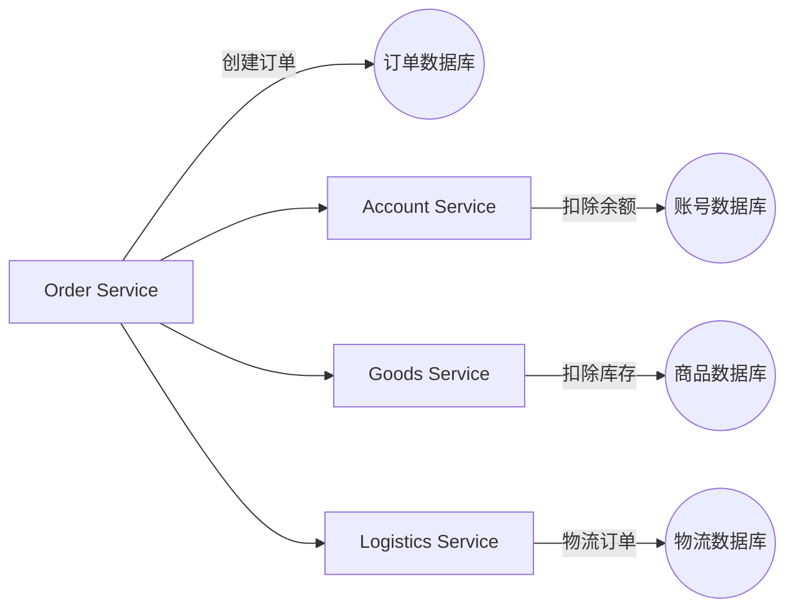
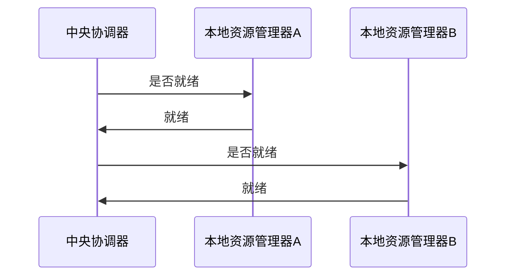
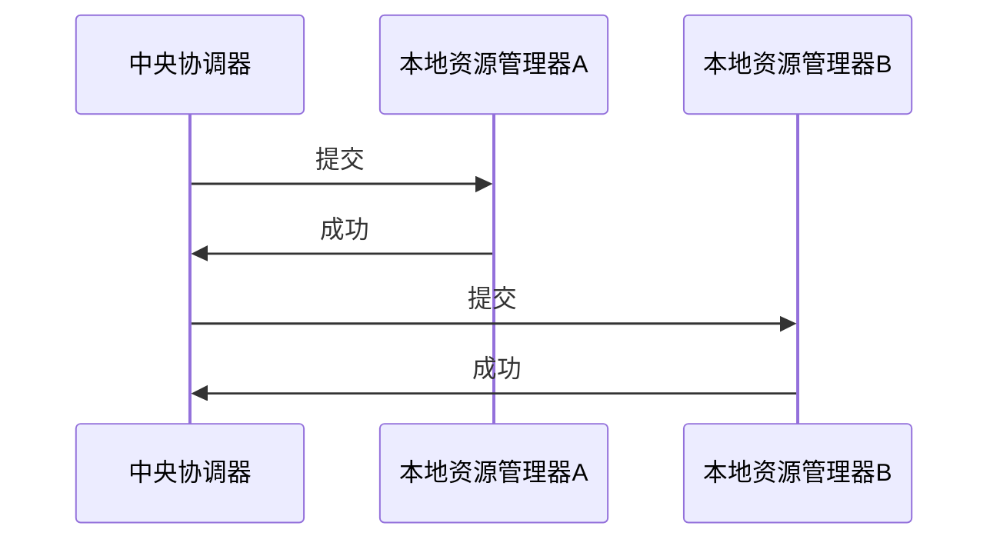

# E-commerce-cloud 

[CSDN博客地址文章](https://blog.csdn.net/Vincent_Vic_/article/details/123221364)

@[TOC](Spring Cloud Alibaba)
# 一、简介
## 1.1 官方描述
>    [Spring Cloud Alibaba](https://spring.io/projects/spring-cloud-alibaba) provides a one-stop solution for distributed application development. It contains all the components required to develop distributed applications, making it easy for you to develop your applications using Spring Cloud.
>    With [Spring Cloud Alibaba](https://spring.io/projects/spring-cloud-alibaba), you only need to add some annotations and a small amount of configurations to connect Spring Cloud applications to the distributed solutions of Alibaba, and build a distributed application system with Alibaba middleware.
## 1.2 架构图

> 图片来源：[processon](https://www.processon.com/view/5fe94f3ce0b34d2934ee23d9?fromnew=1)

## 1.3 模块


# 二、项目搭建
## 2.1 maven
创建maven项目，配置pom

```xml
<?xml version="1.0" encoding="UTF-8"?>
<project xmlns="http://maven.apache.org/POM/4.0.0"
         xmlns:xsi="http://www.w3.org/2001/XMLSchema-instance"
         xsi:schemaLocation="http://maven.apache.org/POM/4.0.0 http://maven.apache.org/xsd/maven-4.0.0.xsd">
    <modelVersion>4.0.0</modelVersion>
    <parent>
        <groupId>org.springframework.boot</groupId>
        <artifactId>spring-boot-starter-parent</artifactId>
        <version>2.4.2</version>
    </parent>
    <groupId>cn.flowboot.e.commerce</groupId>
    <artifactId>E-commerce-cloud</artifactId>
    <version>1.0-SNAPSHOT</version>
    <packaging>pom</packaging>

    <properties>
        <!-- 工程项目版本 -->
        <E-commerce-cloud>1.0-SNAPSHOT</E-commerce-cloud>
        <!-- Spring Cloud 依赖 -->
        <spring.cloud.version>Hoxton.SR12</spring.cloud.version>
        <!-- spring cloud alibaba 依赖 -->
        <spring.cloud.alibaba.version>2.2.7.RELEASE</spring.cloud.alibaba.version>
        <!--  依赖 -->
        <lombok.version>1.16.18</lombok.version>
        <!-- commons-lang3 依赖 -->
        <commons-lang3.version>3.11</commons-lang3.version>
        <!-- commons-collections4 依赖 -->
        <commons-collections4.version>4.4</commons-collections4.version>
        <!-- hutool-all 依赖 -->
        <hutool-all.version>5.6.0</hutool-all.version>
        <!-- jwt  依赖 -->
        <jwt.version>0.11.2</jwt.version>
        <!-- fastjson 依赖 -->
        <fastjson.version>1.2.78</fastjson.version>
        <!-- mybatis plus 依赖 -->
        <mybatis-plus.version>3.4.2</mybatis-plus.version>
        <!-- druid 依赖 -->
        <druid.version>1.2.6</druid.version>
        <!-- bitwalker 依赖 -->
        <bitwalker.version>1.21</bitwalker.version>
        <!--  依赖 -->
        <swagger.version>3.0.0</swagger.version>
        <!-- kaptcha  依赖 -->
        <kaptcha.version>2.3.2</kaptcha.version>
        <!-- mybatis-spring  依赖 -->
        <mybatis-spring-boot.version>2.1.4</mybatis-spring-boot.version>
        <!-- pagehelper  依赖 -->
        <pagehelper.boot.version>1.3.1</pagehelper.boot.version>
        <!-- oshi 依赖 -->
        <oshi.version>5.8.0</oshi.version>
        <!-- jna 依赖 -->
        <jna.version>5.8.0</jna.version>
        <!--  io 依赖 -->
        <commons.io.version>2.11.0</commons.io.version>
        <!-- fileupload 依赖 -->
        <commons.fileupload.version>1.4</commons.fileupload.version>
        <!-- collections 依赖 -->
        <commons.collections.version>3.2.2</commons.collections.version>
        <!-- poi 依赖 -->
        <poi.version>4.1.2</poi.version>
        <!--  velocity 依赖 -->
        <velocity.version>1.7</velocity.version>

    </properties>


    <!-- 项目依赖管理 父项目只是声明依赖，子项目需要写明需要的依赖(可以省略版本信息) -->
    <dependencyManagement>
        <dependencies>
            <!-- spring cloud 依赖 -->
            <dependency>
                <groupId>org.springframework.cloud</groupId>
                <artifactId>spring-cloud-dependencies</artifactId>
                <version>${spring-cloud.version}</version>
                <type>pom</type>
                <scope>import</scope>
            </dependency>

            <!-- spring cloud alibaba 依赖 -->
            <dependency>
                <groupId>com.alibaba.cloud</groupId>
                <artifactId>spring-cloud-alibaba-dependencies</artifactId>
                <version>${spring-cloud-alibaba.version}</version>
                <type>pom</type>
                <scope>import</scope>
            </dependency>

            <!-- lombok 工具通过在代码编译时期动态的将注解替换为具体的代码,   IDEA 需要添加 lombok 插件 -->
            <dependency>
                <groupId>org.projectlombok</groupId>
                <artifactId>lombok</artifactId>
                <version>${lombok.version}</version>
            </dependency>
            <dependency>
                <groupId>org.apache.commons</groupId>
                <artifactId>commons-lang3</artifactId>
                <version>${commons-lang3.version}</version>
            </dependency>
            <dependency>
                <groupId>org.apache.commons</groupId>
                <artifactId>commons-collections4</artifactId>
                <version>${commons-collections4.version}</version>
            </dependency>
            <!-- collections工具类 -->
            <dependency>
                <groupId>commons-collections</groupId>
                <artifactId>commons-collections</artifactId>
                <version>${commons.collections.version}</version>
            </dependency>
            <dependency>
                <groupId>cn.hutool</groupId>
                <artifactId>hutool-all</artifactId>
                <version>${hutool-all.version}</version>
            </dependency>
            <!-- Token生成与解析-->
            <dependency>
                <groupId>io.jsonwebtoken</groupId>
                <artifactId>jjwt-api</artifactId>
                <version>${jwt.version}</version>
            </dependency>
            <dependency>
                <groupId>io.jsonwebtoken</groupId>
                <artifactId>jjwt-impl</artifactId>
                <version>${jwt.version}</version>
            </dependency>
            <dependency>
                <groupId>io.jsonwebtoken</groupId>
                <artifactId>jjwt-jackson</artifactId>
                <version>${jwt.version}</version>
            </dependency>
            <dependency>
                <groupId>com.alibaba</groupId>
                <artifactId>fastjson</artifactId>
                <version>${fastjson.version}</version>
            </dependency>
            <!-- 服务/工具组件 -->
            <!-- https://mvnrepository.com/artifact/com.baomidou/mybatis-plus-boot-starter -->
            <dependency>
                <groupId>com.baomidou</groupId>
                <artifactId>mybatis-plus-boot-starter</artifactId>
                <version>${mybatis-plus.version}</version>
            </dependency>

            <dependency>
                <groupId>com.alibaba</groupId>
                <artifactId>druid-spring-boot-starter</artifactId>
                <version>${druid.version}</version>
            </dependency>
            <!-- 解析客户端操作系统、浏览器等 -->
            <dependency>
                <groupId>eu.bitwalker</groupId>
                <artifactId>UserAgentUtils</artifactId>
                <version>${bitwalker.version}</version>
            </dependency>

            <!-- pagehelper 分页插件 -->
            <dependency>
                <groupId>com.github.pagehelper</groupId>
                <artifactId>pagehelper-spring-boot-starter</artifactId>
                <version>${pagehelper.boot.version}</version>
            </dependency>

            <!-- 获取系统信息 -->
            <dependency>
                <groupId>com.github.oshi</groupId>
                <artifactId>oshi-core</artifactId>
                <version>${oshi.version}</version>
            </dependency>

            <dependency>
                <groupId>net.java.dev.jna</groupId>
                <artifactId>jna</artifactId>
                <version>${jna.version}</version>
            </dependency>

            <dependency>
                <groupId>net.java.dev.jna</groupId>
                <artifactId>jna-platform</artifactId>
                <version>${jna.version}</version>
            </dependency>

            <!-- Swagger3依赖 -->
            <dependency>
                <groupId>io.springfox</groupId>
                <artifactId>springfox-boot-starter</artifactId>
                <version>${swagger.version}</version>
                <exclusions>
                    <exclusion>
                        <groupId>io.swagger</groupId>
                        <artifactId>swagger-models</artifactId>
                    </exclusion>
                </exclusions>
            </dependency>

            <!-- 文件上传工具类 -->
            <dependency>
                <groupId>commons-fileupload</groupId>
                <artifactId>commons-fileupload</artifactId>
                <version>${commons.fileupload.version}</version>
            </dependency>

            <!-- excel工具 -->
            <dependency>
                <groupId>org.apache.poi</groupId>
                <artifactId>poi-ooxml</artifactId>
                <version>${poi.version}</version>
            </dependency>

            <!-- 验证码 -->
            <dependency>
                <groupId>com.github.penggle</groupId>
                <artifactId>kaptcha</artifactId>
                <version>${kaptcha.version}</version>
            </dependency>

        </dependencies>
    </dependencyManagement>

    <!-- 配置远程仓库 -->
    <repositories>
        <repository>
            <id>spring-milestones</id>
            <name>Spring Milestones</name>
            <url>https://repo.spring.io/milestone</url>
            <snapshots>
                <enabled>false</enabled>
            </snapshots>
        </repository>
    </repositories>

</project>

```
## 2.2 创建基础模块及基础功能
### 2.2.1 创建子模块
创建子模块e-commerce-common和e-commerce-mvc-config

**e-commerce-common/pom.xml**
```xml
<?xml version="1.0" encoding="UTF-8"?>
<project xmlns="http://maven.apache.org/POM/4.0.0"
         xmlns:xsi="http://www.w3.org/2001/XMLSchema-instance"
         xsi:schemaLocation="http://maven.apache.org/POM/4.0.0 http://maven.apache.org/xsd/maven-4.0.0.xsd">
    <parent>
        <artifactId>E-commerce-cloud</artifactId>
        <groupId>cn.flowboot.e.commerce</groupId>
        <version>1.0-SNAPSHOT</version>
    </parent>
    <modelVersion>4.0.0</modelVersion>

    <artifactId>e-commerce-common</artifactId>
    <packaging>jar</packaging>
    <properties>
        <maven.compiler.source>8</maven.compiler.source>
        <maven.compiler.target>8</maven.compiler.target>
    </properties>

    <dependencies>
        <dependency>
            <groupId>org.projectlombok</groupId>
            <artifactId>lombok</artifactId>
        </dependency>
    </dependencies>

</project>

```
**e-commerce-mvc-config/pom.xml**
```xml
<?xml version="1.0" encoding="UTF-8"?>
<project xmlns="http://maven.apache.org/POM/4.0.0"
         xmlns:xsi="http://www.w3.org/2001/XMLSchema-instance"
         xsi:schemaLocation="http://maven.apache.org/POM/4.0.0 http://maven.apache.org/xsd/maven-4.0.0.xsd">
    <parent>
        <artifactId>E-commerce-cloud</artifactId>
        <groupId>cn.flowboot.e.commerce</groupId>
        <version>1.0-SNAPSHOT</version>
    </parent>
    <modelVersion>4.0.0</modelVersion>

    <artifactId>e-commerce-mvc-config</artifactId>

    <properties>
        <maven.compiler.source>8</maven.compiler.source>
        <maven.compiler.target>8</maven.compiler.target>
    </properties>

    <dependencies>
        <dependency>
            <groupId>cn.flowboot.e.commerce</groupId>
            <artifactId>e-commerce-common</artifactId>
        </dependency>
        <dependency>
            <groupId>org.springframework.boot</groupId>
            <artifactId>spring-boot-starter-web</artifactId>
        </dependency>
    </dependencies>
</project>

```
在主pom.xml添加模块管理

```xml
 <!-- 项目依赖管理 父项目只是声明依赖，子项目需要写明需要的依赖(可以省略版本信息) -->
 <dependencyManagement>
	 <dependencies>
	     <!-- 本项目模块 依赖 -->
	     <dependency>
	         <groupId>cn.flowboot.e.commerce</groupId>
	         <artifactId>e-commerce-common</artifactId>
	         <version>${E-commerce-cloud}</version>
	     </dependency>
	     <dependency>
	         <groupId>cn.flowboot.e.commerce</groupId>
	         <artifactId>e-commerce-mvc-config</artifactId>
	         <version>${E-commerce-cloud}</version>
	     </dependency>

		...
		
     </dependencies>
</dependencyManagement>
```
### 2.2.2 基础项目代码准备
e-commerce-common/.../CommonResponse
```java
package cn.flowboot.e.commerce.vo;

import lombok.AllArgsConstructor;
import lombok.Data;
import lombok.NoArgsConstructor;

import java.io.Serializable;

/**
 * <h1>通用响应对象定义</h1>
 *
 *  {
 *      "code":0,
 *      "message":"",
 *      "data":{}
 *  }
 * @version 1.0
 * @author: Vincent Vic
 * @since: 2022/03/02
 */
@Data
@AllArgsConstructor
@NoArgsConstructor
public class CommonResponse<T> implements Serializable {

    private final static int SUCCESS_CODE = 0;
    private final static String SUCCESS_MSG = "success";
    private final static int FAIL_CODE = -1;
    private final static String FAIL_MSG = "fail";
    /**
     * 错误码
     */
    private Integer code;
    /**
     * 错误消息
     */
    private String message;
    /**
     * 泛型响应数据
     */
    private T data;


    /**
     * <h2> build - 构建通用消息 - 全参数<h2>
     * version: 1.0 - 2022/3/2
     * @param code 状态码
     * @param message 消息
     * @param data 泛型数据
     * @return {@link CommonResponse }
     */
    public static <T> CommonResponse build(Integer code, String message, T data){
        return new CommonResponse<T>(code,message,data);
    }

    /**
     * <h2> build - 构建通用消息 - 状态消息<h2>
     * version: 1.0 - 2022/3/2
     * @param code 状态码
     * @param message 消息
     * @return {@link CommonResponse }
     */
    public static <T> CommonResponse build(Integer code, String message){
        return new CommonResponse<T>(code,message,null);
    }

    /**
     * <h2> success - 默认成功通用消息<h2>
     * version: 1.0 - 2022/3/2
     * @return {@link CommonResponse }
     */
    public static  CommonResponse success(){
        return new CommonResponse(FAIL_CODE,FAIL_MSG,null);
    }

    /**
     * <h2> success - 成功通用消息 - 消息<h2>
     * version: 1.0 - 2022/3/2
     * @param message 消息
     * @return {@link CommonResponse }
     */
    public static  CommonResponse success( String message){
        return new CommonResponse(FAIL_CODE,message,null);
    }

    /**
     * <h2> success - 成功通用消息 - 消息数据<h2>
     * version: 1.0 - 2022/3/2
     * @param message 消息
     * @param data 泛型数据
     * @return {@link CommonResponse }
     */
    public static <T> CommonResponse success(String message,T data){
        return new CommonResponse<T>(FAIL_CODE,message,data);
    }

    /**
     * <h2> fail - 默认失败通用消息<h2>
     * version: 1.0 - 2022/3/2
     * @return {@link CommonResponse }
     */
    public static  CommonResponse fail(){
        return new CommonResponse(FAIL_CODE,FAIL_MSG,null);
    }

    /**
     * 通用消息
     * @param message 消息
     * @return {@link CommonResponse}
     */

    /**
     * <h2> fail - 失败通用消息 - 消息<h2>
     * version: 1.0 - 2022/3/2
     * @param message 消息
     * @return {@link CommonResponse }
     */
    public static  CommonResponse fail( String message){
        return new CommonResponse(FAIL_CODE,message,null);
    }

    /**
     * <h2> fail - 失败通用消息 - 消息数据 <h2>
     * version: 1.0 - 2022/3/2
     * @param message 消息
     * @param data  泛型数据
     * @return {@link CommonResponse }
     */
    public static <T> CommonResponse fail(String message,T data){
        return new CommonResponse<T>(FAIL_CODE,message,data);
    }

}

```
e-commerce-mvc-config/.../annotation/IgnoreResponseAdvice
```java
package cn.flowboot.e.commerce.annotation;

import java.lang.annotation.ElementType;
import java.lang.annotation.Retention;
import java.lang.annotation.RetentionPolicy;
import java.lang.annotation.Target;

/**
 * <h1>忽略返回通用响应</h1>
 *
 * @version 1.0
 * @author: Vincent Vic
 * @since: 2022/03/02
 */
@Target({ElementType.TYPE,ElementType.METHOD})
@Retention(RetentionPolicy.RUNTIME)
public @interface IgnoreResponseAdvice {
}

```
e-commerce-mvc-config/.../advice/CommonResponseDataAdvice 
```java
package cn.flowboot.e.commerce.advice;

import cn.flowboot.e.commerce.annotation.IgnoreResponseAdvice;
import cn.flowboot.e.commerce.vo.CommonResponse;
import org.springframework.core.MethodParameter;
import org.springframework.http.MediaType;
import org.springframework.http.server.ServerHttpRequest;
import org.springframework.http.server.ServerHttpResponse;
import org.springframework.web.bind.annotation.RestControllerAdvice;
import org.springframework.web.servlet.mvc.method.annotation.ResponseBodyAdvice;

import java.util.Objects;

/**
 * <h1>实现统一响应</h1>
 * @RestControllerAdvice value 限制生效的包
 * @version 1.0
 * @author: Vincent Vic
 * @since: 2022/03/02
 */
@RestControllerAdvice(value = "cn.flowboot.e.commerce")
public class CommonResponseDataAdvice implements ResponseBodyAdvice {

    /**
     * 判断是否需要被处理
     */
    @Override
    public boolean supports(MethodParameter methodParameter, Class aClass) {
        if (methodParameter.getDeclaringClass().isAnnotationPresent(IgnoreResponseAdvice.class)
                || Objects.requireNonNull(methodParameter.getMethod()).isAnnotationPresent(IgnoreResponseAdvice.class)){
            return false;
        }
        return true;
    }

    /**
     * 处理
     */
    @Override
    public Object beforeBodyWrite(Object o, MethodParameter methodParameter, MediaType mediaType,
                                  Class aClass, ServerHttpRequest serverHttpRequest, ServerHttpResponse serverHttpResponse) {

        CommonResponse response = CommonResponse.success();
        if (null == o){
            return CommonResponse.success();
        } else if (o instanceof  CommonResponse){
            return  o;
        } else if (o instanceof String) {
            response.setData(o);
            return JSONObject.toJSONString(response);
        } else {
            response.setData(o);
            return response;
        }
    }
}

```
e-commerce-mvc-config/.../advice/GlobalExceptionAdvice 
```java
package cn.flowboot.e.commerce.advice;

import cn.flowboot.e.commerce.vo.CommonResponse;
import lombok.extern.slf4j.Slf4j;
import org.springframework.web.bind.annotation.ExceptionHandler;
import org.springframework.web.bind.annotation.RestControllerAdvice;

import javax.servlet.http.HttpServletRequest;

/**
 * <h1></h1>
 *
 * @version 1.0
 * @author: Vincent Vic
 * @since: 2022/03/02
 */
@Slf4j
@RestControllerAdvice
public class GlobalExceptionAdvice {

    @ExceptionHandler(value = Exception.class)
    public CommonResponse<String> handlerCommerceException(HttpServletRequest req,Exception ex){
        log.error("commerce service has error  [{}]: {}",req.getRequestURI(),ex.getMessage(),ex);
        return CommonResponse.fail("business error",ex.getMessage());
    }
}

```

# 三、Nacos 服务注册与配置中心
## 3.1 简介
[官网](https://nacos.io/) | [文档](https://nacos.io/zh-cn/docs/quick-start.html) | [架构](https://nacos.io/zh-cn/docs/architecture.html)

官网解释：

**服务 (Service)**
> 服务是指一个或一组软件功能（例如特定信息的检索或一组操作的执行），其目的是不同的客户端可以为不同的目的重用（例如通过跨进程的网络调用）。Nacos 支持主流的服务生态，如 Kubernetes Service、gRPC|Dubbo RPC Service 或者 Spring Cloud RESTful Service。

 **服务注册中心 (Service Registry)**
> 服务注册中心，它是服务，其实例及元数据的数据库。服务实例在启动时注册到服务注册表，并在关闭时注销。服务和路由器的客户端查询服务注册表以查找服务的可用实例。服务注册中心可能会调用服务实例的健康检查 API 来验证它是否能够处理请求。

**服务元数据 (Service Metadata)**
> 服务元数据是指包括服务端点(endpoints)、服务标签、服务版本号、服务实例权重、路由规则、安全策略等描述服务的数据。

**服务提供方 (Service Provider)**
> 是指提供可复用和可调用服务的应用方。

**服务消费方 (Service Consumer)**
> 是指会发起对某个服务调用的应用方。

**配置 (Configuration)**
> 在系统开发过程中通常会将一些需要变更的参数、变量等从代码中分离出来独立管理，以独立的配置文件的形式存在。目的是让静态的系统工件或者交付物（如 WAR，JAR 包等）更好地和实际的物理运行环境进行适配。配置管理一般包含在系统部署的过程中，由系统管理员或者运维人员完成这个步骤。配置变更是调整系统运行时的行为的有效手段之一。

**配置管理 (Configuration Management)**
> 在数据中心中，系统中所有配置的编辑、存储、分发、变更管理、历史版本管理、变更审计等所有与配置相关的活动统称为配置管理。

**名字服务 (Naming Service)**
> 提供分布式系统中所有对象(Object)、实体(Entity)的“名字”到关联的元数据之间的映射管理服务，例如 ServiceName -> Endpoints Info, Distributed Lock Name -> Lock Owner/Status Info, DNS Domain Name -> IP List, 服务发现和 DNS 就是名字服务的2大场景。

**配置服务 (Configuration Service)**
> 在服务或者应用运行过程中，提供动态配置或者元数据以及配置管理的服务提供者。

- 如上解释来自官网[文档](https://nacos.io/zh-cn/docs/architecture.html)

## 3.2 安装使用
本部分直接访问官网： [nacos快速开始](https://nacos.io/zh-cn/docs/quick-start.html)
## 3.3 配置MySQL持久化
- 修改配置，指定MySQL地址、用户名、端口号

```yaml
#*************** Config Module Related Configurations ***************#
### If use MySQL as datasource:
spring.datasource.platform=mysql

### Count of DB:
db.num=1

### Connect URL of DB:
db.url.0=jdbc:mysql://127.0.0.1:3306/e-commerce-nacos?characterEncoding=utf8&connectTimeout=1000&socketTimeout=3000&autoReconnect=true&useUnicode=true&useSSL=false&serverTimezone=UTC
db.user.0=root
db.password.0=root
```
创建数据库e-commerce-nacos，并执行conf/nacos-mysql.sql文件
运行nacos
## 3.4 客户端编写
创建模块添加服务发现和服务配置maven

```xml
<!-- spring cloud alibaba nacos discovery 依赖 -->
<dependency>
    <groupId>com.alibaba.cloud</groupId>
    <artifactId>spring-cloud-starter-alibaba-nacos-discovery</artifactId>
</dependency>
<!-- nacos config -->
<dependency>
    <groupId>com.alibaba.cloud</groupId>
    <artifactId>spring-cloud-starter-alibaba-nacos-config</artifactId>
</dependency>
```
启动入口
```java
package cn.flowboot.e.commerce;

import org.springframework.boot.SpringApplication;
import org.springframework.boot.autoconfigure.SpringBootApplication;
import org.springframework.cloud.client.discovery.EnableDiscoveryClient;

/**
 * <h1>nacos 客户端 启动入口</h1>
 *
 * @version 1.0
 * @author: Vincent Vic
 * @since: 2022/03/02
 */
@EnableDiscoveryClient
@SpringBootApplication
public class NacosClientApplication {

    public static void main(String[] args) {
        SpringApplication.run(NacosClientApplication.class,args);
    }
}

```
### 3.4.1 服务发现
配置 bootstrap.yml
```yaml
server:
  port: 8000
  servlet:
    context-path: /nacos-client
spring:
  application:
    name: e-commerce-nacos-client
  cloud:
    nacos:
      #服务发现
      discovery:
        enabled: true
        server-addr: 127.0.0.1:8848
        namespace: e-commerce-nacos-server
```
> namespace: e-commerce-nacos-server 为手动指定id创建的命名空间

NacosClientServiceImpl  此处省略接口定义代码
```java
package cn.flowboot.e.commerce.service.impl;

import cn.flowboot.e.commerce.service.NacosClientService;
import lombok.RequiredArgsConstructor;
import lombok.extern.slf4j.Slf4j;
import org.springframework.cloud.client.ServiceInstance;
import org.springframework.cloud.client.discovery.DiscoveryClient;
import org.springframework.stereotype.Service;

import java.util.List;

/**
 * <h1>客户端实现类</h1>
 *
 * @version 1.0
 * @author: Vincent Vic
 * @since: 2022/03/02
 */
@Service
@Slf4j
@RequiredArgsConstructor
public class NacosClientServiceImpl implements NacosClientService {
    private final DiscoveryClient discoveryClient;

    /**
     * <h2> getNacosClientList - 获取服务发现中的客户端<h2>
     * version: 1.0 - 2022/3/2
     * @param
     * @return {@link List< ServiceInstance> }
     */
    @Override
    public List<ServiceInstance> getNacosClientInfo(String serviceId){
        log.info("request nacos client to get service instance info:[{}]",serviceId);
        return discoveryClient.getInstances(serviceId);
    }
}

```

```java
package cn.flowboot.e.commerce.controller;

import cn.flowboot.e.commerce.service.NacosClientService;
import lombok.RequiredArgsConstructor;
import lombok.extern.slf4j.Slf4j;
import org.springframework.cloud.client.ServiceInstance;
import org.springframework.web.bind.annotation.GetMapping;
import org.springframework.web.bind.annotation.PathVariable;
import org.springframework.web.bind.annotation.RequestMapping;
import org.springframework.web.bind.annotation.RestController;

import java.util.List;

/**
 * <h1></h1>
 *
 * @version 1.0
 * @author: Vincent Vic
 * @since: 2022/03/02
 */
@RequiredArgsConstructor
@Slf4j
@RestController
public class NacosClientController {

    private final NacosClientService nacosClientService;

    @GetMapping("/service/instance/{serviceId}")
    public List<ServiceInstance> logNacosClientInfo(@PathVariable("serviceId") String serviceId){
        log.info("request nacos client to get service instance info:[{}]",serviceId);
        return nacosClientService.getNacosClientInfo(serviceId);
    }

}

```
测试结果：

```json
{
  "code": 0,
  "message": "",
  "data": [
    {
      "serviceId": "e-commerce-nacos-client",
      "host": "172.21.64.1",
      "port": 8000,
      "secure": false,
      "metadata": {
        "nacos.instanceId": null,
        "nacos.weight": "1.0",
        "nacos.cluster": "DEFAULT",
        "nacos.ephemeral": "true",
        "nacos.healthy": "true",
        "preserved.register.source": "SPRING_CLOUD"
      },
      "uri": "http://172.21.64.1:8000",
      "instanceId": null,
      "scheme": null
    }
  ]
}
```

### 3.4.2 服务配置
NacosClientController  添加方法
```java
@Value(value = "${flowboot.version}")
private String version;

@GetMapping("version")
public String getVersion(){
    return version;
}
```
本地yml测试是没问题的

```yaml
flowboot:
  version: "1.0.0"
```

> {"code":0,"data":"1.0.0","message":"success"}

配置yaml

```yaml
server:
  port: 8000
  servlet:
    context-path: /nacos-client
spring:
  application:
    name: e-commerce-nacos-client
  cloud:
    nacos:
      #服务发现
      discovery:
        enabled: true
        server-addr: 127.0.0.1:8848
        namespace: e-commerce-nacos-server
      #服务配置
      ## nacos 文件名：${spring.application.name}- ${spring.profiles.active}.${spring.cloud.nacos.config.file-extension}
      ## ${prefix}-${spring.profile.active}.${file-extension}
      config:
        enabled: true
        # 配置中心地址
        server-addr: 127.0.0.1:8848
        # 配置文件格式
        file-extension: yaml
        # 服务命名空间
        namespace: e-commerce-nacos-server

  profiles:
    active: dev
```
配置完在nacos面板中添加配置，如下是对应yaml的配置文件命名规则，值与本地不同，本地注释，重新启动请求获取配置的值，如果已经是nacos设置的说明配置成功

### 3.4.3 动态配置
@Value 的场景下在，可在类上添加注解@RefreshScope即可实现动态刷新，如：
```java
@RefreshScope
public class NacosClientController {
	...
}
```
> 重启后就可以动态修改值
配置文件添加

```yaml
spring:
  cloud:
    nacos:
      config:
        ...
        #启动刷新
        refresh-enabled: true
```

### 3.4.4 配置共享 
配置(完整配置)
```yaml
server:
  port: 8000
  servlet:
    context-path: /nacos-client
spring:
  application:
    name: e-commerce-nacos-client
  cloud:
    nacos:
      #服务发现
      discovery:
        enabled: true
        server-addr: 127.0.0.1:8848
        namespace: e-commerce-nacos-server
      #服务配置
      ## nacos 文件名：${spring.application.name}- ${spring.profiles.active}.${spring.cloud.nacos.config.file-extension}
      config:
        enabled: true
        # 配置中心地址
        server-addr: 127.0.0.1:8848
        # 配置文件格式
        file-extension: yaml
        # 服务命名空间
        namespace: e-commerce-nacos-server
        #启动刷新
        refresh-enabled: true
        # 支持多个共享 Data Id 的配置，优先级小于extension-configs,自定义 Data Id 配置 属性是个集合，内部由 Config POJO 组成。Config 有 3 个属性，分别是 dataId, group 以及 refresh
        shared-configs[0]:
          data-id: common.yaml # 配置文件名-Data Id
          group: DEFAULT_GROUP   # 默认为DEFAULT_GROUP
          refresh: true   # 是否动态刷新，默认为false
        # 扩展配置
        extension-configs[0]:
          data-id: file.yaml
          group: DEFAULT_GROUP     # 默认为DEFAULT_GROUP
          refresh: true            # 是否动态刷新，默认为false
  profiles:
    active: dev
```

> 重新运行，日志中出现common.yaml说明共享配置文件被读取，可以通过读取值测试
> Located property source: [BootstrapPropertySource {name='bootstrapProperties-e-commerce-nacos-client-dev.yaml,DEFAULT_GROUP'}, BootstrapPropertySource {name='bootstrapProperties-e-commerce-nacos-client.yaml,DEFAULT_GROUP'}, BootstrapPropertySource {name='bootstrapProperties-e-commerce-nacos-client,DEFAULT_GROUP'}, BootstrapPropertySource {name='bootstrapProperties-common.yaml,DEFAULT_GROUP'}]

> 其中配置优先级 : shared-configs < extension-configs < 自动

# 四、SpringBoot Admin 监控服务器
## 4.1 创建模块
创建子模块并添加maven
```xml
<!-- spring cloud alibaba nacos discovery 依赖 -->
<dependency>
    <groupId>com.alibaba.cloud</groupId>
    <artifactId>spring-cloud-starter-alibaba-nacos-discovery</artifactId>
</dependency>
<dependency>
    <groupId>de.codecentric</groupId>
    <artifactId>spring-boot-admin-starter-server</artifactId>
    <version>2.2.4</version>
</dependency>
<dependency>
    <groupId>cn.flowboot.e.commerce</groupId>
    <artifactId>e-commerce-mvc-config</artifactId>
</dependency>
```
## 4.2 启用Admin Server
启动入口程序，加上@EnableAdminServer注解即可
```java
package cn.flowboot.e.commerce;

import de.codecentric.boot.admin.server.config.EnableAdminServer;
import org.springframework.boot.SpringApplication;
import org.springframework.boot.autoconfigure.SpringBootApplication;

/**
 * <h1></h1>
 *
 * @version 1.0
 * @author: Vincent Vic
 * @since: 2022/03/02
 */
@EnableAdminServer
@SpringBootApplication
public class AdminApplication {

    public static void main(String[] args) {
        SpringApplication.run(AdminApplication.class,args);
    }
}

```
## 4.3 配置yaml
注册到服务发现，可以管理其他微服务
```yaml
server:
  port: 7001
  servlet:
    context-path: /admin
spring:
  application:
    name: e-commerce-admin
  cloud:
    nacos:
      #服务发现
      discovery:
        enabled: true
        server-addr: 127.0.0.1:8848
        namespace: e-commerce-nacos-server
        metadata:
          management:
            context-path: ${server.servlet.context-path}/actuator
  thymeleaf:
    check-template: false
    check-template-location: false

#暴露端点
management:
  endpoint:
    health:
      show-details: always
  endpoints:
    web:
      exposure:
        include: '*'

```

其他微服务需要被监控需要添加**actuator**依赖，直接添加到common模块依赖中

```xml
<dependency>
    <groupId>org.springframework.boot</groupId>
    <artifactId>spring-boot-starter-actuator</artifactId>
</dependency>
```

在nacos-client配置文件中添加

```yaml
server:
  port: 8000
  servlet:
    context-path: /nacos-client
spring:
  application:
    name: e-commerce-nacos-client
  cloud:
    nacos:
      #服务发现
      discovery:
        enabled: true
        server-addr: 127.0.0.1:8848
        namespace: e-commerce-nacos-server
        # SpringBoot Admin 新增
        metadata:
          management:
            context-path: ${server.servlet.context-path}/actuator
      #服务配置
      ## nacos 文件名：${spring.application.name}- ${spring.profiles.active}.${spring.cloud.nacos.config.file-extension}
      config:
        enabled: true
        # 配置中心地址
        server-addr: 127.0.0.1:8848
        # 配置文件格式
        file-extension: yaml
        # 服务命名空间
        namespace: e-commerce-nacos-server
        #启动刷新
        refresh-enabled: true
        # 支持多个共享 Data Id 的配置，优先级小于extension-configs,自定义 Data Id 配置 属性是个集合，内部由 Config POJO 组成。Config 有 3 个属性，分别是 dataId, group 以及 refresh
        shared-configs[0]:
          data-id: common.yaml # 配置文件名-Data Id
          group: DEFAULT_GROUP   # 默认为DEFAULT_GROUP
          refresh: true   # 是否动态刷新，默认为false
        # 扩展配置
#        extension-configs[0]:
#          data-id: file.yaml
#          group: DEFAULT_GROUP     # 默认为DEFAULT_GROUP
#          refresh: true            # 是否动态刷新，默认为false
  profiles:
    active: dev
#flowboot:
#  version: "1.0.0"

# SpringBoot Admin 新增
# 暴露端点
management:
  endpoints:
    web:
      exposure:
        include: '*'
  endpoint:
    health:
      show-details: always
```
http://localhost:7001/admin/

## 4.4 安全配置
### 4.4.1 添加Security
maven
```xml
<!-- 开启认证功能-->
<dependency>
    <groupId>org.springframework.boot</groupId>
    <artifactId>spring-boot-starter-security</artifactId>
</dependency>
```

### 4.4.2 配置账号
配置security账号
```yaml
server:
  port: 7001
  servlet:
    context-path: /admin
spring:
  application:
    name: e-commerce-admin
  security:
    user:
      name: admin
      password: admin
  cloud:
    nacos:
      #服务发现
      discovery:
        enabled: true
        server-addr: 127.0.0.1:8848
        namespace: e-commerce-nacos-server
        metadata:
          management:
            context-path: ${server.servlet.context-path}/actuator
          user:
            name: admin
            password: admin
  thymeleaf:
    check-template: false
    check-template-location: false

#暴露端点
management:
  endpoint:
    health:
      show-details: always
  endpoints:
    web:
      exposure:
        include: '*'

```

### 4.4.3 安全认证处理
conf/SecuritySecureConfig

```java
package cn.flowboot.e.commerce.conf;

import de.codecentric.boot.admin.server.config.AdminServerProperties;
import org.springframework.context.annotation.Configuration;
import org.springframework.security.config.annotation.web.builders.HttpSecurity;
import org.springframework.security.config.annotation.web.configuration.WebSecurityConfigurerAdapter;
import org.springframework.security.web.authentication.SavedRequestAwareAuthenticationSuccessHandler;
import org.springframework.security.web.csrf.CookieCsrfTokenRepository;

/**
 * <h1>配置安全认证</h1>
 *
 * @version 1.0
 * @author: Vincent Vic
 * @since: 2022/03/02
 */
@Configuration
public class SecuritySecureConfig extends WebSecurityConfigurerAdapter {

    /** 应用上下文路径 */
    private final String adminContextPath;

    public SecuritySecureConfig(AdminServerProperties adminServerProperties) {

        this.adminContextPath = adminServerProperties.getContextPath();
    }

    @Override
    protected void configure(HttpSecurity http) throws Exception {

        SavedRequestAwareAuthenticationSuccessHandler successHandler =
                new SavedRequestAwareAuthenticationSuccessHandler();

        successHandler.setTargetUrlParameter("redirectTo");
        successHandler.setDefaultTargetUrl(adminContextPath + "/");

        http.authorizeRequests()
                // 1. 配置所有的静态资源和登录页可以公开访问
                .antMatchers(adminContextPath + "/assets/**").permitAll()
                .antMatchers(adminContextPath + "/login").permitAll()
                // 2. 其他请求, 必须要经过认证
                .anyRequest().authenticated()
                .and()
                // 3. 配置登录和登出路径
                .formLogin().loginPage(adminContextPath + "/login")
                .successHandler(successHandler)
                .and()
                .logout().logoutUrl(adminContextPath + "/logout")
                .and()
                // 4. 开启 http basic 支持, 其他的服务模块注册时需要使用
                .httpBasic()
                .and()
                // 5. 开启基于 cookie 的 csrf 保护
                .csrf()
                .csrfTokenRepository(CookieCsrfTokenRepository.withHttpOnlyFalse())
                // 6. 忽略这些路径的 csrf 保护以便其他的模块可以实现注册
                .ignoringAntMatchers(
                        adminContextPath + "/instances",
                        adminContextPath + "/actuator/**"
                );
    }
}

```
重启项目访问

## 4.5 监控警告
### 4.5.1 邮件通知
添加maven

```java
<!-- 监控告警 email-->
<dependency>
    <groupId>org.springframework.boot</groupId>
    <artifactId>spring-boot-starter-mail</artifactId>
</dependency>
```
添加配置

```yaml
spring:
  # 被监控的应用状态变更为 DOWN、OFFLINE、UNKNOWN 时, 会自动发出告警: 实例的状态、原因、实例地址等信息
  # 需要在 pom.xml 文件中添加 spring-boot-starter-mail 依赖
  # 配置发送告警的邮箱服务器
  # 但是, 这个要能连接上, 否则会报错
  mail:
    host: smtp.ym.163.com
    username: xxx@163.com
    password: xxxxxx
    default-encoding: UTF-8
    properties:
      mail:
        smtp:
          connectiontimeout: 600000
          timeout: 600000
          writetimeout: 600000
          auth: true
          socketFactory:
            class: javax.net.ssl.SSLSocketFactory
            port: 25
  # 监控告警通知
  boot:
    admin:
      notify:
        mail:
          from: ${spring.mail.username}
          to: ["xxx@qq.com"]
          cc: ["xxx@qq.com"]
```

### 4.5.2 自定义监控
notifier /AppNotifier 
```java
package cn.flowboot.e.commerce.notifier;

import de.codecentric.boot.admin.server.domain.entities.Instance;
import de.codecentric.boot.admin.server.domain.entities.InstanceRepository;
import de.codecentric.boot.admin.server.domain.events.InstanceEvent;
import de.codecentric.boot.admin.server.domain.events.InstanceStatusChangedEvent;
import de.codecentric.boot.admin.server.notify.AbstractEventNotifier;
import lombok.extern.slf4j.Slf4j;
import org.springframework.stereotype.Component;
import reactor.core.publisher.Mono;

/**
 * <h1>自定义报警</h1>
 *
 * @version 1.0
 * @author: Vincent Vic
 * @since: 2022/03/03
 */
@Slf4j
@Component
@SuppressWarnings("all")
public class AppNotifier extends AbstractEventNotifier {

    private final InstanceRepository repository;

    protected AppNotifier(InstanceRepository repository) {
        super(repository);
        this.repository = repository;
    }

    /**
     * <h2> doNotify - 事件通知 <h2>
     * version: 1.0 - 2022/3/3
     * @param event
     * @param instance
     * @return {@link Mono< Void> }
     */
    @Override
    protected Mono<Void> doNotify(InstanceEvent event, Instance instance) {
        return Mono.fromRunnable(() -> {

            if (event instanceof InstanceStatusChangedEvent) {
                log.info("Instance Status Change: [{}], [{}], [{}]",
                        instance.getRegistration().getName(), event.getInstance(),
                        ((InstanceStatusChangedEvent) event).getStatusInfo().getStatus());
            } else {
                log.info("Instance Info: [{}], [{}], [{}]",
                        instance.getRegistration().getName(), event.getInstance(),
                        event.getType());
            }

        });

    }
}

```

# 五、Gateway
参考：[来自网友的官方文档](https://cloud.tencent.com/developer/article/1403887)
## 5.1 架构图


## 5.2 Predicate  断言
 **Predicate 断言**：这是一个Java 8 Function Predicate。输入类型是 Spring Framework ServerWebExchange。这允许开发人员可以匹配来自HTTP请求的任何内容，例如Header或参数。

> Predicate 由Java8引入，位于java.util.function包中，是一个FunctionalInterface (函数式接口)
```java

    /**
     * Evaluates this predicate on the given argument.
     *
     * @param t the input argument
     * @return {@code true} if the input argument matches the predicate,
     * otherwise {@code false}
     */
    boolean test(T t);
```
> 通常用在stream的filter 中，表示是否满足过滤条件
## 5.3 路由
 **Route 路由**：gateway的基本构建模块。它由ID、目标URI、断言集合和过滤器集合组成。如果聚合断言结果为真，则匹配到该路由。
## 5.3.1 静态路由
**yaml配置**
```yaml
spring:
  cloud:
    # 静态路由
    gateway:
      discovery:
        locator:
          enabled: true # gateway可以通过开启以下配置来打开根据服务的serviceId来匹配路由,默认是大写
      routes:
        - id: 163  # 路由 ID，保持唯一
          uri: http://www.163.com/ # uri指目标服务地址，lb代表从注册中心获取服务
          predicates: # 路由条件。Predicate 接受一个输入参数，返回一个布尔值结果。该接口包含多种默认方法来将 Predicate 组合成其他复杂的逻辑（比如：与，或，非）
            - Path=/163
        - id: good1  # 路由 ID，保持唯一
          uri: http://localhost:8800/ # uri指目标服务地址，lb代表从注册中心获取服务
          predicates: # 路由条件。Predicate 接受一个输入参数，返回一个布尔值结果。该接口包含多种默认方法来将 Predicate 组合成其他复杂的逻辑（比如：与，或，非）
            - Path=/good/**,
          #  若无StripPrefix过滤器时，gateway 发送请求到后台服务producer的url就是http://producer/producerInEureka/hello
          #  若有StripPrefix过滤器时，gateway会根据StripPrefix=1所配的值（这里是1）去掉URL路径中的部分前缀（这里去掉一个前缀，即去掉producerInEureka）
          filters:
            - StripPrefix=1
        - id: good2  # 路由 ID，保持唯一
          uri: lb://e-commerce-demo-good # uri指目标服务地址，lb代表从注册中心获取服务
          predicates: # 路由条件。Predicate 接受一个输入参数，返回一个布尔值结果。该接口包含多种默认方法来将 Predicate 组合成其他复杂的逻辑（比如：与，或，非）
            - Path=/g/**,
          filters:
            - StripPrefix=1
            # 它的作用和StripPrefix正相反，是在URL路径前面添加一部分的前缀 对应工程设置了server.servlet.context-path
            - PrefixPath=/demo-good
```

### 5.3.2 动态路由
GatewayConfig ：配置类, 读取 Nacos 相关的配置项, 用于配置监听器
```java
package cn.flowboot.e.commerce.config;

import org.springframework.beans.factory.annotation.Value;
import org.springframework.context.annotation.Configuration;

/**
 * <h1>配置类, 读取 Nacos 相关的配置项, 用于配置监听器</h1>
 * */
@Configuration
public class GatewayConfig {

    /** 读取配置的超时时间 */
    public static final long DEFAULT_TIMEOUT = 30000;

    /** Nacos 服务器地址 */
    public static String NACOS_SERVER_ADDR;

    /** 命名空间 */
    public static String NACOS_NAMESPACE;

    /** data-id */
    public static String NACOS_ROUTE_DATA_ID;

    /** 分组 id */
    public static String NACOS_ROUTE_GROUP;

    @Value("${spring.cloud.nacos.discovery.server-addr}")
    public void setNacosServerAddr(String nacosServerAddr) {
        NACOS_SERVER_ADDR = nacosServerAddr;
    }

    @Value("${spring.cloud.nacos.discovery.namespace}")
    public void setNacosNamespace(String nacosNamespace) {
        NACOS_NAMESPACE = nacosNamespace;
    }

    @Value("${nacos.gateway.route.config.data-id}")
    public void setNacosRouteDataId(String nacosRouteDataId) {
        NACOS_ROUTE_DATA_ID = nacosRouteDataId;
    }

    @Value("${nacos.gateway.route.config.group}")
    public void setNacosRouteGroup(String nacosRouteGroup) {
        NACOS_ROUTE_GROUP = nacosRouteGroup;
    }
}

```
DynamicRouteServiceImpl ：事件推送 Aware: 动态更新路由网关 Service
```java
package cn.flowboot.e.commerce.config;

import lombok.RequiredArgsConstructor;
import lombok.extern.slf4j.Slf4j;
import org.apache.commons.collections4.CollectionUtils;
import org.springframework.cloud.gateway.event.RefreshRoutesEvent;
import org.springframework.cloud.gateway.route.RouteDefinition;
import org.springframework.cloud.gateway.route.RouteDefinitionLocator;
import org.springframework.cloud.gateway.route.RouteDefinitionWriter;
import org.springframework.context.ApplicationEventPublisher;
import org.springframework.context.ApplicationEventPublisherAware;
import org.springframework.stereotype.Service;
import reactor.core.publisher.Mono;

import java.util.List;

/**
 * 事件推送 Aware: 动态更新路由网关 Service
 * */
@RequiredArgsConstructor
@Slf4j
@Service
@SuppressWarnings("all")
public class DynamicRouteServiceImpl implements ApplicationEventPublisherAware {

    /** 写路由定义 */
    private final RouteDefinitionWriter routeDefinitionWriter;
    /** 获取路由定义 */
    private final RouteDefinitionLocator routeDefinitionLocator;

    /** 事件发布 */
    private ApplicationEventPublisher publisher;

    @Override
    public void setApplicationEventPublisher(
            ApplicationEventPublisher applicationEventPublisher) {
        // 完成事件推送句柄的初始化
        this.publisher = applicationEventPublisher;
    }

    /**
     * <h2>增加路由定义</h2>
     * */
    public String addRouteDefinition(RouteDefinition definition) {

        log.info("gateway add route: [{}]", definition);

        // 保存路由配置并发布
        routeDefinitionWriter.save(Mono.just(definition)).subscribe();
        // 发布事件通知给 Gateway, 同步新增的路由定义
        this.publisher.publishEvent(new RefreshRoutesEvent(this));

        return "success";
    }

    /**
     * <h2>更新路由</h2>
     * */
    public String updateList(List<RouteDefinition> definitions) {

        log.info("gateway update route: [{}]", definitions);

        // 先拿到当前 Gateway 中存储的路由定义
        List<RouteDefinition> routeDefinitionsExits =
                routeDefinitionLocator.getRouteDefinitions().buffer().blockFirst();
        if (!CollectionUtils.isEmpty(routeDefinitionsExits)) {
            // 清除掉之前所有的 "旧的" 路由定义
            routeDefinitionsExits.forEach(rd -> {
                log.info("delete route definition: [{}]", rd);
                deleteById(rd.getId());
            });
        }

        // 把更新的路由定义同步到 gateway 中
        definitions.forEach(definition -> updateByRouteDefinition(definition));
        return "success";
    }

    /**
     * <h2>根据路由 id 删除路由配置</h2>
     * */
    private String deleteById(String id) {

        try {
            log.info("gateway delete route id: [{}]", id);
            this.routeDefinitionWriter.delete(Mono.just(id)).subscribe();
            // 发布事件通知给 gateway 更新路由定义
            this.publisher.publishEvent(new RefreshRoutesEvent(this));
            return "delete success";
        } catch (Exception ex) {
            log.error("gateway delete route fail: [{}]", ex.getMessage(), ex);
            return "delete fail";
        }
    }

    /**
     * <h2>更新路由</h2>
     * 更新的实现策略比较简单: 删除 + 新增 = 更新
     * */
    private String updateByRouteDefinition(RouteDefinition definition) {

        try {
            log.info("gateway update route: [{}]", definition);
            this.routeDefinitionWriter.delete(Mono.just(definition.getId()));
        } catch (Exception ex) {
            return "update fail, not find route routeId: " + definition.getId();
        }

        try {
            this.routeDefinitionWriter.save(Mono.just(definition)).subscribe();
            this.publisher.publishEvent(new RefreshRoutesEvent(this));
            return "success";
        } catch (Exception ex) {
            return "update route fail";
        }
    }
}

```
DynamicRouteServiceImplByNacos ：通过 nacos 下发动态路由配置, 监听 Nacos 中路由配置变更
```java
package cn.flowboot.e.commerce.config;

import com.alibaba.fastjson.JSON;
import com.alibaba.nacos.api.NacosFactory;
import com.alibaba.nacos.api.config.ConfigService;
import com.alibaba.nacos.api.config.listener.Listener;
import com.alibaba.nacos.api.exception.NacosException;
import lombok.RequiredArgsConstructor;
import lombok.extern.slf4j.Slf4j;
import org.apache.commons.collections4.CollectionUtils;
import org.springframework.cloud.gateway.route.RouteDefinition;
import org.springframework.context.annotation.DependsOn;
import org.springframework.stereotype.Component;

import javax.annotation.PostConstruct;
import java.util.List;
import java.util.Properties;
import java.util.concurrent.Executor;

/**
 * <h1>通过 nacos 下发动态路由配置, 监听 Nacos 中路由配置变更</h1>
 * */
@Slf4j
@RequiredArgsConstructor
@Component
@DependsOn({"gatewayConfig"})
public class DynamicRouteServiceImplByNacos {

    /** Nacos 配置服务 */
    private ConfigService configService;
    private final DynamicRouteServiceImpl dynamicRouteService;


    /**
     * <h2>Bean 在容器中构造完成之后会执行 init 方法</h2>
     * */
    @PostConstruct
    public void init() {

        log.info("gateway route init....");

        try {
            // 初始化 Nacos 配置客户端
            configService = initConfigService();
            if (null == configService) {
                log.error("init config service fail");
                return;
            }

            // 通过 Nacos Config 并指定路由配置路径去获取路由配置
            String configInfo = configService.getConfig(
                    GatewayConfig.NACOS_ROUTE_DATA_ID,
                    GatewayConfig.NACOS_ROUTE_GROUP,
                    GatewayConfig.DEFAULT_TIMEOUT
            );

            log.info("get current gateway config:\n {}", configInfo);
            List<RouteDefinition> definitionList =
                    JSON.parseArray(configInfo, RouteDefinition.class);

            if (CollectionUtils.isNotEmpty(definitionList)) {
                for (RouteDefinition definition : definitionList) {
                    log.info("init gateway config: [{}]", definition.toString());
                    dynamicRouteService.addRouteDefinition(definition);
                }
            }

        } catch (Exception ex) {
            log.error("gateway route init has some error: [{}]", ex.getMessage(), ex);
        }

        // 设置监听器
        dynamicRouteByNacosListener(GatewayConfig.NACOS_ROUTE_DATA_ID,
                GatewayConfig.NACOS_ROUTE_GROUP);
    }

    /**
     * <h2>初始化 Nacos Config</h2>
     * */
    private ConfigService initConfigService() {

        try {
            Properties properties = new Properties();
            properties.setProperty("serverAddr", GatewayConfig.NACOS_SERVER_ADDR);
            properties.setProperty("namespace", GatewayConfig.NACOS_NAMESPACE);
            return configService = NacosFactory.createConfigService(properties);
        } catch (Exception ex) {
            log.error("init gateway nacos config error: [{}]", ex.getMessage(), ex);
            return null;
        }
    }

    /**
     * <h2>监听 Nacos 下发的动态路由配置</h2>
     * */
    private void dynamicRouteByNacosListener(String dataId, String group) {

        try {
            // 给 Nacos Config 客户端增加一个监听器
            configService.addListener(dataId, group, new Listener() {

                /**
                 * <h2>自己提供线程池执行操作</h2>
                 * */
                @Override
                public Executor getExecutor() {
                    return null;
                }

                /**
                 * <h2>监听器收到配置更新</h2>
                 * @param configInfo Nacos 中最新的配置定义
                 * */
                @Override
                public void receiveConfigInfo(String configInfo) {

                    log.info("start to update config: [{}]", configInfo);
                    List<RouteDefinition> definitionList =
                            JSON.parseArray(configInfo, RouteDefinition.class);
                    log.info("update route: [{}]", definitionList.toString());
                    dynamicRouteService.updateList(definitionList);
                }
            });
        } catch (NacosException ex) {
            log.error("dynamic update gateway config error: [{}]", ex.getMessage(), ex);
        }
    }
}

```

## 5.4 过滤器
 **Filter 过滤器**：这些是使用特定工厂构建的 Spring FrameworkGatewayFilter实例。所以可以在返回请求之前或之后修改请求和响应的内容。

- SpringCloud Gateway基于过滤器实现，同zuul类似，有pre和post两种方式的filter，分别处理前置逻辑和后置逻辑
- 客户端的请求先经过pre类型的filter，然后将请求转发到具体的业务服务，收到业务服务的响应之后，再经过post类型的filter处理，最后返回响应到客户端
- Filter一共有两大类∶全局过滤器和局部过滤器

### 5.4.1 全局过滤器
gateway 自带的全局过滤器 如：RouteToRequestUrlFilter，实现了GlobalFilter

实现全局运行日志
```java
package cn.flowboot.e.commerce.filter;

import com.alibaba.nacos.shaded.com.google.common.base.Stopwatch;
import lombok.extern.slf4j.Slf4j;
import org.apache.commons.lang3.time.StopWatch;
import org.springframework.cloud.gateway.filter.GatewayFilterChain;
import org.springframework.cloud.gateway.filter.GlobalFilter;
import org.springframework.core.Ordered;
import org.springframework.stereotype.Component;
import org.springframework.web.server.ServerWebExchange;
import reactor.core.publisher.Mono;

import java.util.concurrent.TimeUnit;

/**
 * <h1>全局运行日志</h1>
 *
 * @version 1.0
 * @author: Vincent Vic
 * @since: 2022/03/04
 */
@Slf4j
@Component
public class GlobalElapsedLogFilter implements GlobalFilter, Ordered {

    @Override
    public Mono<Void> filter(ServerWebExchange exchange, GatewayFilterChain chain) {
        //前置逻辑
        StopWatch sw = StopWatch.createStarted();
        String uri = exchange.getRequest().getURI().getPath();

        return chain.filter(exchange).then(Mono.fromRunnable(()->{
            log.info("[{}] elapsed: [{}ms]",uri,sw.getTime(TimeUnit.MILLISECONDS));
        }));
    }

    @Override
    public int getOrder() {
        return HIGHEST_PRECEDENCE;
    }
}

```

### 5.4.1 局部过滤器
gateway 自带的局部过滤器 如：PrefixPathGatewayFilterFactory,StripPrefixGatewayFilterFactory

```yaml
spring:
  cloud:
    # 静态路由
    gateway:
        - id: good2  
          uri: lb://e-commerce-demo-good 
          predicates: 
            - Path=/g/**,
          filters:
            # 去除前缀
            - StripPrefix=1
            # 添加前缀
            - PrefixPath=/demo-good
```
自定义局部过滤器
HeaderTokenGatewayFilter 
```java
package cn.flowboot.e.commerce.filter;

import org.apache.commons.lang3.StringUtils;
import org.springframework.cloud.gateway.filter.GatewayFilter;
import org.springframework.cloud.gateway.filter.GatewayFilterChain;
import org.springframework.core.Ordered;
import org.springframework.http.HttpStatus;
import org.springframework.web.server.ServerWebExchange;
import reactor.core.publisher.Mono;

/**
 * <h1>Http携带Token验证过滤器</h1>
 *
 * @version 1.0
 * @author: Vincent Vic
 * @since: 2022/03/04
 */
public class HeaderTokenGatewayFilter implements GatewayFilter, Ordered {
    @Override
    public Mono<Void> filter(ServerWebExchange exchange, GatewayFilterChain chain) {
        //从Http Header 中寻找 key为 token,value的键值对
        String value = exchange.getRequest().getHeaders().getFirst("token");

        //这里仅仅判断token是否存在
        if (StringUtils.isNotBlank(value)) {
            return chain.filter(exchange);
        }

        //不存在标记没有权限拦截
        exchange.getResponse().setStatusCode(HttpStatus.UNAUTHORIZED);
        return exchange.getResponse().setComplete();
    }

    @Override
    public int getOrder() {
        return 0;
    }
}

```
token 局部过滤器工厂
Gateway 过滤器命名规则: 功能名称 + GatewayFilterFactory
```java
package cn.flowboot.e.commerce.filter.factory;

import cn.flowboot.e.commerce.filter.HeaderTokenGatewayFilter;
import org.springframework.cloud.gateway.filter.GatewayFilter;
import org.springframework.cloud.gateway.filter.factory.AbstractGatewayFilterFactory;
import org.springframework.stereotype.Component;

/**
 * <h1>token 局部过滤器 </h1>
 * <h2>Gateway 过滤器命名规则: 功能名称 + GatewayFilterFactory  </h2>
 * GatewayFilterFactory 是必须为类名称结尾
 * @version 1.0
 * @author: Vincent Vic
 * @since: 2022/03/04
 */
@Component
public class HeaderTokenGatewayFilterFactory extends AbstractGatewayFilterFactory<Object> {
    @Override
    public GatewayFilter apply(Object config) {
        return new HeaderTokenGatewayFilter();
    }
}

```
使用

```java
spring:
  cloud:
    # 静态路由
    gateway:
        - id: good2  
          uri: lb://e-commerce-demo-good 
          predicates: 
            - Path=/g/**,
          filters:
            # 使用自定义过滤器
            - HeaderToken
```
# 六、链路监控 Sleuth+Zipkin
## 6.1 Zipkin
官网：[Zipkin](https://zipkin.io/pages/quickstart.html)

If you have Java 8 or higher installed, the quickest way to get started is to fetch the [latest release](https://search.maven.org/remote_content?g=io.zipkin&a=zipkin-server&v=LATEST&c=exec) as a self-contained executable jar:

```shell
curl -sSL https://zipkin.io/quickstart.sh | bash -s
java -jar zipkin.jar
```

## 6.2 项目集成

gateway及其他微服务模块添加maven
```xml
<dependency>
    <groupId>org.springframework.cloud</groupId>
    <artifactId>spring-cloud-starter-zipkin</artifactId>
</dependency>
```
添加配置
```yaml
spring:
  zipkin:
    base-url: http://localhost:9411/
```

## 6.3 持久化
> 默认情况下，Zipkin Server将跟踪信息存储在内存中(JVM)，重启会丢失

zipkin支出MySQL、elasticsearch、cassandra三种数据持久化方法

这里使用MySQL 持久化，创建数据库，[SQL文件](https://github.com/openzipkin/zipkin/blob/master/zipkin-storage/mysql-v1/src/main/resources/mysql.sql)

```shell
$ java -jar zipkin.jar --STORAGE_TYPE=mysql --MYSQL_HOST=127.0.0.1 --MYSQL_TCP_PORT=3306 --MYSQL_USER=root --MYSQL_PASS=root --MYSQL_DB=zipkin
```
## 6.4 Kafka数据传输

> Zipkin Server默认使用HTTP方式上报跟踪数据，性能较差

### 6.4.1 环境搭建
Kafka搭建直接参考 [Kafka 官方操作手册](https://kafka.apache.org/quickstart)

**Window 系统参考**
在**bin/windows**下
1.启动zookeeper
> zookeeper-server-start.bat ..\..\config\zookeeper.properties
2.启动kafka
> kafka-server-start.bat ..\..\config\server.properties

### 6.4.2 Zipkin 配置
启动命令
```shell
$ java -DKAFKA_BOOTSTRAP_SERVERS=127.0.0.1:9092 -jar zipkin.jar --STORAGE_TYPE=mysql --MYSQL_HOST=127.0.0.1 --MYSQL_TCP_PORT=3306 --MYSQL_USER=root --MYSQL_PASS=root --MYSQL_DB=zipkin

```
gateway和其他微服务模块添加maven及yaml

```xml
<dependency>
    <groupId>org.springframework.kafka</groupId>
    <artifactId>spring-kafka</artifactId>
</dependency>
```
配置信息
```yaml
spring:
  kafka:
    bootstrap-servers: 127.0.0.1:9092
    producer:
      retries: 3
    consumer:
      auto-offset-reset: latest
  zipkin:
    sender:
      type: kafka # 默认是 web
    base-url: http://localhost:9411/
```

## 6.5 采样策略
### 6.5.1 采样率策略
**ProbabilityBasedSampler**采样率策略
- 默认使用的策略,以请求百分比的方式配置和收集跟踪信息:它的默认值为0.1，代表收集10%的请求跟踪信息
- spring.sleuth.sampler.probability=0.5

### 6.5.2 抽样策略
**RateLimitingSampler** 抽样策略
- 限速采集,也就是说它可以用来限制每秒追踪请求的最大数量,优先级更高
- spring.sleuth.sampler.rate=10

yaml
```yaml
spring:
  sleuth:
    sampler:
      # ProbabilityBasedSampler抽样策略
      probability: 1.0 #采样比例,1.0表示100%，默认是0.1
      # RateLimitingSampler抽样策略，设置了限速采集，spring.sleuth. sampler.probability属性值无效
      rate: 100 # 每秒间隔接受的 trace量
```

# 七、微服务通信
## 7.1 REST (RestTemlate)
模拟业务：订单服务向商品服务请求查询商品信息
编写服务提供者，在之前的服务基础上提供接口
```java
@Slf4j
@RestController
@RequestMapping("good")
public class GoodController {

    ...

    @PostMapping("/search/list")
    public List<Good> list(@RequestBody SearchGoodByIdsDto searchGoodByIdsDto){

        log.info("search Good list : {}" , searchGoodByIdsDto);
        List<Good> list = new ArrayList<>();
        if (searchGoodByIdsDto.getIds() != null && searchGoodByIdsDto.getIds().size() > 0) {
            for (Integer id : searchGoodByIdsDto.getIds()) {
                Good good = new Good();
                good.setId(id);
                good.setName("good_"+id);
                good.setPrice(new BigDecimal(id * 10));
                list.add(good);
            }
        }
        return list;
    }
}
```
编写消费者，来进行通过RestTemplate的服务通信
```java
package cn.flowboot.e.commerce.controller;

import cn.flowboot.e.commerce.dto.Good;
import cn.flowboot.e.commerce.dto.SearchGoodByIdsDto;
import cn.flowboot.e.commerce.vo.CommonResponse;
import com.alibaba.fastjson.JSON;
import com.alibaba.fastjson.JSONObject;
import lombok.extern.slf4j.Slf4j;
import org.springframework.http.HttpEntity;
import org.springframework.http.HttpHeaders;
import org.springframework.http.MediaType;
import org.springframework.web.bind.annotation.*;
import org.springframework.web.client.RestTemplate;

import java.util.HashMap;
import java.util.List;
import java.util.Map;

/**
 * <h1></h1>
 *
 * @version 1.0
 * @author: Vincent Vic
 * @since: 2022/03/03
 */
@Slf4j
@RestController
@RequestMapping("order")
public class OrderController {

    ...

    @GetMapping("/create/order")
    public Map<String,Object> createOrder(@RequestParam(defaultValue = "1,2,3") List<Integer> ids){


        //第一种方式:写死url
        String requestUrL = "http://127.0.0.1:8800//demo-good/good/search/list";

        log.info("RestTemplate request url [{}] and body [{}]:",requestUrL,ids);

        SearchGoodByIdsDto searchGoodByIdsDto = new SearchGoodByIdsDto();
        searchGoodByIdsDto.setIds(ids);


        HttpHeaders headers = new HttpHeaders();
        headers.setContentType(MediaType.APPLICATION_JSON);
        CommonResponse response = new RestTemplate().postForObject(requestUrL, new HttpEntity<>(JSON.toJSONString(searchGoodByIdsDto), headers), CommonResponse.class);
        Map<String,Object> map = new HashMap<>();
        map.put("result",response.getData());
        return map;
    }
}

```

> GET http://localhost:8900/demo-order/order/create/order?ids=1

当前写死了ip:port，通过配置简化且启动负载均衡功能，将RestTemplate 注册为Bean加上@LoadBalanced，

```java
@Bean
@LoadBalanced
public RestTemplate restTemplate() {
    return new RestTemplate();
}
```
添加maven
```xml
<dependency>
    <groupId>org.springframework.cloud</groupId>
    <artifactId>spring-cloud-starter-netflix-ribbon</artifactId>
</dependency>
```

将requestUrL 固定的ip:port改成微服务名称，RestTemplate通过注入使用
```java
//String requestUrL = "http://127.0.0.1:8800/demo-good/good/search/list";
String requestUrL = "http://e-commerce-demo-good/demo-good/good/search/list";
```

## 7.2 OpenFeign
### 7.2.1 简单用例
添加maven
```xml
<dependency>
    <groupId>org.springframework.cloud</groupId>
    <artifactId>spring-cloud-starter-openfeign</artifactId>
</dependency>
```
启动类中添加@EnableFeignClients注解
编写商品Feign,调用功能来自商品模块的GoodController 中
```java
/**
 * <h1>与Good 服务通信的feign Client接口定义</h1>
 * contextId 对定义同一个服务的区分
 * @version 1.0
 * @author: Vincent Vic
 * @since: 2022/03/05
 */
@FeignClient(contextId = "GoodFeignClient",value = "e-commerce-demo-good")
public interface GoodFeignClient {

    /**
     * <h2> list - feign 访问 <h2>
     * version: 1.0 - 2022/3/5
     * @param searchGoodByIdsDto
     * @return {@link List< Good> }
     */
    @RequestMapping(value = "/demo-good/good/search/list",method = RequestMethod.POST,consumes = "application/json",produces = "application/json")
    CommonResponse list(SearchGoodByIdsDto searchGoodByIdsDto);
}
```
使用GoodFeignClient 测试效果
```java
@Autowired
private GoodFeignClient goodFeignClient;

@GetMapping("/feign/create/order")
public Map<String,Object> createOrderByFeign(@RequestParam(defaultValue = "1,2,3") List<Integer> ids){

    log.info("GoodFeignClient request  body [{}]:",ids);

    SearchGoodByIdsDto searchGoodByIdsDto = new SearchGoodByIdsDto();
    searchGoodByIdsDto.setIds(ids);

    CommonResponse response = goodFeignClient.list(searchGoodByIdsDto);
    Map<String,Object> map = new HashMap<>();
    map.put("result",response.getData() );
    return map;
}
```
> GET http://localhost:8900/demo-order/order/feign/create/order
### 7.2.2 优化
SpringCloud OpenFeign最常用的配置
- OpenFeign开启gzip压缩
- 统一OpenFeign使用配置∶日志、重试、请求连接和响应时间限制
- 使用okhttp替换 httpclient 

# 八、Hystrix 服务熔断
## 8.1 Hystrix 三种模式
Hystrix的断路器模式和后备策略模式


Hystrix的舱壁模式

可以通过为各个服务分别指定线程池

## 8.2 熔断使用
### 8.2.1 注解的方式
编写测试服务OrderServiceImpl ，睡眠被调用功能
```java
package cn.flowboot.e.commerce.service.impl;

import cn.flowboot.e.commerce.service.OrderService;
import com.google.common.collect.Lists;
import com.google.common.collect.Maps;
import lombok.extern.slf4j.Slf4j;
import org.springframework.stereotype.Service;

import java.time.LocalDate;
import java.time.LocalDateTime;
import java.util.ArrayList;
import java.util.HashMap;
import java.util.List;
import java.util.Map;

/**
 * <h1></h1>
 *
 * @version 1.0
 * @author: Vincent Vic
 * @since: 2022/03/06
 */
@Slf4j
@Service
public class OrderServiceImpl implements OrderService {

    /**
     * 订单列表
     * 测试
     * @return
     */
    @Override
    public List<Map<String, Object>> list() {
        Map<String, Object> map = Maps.newHashMap();
        map.put("orderNo","1234567890");
        log.info("now time : {}", LocalDateTime.now());
        try {
            Thread.sleep(3000);
        } catch (InterruptedException e) {
            e.printStackTrace();
        }

        log.info("now time : {}", LocalDateTime.now());
        return Lists.newArrayList(map);
    }
}

```
编写用于测试熔断的的中间服务，使用@HystrixCommand 注解，
```java
package cn.flowboot.e.commerce.hystrix;

import cn.flowboot.e.commerce.service.OrderService;
import com.netflix.hystrix.contrib.javanica.annotation.HystrixCommand;
import com.netflix.hystrix.contrib.javanica.annotation.HystrixProperty;
import lombok.RequiredArgsConstructor;
import lombok.extern.slf4j.Slf4j;
import org.springframework.stereotype.Service;

import java.util.Collections;
import java.util.List;
import java.util.Map;

/**
 * <h1> 使用 HystrixCommand 注解 </h1>
 *
 * @version 1.0
 * @author: Vincent Vic
 * @since: 2022/03/06
 */
@Slf4j
@Service
@RequiredArgsConstructor
public class UseHystrixCommandAnnotation {

    private final OrderService orderService;


    @HystrixCommand(
            // 用于对 Hystrix 命令进行分组, 分组之后便于统计展示于仪表盘、上传报告和预警等等
            // 内部进行度量统计时候的分组标识, 数据上报和统计的最小维度就是 groupKey
            groupKey = "OrderService",
            // HystrixCommand 的名字, 默认是当前类的名字, 主要方便 Hystrix 进行监控、报警等
            commandKey = "OrderService",
            // 舱壁模式
            threadPoolKey = "OrderService",
            // 后备模式
            fallbackMethod = "listFallback",
            // 断路器模式
            commandProperties = {
                    // 超时时间, 单位毫秒, 超时进 fallback
                    @HystrixProperty(name = "execution.isolation.thread.timeoutInMilliseconds", value = "1500"),
                    // 判断熔断的最少请求数, 默认是10; 只有在一定时间内请求数量达到该值, 才会进行成功率的计算
                    @HystrixProperty(name = "circuitBreaker.requestVolumeThreshold", value = "10"),
                    // 熔断的阈值默认值 50, 表示在一定时间内有50%的请求处理失败, 会触发熔断
                    @HystrixProperty(name = "circuitBreaker.errorThresholdPercentage", value = "10"),
            },
            // 舱壁模式
            threadPoolProperties = {
                    @HystrixProperty(name = "coreSize", value = "30"),
                    @HystrixProperty(name = "maxQueueSize", value = "101"),
                    @HystrixProperty(name = "keepAliveTimeMinutes", value = "2"),
                    @HystrixProperty(name = "queueSizeRejectionThreshold", value = "15"),
                    // 在时间窗口中, 收集统计信息的次数; 在 1440ms 的窗口中一共统计 12 次
                    @HystrixProperty(name = "metrics.rollingStats.numBuckets", value = "12"),
                    // 时间窗口, 从监听到第一次失败开始计时
                    @HystrixProperty(name = "metrics.rollingStats.timeInMilliseconds", value = "1440")
            }
    )
    public List<Map<String,Object>> list() {

        log.info("use hystrix command annotation to order list: [{}]",
                Thread.currentThread().getName());
        return orderService.list();
    }

    /**
     * <h2>list的兜底策略 - Hystrix 后备模式</h2>
     * */
    public List<Map<String,Object>> listFallback() {

        log.warn("trigger hystrix fallback: [{}]",
                Thread.currentThread().getName());
        return Collections.emptyList();
    }
}

```
编写Controller测试

```java
@Autowired
private UseHystrixCommandAnnotation useHystrixCommandAnnotation;

@GetMapping("/list")
public List<Map<String,Object>> list(){
    log.info("Hystrix Command test");
    return useHystrixCommandAnnotation.list();
}
```
由于服务中休眠3秒而熔断策略中限制在1.5s，所以请求会触发后备策略

### 8.2.2 编程的方式
OrderService 实现包装-线程池的方式
```java
package cn.flowboot.e.commerce.hystrix;


import cn.flowboot.e.commerce.service.OrderService;
import com.netflix.hystrix.*;
import lombok.extern.slf4j.Slf4j;
import org.springframework.stereotype.Service;

import java.util.Collections;
import java.util.List;
import java.util.Map;

/**
 * <h1> OrderService 实现包装</h1>
 * Hystrix舱壁模式:
 * 1。线程池
 * 2.信号量 ： 有限信号机
 * @version 1.0
 * @author: Vincent Vic
 * @since: 2022/03/06
 */
@Slf4j

@Service
public class OrderHystrixCommand extends HystrixCommand<List<Map<String,Object>>> {

    private final OrderService orderService;

    protected OrderHystrixCommand(OrderService orderService) {
        super(Setter.withGroupKey(
                HystrixCommandGroupKey.Factory.asKey("OrderService"))
                .andCommandKey(HystrixCommandKey.Factory.asKey("OrderHystrixCommand"))
                .andThreadPoolKey(HystrixThreadPoolKey.Factory.asKey("OrderClientPool"))
                .andCommandPropertiesDefaults(
                        HystrixCommandProperties.Setter()
                                .withExecutionIsolationStrategy(HystrixCommandProperties.ExecutionIsolationStrategy.THREAD) //线程池隔离策略
                                .withFallbackEnabled(true)
                                .withCircuitBreakerEnabled(true)
                )
        );

        //可以配置信号量隔离策略
//        Setter semaphore = Setter.withGroupKey(HystrixCommandGroupKey.Factory.asKey("OrderService"))
//                .andCommandKey(HystrixCommandKey.Factory.asKey("OrderHystrixCommand"))
//                .andCommandPropertiesDefaults(
//                        HystrixCommandProperties.Setter()
//                                .withCircuitBreakerRequestVolumeThreshold(10)
//                                .withCircuitBreakerSleepWindowInMilliseconds(5000)
//                                .withExecutionIsolationStrategy(HystrixCommandProperties.ExecutionIsolationStrategy.SEMAPHORE)
//                );

        this.orderService = orderService;
    }

    /**
     * Implement this method with code to be executed when {@link #execute()} or {@link #queue()} are invoked.
     *
     * @return R response type
     * @throws Exception if command execution fails
     */
    @Override
    protected List<Map<String, Object>> run() throws Exception {
        log.info("hystrix command to Get Order List: [{}]",
                Thread.currentThread().getName());
        return orderService.list();
    }

    /**
     * If {@link #execute()} or {@link #queue()} fails in any way then this method will be invoked to provide an opportunity to return a fallback response.
     * <p>
     * This should do work that does not require network transport to produce.
     * <p>
     * In other words, this should be a static or cached result that can immediately be returned upon failure.
     * <p>
     * If network traffic is wanted for fallback (such as going to MemCache) then the fallback implementation should invoke another {@link HystrixCommand} instance that protects against that network
     * access and possibly has another level of fallback that does not involve network access.
     * <p>
     * DEFAULT BEHAVIOR: It throws UnsupportedOperationException.
     *
     * @return R or throw UnsupportedOperationException if not implemented
     */
    @Override
    protected List<Map<String, Object>> getFallback() {
        log.warn("trigger hystrix fallback: [{}]",
                Thread.currentThread().getName());
        return Collections.emptyList();
    }
}

```
测试，有四种调用方式
```java
/**
     * <h2> executeList - 测试编程方式服务熔断<h2>
     * version: 1.0 - 2022/3/6
     * @return {@link List< Map< String, Object>> }
     */
    @GetMapping("/execute/list")
    public List<Map<String,Object>> executeList(){
        log.info("Hystrix Command test");
        return orderHystrixCommand.execute();
    }

    /**
     * <h2> queueList - 测试编程方式服务熔断 - 采用异步<h2>
     * version: 1.0 - 2022/3/6
     * @param
     * @return {@link List< Map< String, Object>> }
     */
    @GetMapping("/queue/list")
    public List<Map<String,Object>> queueList() throws ExecutionException, InterruptedException {
        log.info("queue Hystrix Command test");
        Future<List<Map<String, Object>>> future = orderHystrixCommand.queue();
        //异步执行，这里可以进行其他操作
        return future.get();
    }

    /**
     * <h2> observeList - 测试编程方式服务熔断 - 热响应调用<h2>
     * version: 1.0 - 2022/3/6
     * @param
     * @return {@link List< Map< String, Object>> }
     */
    @GetMapping("/observe/list")
    public List<Map<String,Object>> observeList() throws ExecutionException, InterruptedException {
        log.info("observe Hystrix Command test");
        Observable<List<Map<String, Object>>> observe = orderHystrixCommand.observe();
        //异步执行，这里可以进行其他操作
        return observe.toBlocking().single();
    }

    /**
     * <h2> toObservableList - 测试编程方式服务熔断 - 冷响应调用<h2>
     * version: 1.0 - 2022/3/6
     * @param
     * @return {@link List< Map< String, Object>> }
     */
    @GetMapping("/observe/list")
    public List<Map<String,Object>> toObservableList() throws ExecutionException, InterruptedException {
        log.info("toObservable Hystrix Command test");
        Observable<List<Map<String, Object>>> toObservable = orderHystrixCommand.toObservable();
        //异步执行，这里可以进行其他操作
        return toObservable.toBlocking().single();
    }
```
信号量方式处理

```java
package cn.flowboot.e.commerce.hystrix;


import cn.flowboot.e.commerce.service.OrderService;
import com.netflix.hystrix.*;
import lombok.extern.slf4j.Slf4j;
import org.springframework.stereotype.Service;
import rx.Observable;

import java.util.Collections;
import java.util.List;
import java.util.Map;

/**
 * <h1> OrderService 实现包装 信号量处理</h1>
 * Hystrix舱壁模式:
 * 1。线程池
 * 2.信号量 ： 有限信号机
 * @version 1.0
 * @author: Vincent Vic
 * @since: 2022/03/06
 */
@Slf4j
@Service
public class OrderHystrixObservableCommand extends HystrixObservableCommand<List<Map<String,Object>>> {

    private final OrderService orderService;

    protected OrderHystrixObservableCommand(OrderService orderService) {
        super(HystrixObservableCommand.Setter
                .withGroupKey(HystrixCommandGroupKey.Factory.asKey("OrderService"))
                .andCommandKey(HystrixCommandKey.Factory.asKey("OrderHystrixObservableCommand"))
                .andCommandPropertiesDefaults(
                        HystrixCommandProperties.Setter()
                                .withFallbackEnabled(true)
                                .withCircuitBreakerEnabled(true)
                )
        );


        this.orderService = orderService;
    }


    /**
     * Implement this method with code to be executed when {@link #observe()} or {@link #toObservable()} are invoked.
     *
     * @return R response type
     */
    @Override
    protected Observable<List<Map<String, Object>>> construct() {
        log.info("Hystrix Observable Command construct to Get Order List: [{}]", Thread.currentThread().getName());
        return Observable.create(subscriber->{
            //Observable有三个关键的事件方法，分别是onNext、onCompleted、onError
            try {
                if (!subscriber.isUnsubscribed()){
                    log.info("subscriber command task : [{}]",Thread.currentThread().getName());
                    //这里可以批量操作
                    //仅为演示
//                    for (int i = 0; i < 10; i++) {
//                        subscriber.onNext(orderService.list());
//                    }
                    subscriber.onNext(orderService.list());
                    subscriber.onCompleted();
                }
            } catch (Exception exception){
                subscriber.onError(exception);
            }
        });
    }

    /**
     * <h2> resumeWithFallback - 服务熔断后处理<h2>
     * version: 1.0 - 2022/3/6
     * @param  
     * @return {@link Observable< List< Map< String, Object>>> }
     */ 
    @Override
    protected Observable<List<Map<String, Object>>> resumeWithFallback() {
        log.warn("trigger hystrix fallback: [{}]", Thread.currentThread().getName());
        return Observable.create(subscriber->{
            //Observable有三个关键的事件方法，分别是onNext、onCompleted、onError
            try {
                if (!subscriber.isUnsubscribed()){
                    log.info("[Fallback]subscriber command task : [{}]",Thread.currentThread().getName());
                    subscriber.onNext(Collections.emptyList());
                    subscriber.onCompleted();
                }
            } catch (Exception exception){
                subscriber.onError(exception);
            }
        });
    }
}

```
测试接口

```java
	/**
     * <h2> executeObsList - 测试编程方式服务熔断 信号量异步执行<h2>
     * version: 1.0 - 2022/3/6
     * @return {@link List< Map< String, Object>> }
     */
    @GetMapping("/execute/obs/list")
    public List<Map<String,Object>> executeObsList(){
        log.info("Hystrix Observe Command test");
        List<Map<String, Object>> results = new ArrayList<>();
        //异步执行
        Observable<List<Map<String, Object>>> observe = orderHystrixObservableCommand.observe();
        observe.subscribe(new Observer<List<Map<String, Object>>>() {
            @Override
            public void onCompleted() {
                log.info("subscriber onCompleted : [{}]",Thread.currentThread().getName());
            }

            @Override
            public void onError(Throwable e) {
                e.printStackTrace();
            }

            @Override
            public void onNext(List<Map<String, Object>> list) {
                results.addAll(list);
            }
        });
        log.info("observe command results : [{}],[{}]",JSON.toJSONString(results),Thread.currentThread().getName());
        return results;
    }

    /**
     * <h2> executeToObsList - 测试编程方式服务熔断<h2>
     * version: 1.0 - 2022/3/6
     * @return {@link List< Map< String, Object>> }
     */
    @GetMapping("/execute/to/obs/list")
    public List<Map<String,Object>> executeToObsList(){
        log.info("Hystrix toObservable Command test");
        return orderHystrixObservableCommand.toObservable().toBlocking().single();
    }
```

## 8.3 Hystrix 请求缓存
实现过滤器
```java
package cn.flowboot.e.commerce.filter;

import com.netflix.hystrix.strategy.HystrixPlugins;
import com.netflix.hystrix.strategy.concurrency.HystrixConcurrencyStrategy;
import com.netflix.hystrix.strategy.concurrency.HystrixConcurrencyStrategyDefault;
import com.netflix.hystrix.strategy.concurrency.HystrixRequestContext;
import com.netflix.hystrix.strategy.eventnotifier.HystrixEventNotifier;
import com.netflix.hystrix.strategy.executionhook.HystrixCommandExecutionHook;
import com.netflix.hystrix.strategy.metrics.HystrixMetricsPublisher;
import com.netflix.hystrix.strategy.properties.HystrixPropertiesStrategy;
import lombok.extern.slf4j.Slf4j;
import org.springframework.stereotype.Component;

import javax.servlet.*;
import javax.servlet.annotation.WebFilter;
import java.io.File;
import java.io.FileFilter;
import java.io.IOException;

/**
 * <h1></h1>
 *
 * @version 1.0
 * @author: Vincent Vic
 * @since: 2022/03/06
 */
@Slf4j
@Component
@WebFilter(
        filterName = "HystrixRequestContextServletFilter",
        urlPatterns = "/*",
        asyncSupported = true
)
public class HystrixRequestContextServletFilter implements Filter {


    @Override
    public void doFilter(ServletRequest request, ServletResponse response, FilterChain chain) throws IOException, ServletException {
        // 初始化 Hystrix 请求上下文
        // 在不同的 context 中缓存是不共享的
        // 这个初始化是必须的
        HystrixRequestContext context = HystrixRequestContext.initializeContext();

        try {
            // 配置
            hystrixConcurrencyStrategyConfig();
            // 请求正常通过
            chain.doFilter(request, response);
        } finally {
            // 关闭 Hystrix 请求上下文
            context.shutdown();
        }

    }

    /**
     * <h2>配置 Hystrix 的并发策略</h2>
     * */
    public void hystrixConcurrencyStrategyConfig() {

        try {

            HystrixConcurrencyStrategy target = HystrixConcurrencyStrategyDefault.getInstance();
            HystrixConcurrencyStrategy strategy = HystrixPlugins.getInstance().getConcurrencyStrategy();
            if (strategy instanceof HystrixConcurrencyStrategyDefault) {
                // 如果已经就是我们想要配置的
                return;
            }

            // 将原来其他的配置保存下来
            HystrixCommandExecutionHook commandExecutionHook = HystrixPlugins.getInstance().getCommandExecutionHook();
            HystrixEventNotifier eventNotifier = HystrixPlugins.getInstance().getEventNotifier();
            HystrixMetricsPublisher metricsPublisher = HystrixPlugins.getInstance().getMetricsPublisher();
            HystrixPropertiesStrategy propertiesStrategy = HystrixPlugins.getInstance().getPropertiesStrategy();

            // 先重置, 再把我们自定义的配置与原来的配置写回去
            HystrixPlugins.reset();
            HystrixPlugins.getInstance().registerConcurrencyStrategy(target);
            HystrixPlugins.getInstance().registerCommandExecutionHook(commandExecutionHook);
            HystrixPlugins.getInstance().registerEventNotifier(eventNotifier);
            HystrixPlugins.getInstance().registerMetricsPublisher(metricsPublisher);
            HystrixPlugins.getInstance().registerPropertiesStrategy(propertiesStrategy);

            log.info("config hystrix concurrency strategy success");
        } catch (Exception ex) {
            log.error("Failed to register Hystrix Concurrency Strategy: [{}]",
                    ex.getMessage(), ex);
        }
    }

}
```
### 8.3.1 编程的方式

```java
package cn.flowboot.e.commerce.hystrix;

import cn.flowboot.e.commerce.service.OrderService;
import com.google.common.collect.Maps;
import com.netflix.hystrix.HystrixCommand;
import com.netflix.hystrix.HystrixCommandGroupKey;
import com.netflix.hystrix.HystrixCommandKey;
import com.netflix.hystrix.HystrixRequestCache;
import com.netflix.hystrix.strategy.concurrency.HystrixConcurrencyStrategy;
import com.netflix.hystrix.strategy.concurrency.HystrixConcurrencyStrategyDefault;
import lombok.extern.slf4j.Slf4j;

import java.util.Collections;
import java.util.List;
import java.util.Map;

/**
 * <h1></h1>
 *
 * @version 1.0
 * @author: Vincent Vic
 * @since: 2022/03/06
 */
@Slf4j
public class CacheHystrixCommand extends HystrixCommand<Map<String,Object>> {
    private final OrderService orderService;
    private static final HystrixCommandKey CACHE_KEY = HystrixCommandKey.Factory.asKey("CacheHystrixCommand");

    private final String orderNo;

    public CacheHystrixCommand(OrderService orderService,String orderNo) {
        super(
                HystrixCommand.Setter
                        .withGroupKey(HystrixCommandGroupKey.Factory.asKey("CacheHystrixCommandGroup"))
                        .andCommandKey(CACHE_KEY)
        );
        this.orderService = orderService;
        this.orderNo = orderNo;
    }

    /**
     * Implement this method with code to be executed when {@link #execute()} or {@link #queue()} are invoked.
     *
     * @return R response type
     * @throws Exception if command execution fails
     */
    @Override
    protected Map<String, Object> run() throws Exception {
        log.info("CacheHystrixCommand In Hystrix Command to get service instance:[{}], [{}]",orderNo,Thread.currentThread().getName());
        return orderService.desc(orderNo);
    }

    @Override
    protected Map<String, Object> getFallback() {
        return Maps.newConcurrentMap();
    }

    @Override
    protected String getCacheKey() {
        return orderNo;
    }

    /**
     * <h2> flushRequestCache - 根据缓存key清理在一次Hystrix请求上下文中的缓存 <h2>
     * version: 1.0 - 2022/3/6
     * @param orderNo 订单号
     */
    public static void flushRequestCache(String orderNo){
        HystrixRequestCache.getInstance(CACHE_KEY, HystrixConcurrencyStrategyDefault.getInstance()).clear(orderNo);
        log.info("flush request cacheIin hystrix command:[{}],[{}]",orderNo,Thread.currentThread().getName());
    }
}

```

测试
```java
@Autowired
private OrderService orderService;

/**
 * <h2> queueList - 测试编程方式服务熔断 - 缓存测试<h2>
 * version: 1.0 - 2022/3/6
 * @param
 * @return {@link List< Map< String, Object>> }
 */
@GetMapping("/cache/desc")
public CommonResponse cacheHystrixCommand(@RequestParam(defaultValue = "123456") String orderNo) throws ExecutionException, InterruptedException {
    log.info("cache Hystrix Command test");
    CacheHystrixCommand command1 = new CacheHystrixCommand(orderService,orderNo);
    CacheHystrixCommand command2 = new CacheHystrixCommand(orderService,orderNo);
    Map<String, Object> result01 = command1.execute();
    Map<String, Object> result02 = command2.execute();
    log.info("result01 [{}] result02 [{}]",JSON.toJSONString(result01),JSON.toJSONString(result02));
    //清除缓存
    CacheHystrixCommand.flushRequestCache(orderNo);
    //继续发起
    CacheHystrixCommand command3 = new CacheHystrixCommand(orderService,orderNo);
    CacheHystrixCommand command4 = new CacheHystrixCommand(orderService,orderNo);
    Map<String, Object> result03 = command3.execute();
    Map<String, Object> result04 = command4.execute();
    log.info("result03 [{}] result04 [{}]",JSON.toJSONString(result03),JSON.toJSONString(result04));
    return CommonResponse.success();
}
```

### 8.3.2 注解的方式
|注解 | 描述 | 属性|
|--|--|--|
@CacheResult | 该注解用来标记请求命令返回的结果应该被缓存，它必须与@HystrixCommand注解结合使用|cacheKeyMethod
@CacheRemove | 该注解用来让请求命令的缓存失效，失效的缓存根据commandKey进行查找。|commandKey,cacheKeyMethod
@CacheKey | 该注解用来在请求命令的参数上标记，使其作为cacheKey，如果没有使用此注解则会使用所有参数列表中的参数作为cacheKey |value


```java
package cn.flowboot.e.commerce.hystrix;

import cn.flowboot.e.commerce.service.OrderService;
import com.netflix.hystrix.contrib.javanica.annotation.HystrixCommand;
import com.netflix.hystrix.contrib.javanica.cache.annotation.CacheKey;
import com.netflix.hystrix.contrib.javanica.cache.annotation.CacheRemove;
import com.netflix.hystrix.contrib.javanica.cache.annotation.CacheResult;
import lombok.RequiredArgsConstructor;
import lombok.extern.slf4j.Slf4j;
import org.springframework.stereotype.Service;

import java.util.List;
import java.util.Map;

/**
 * <h1></h1>
 *
 * @version 1.0
 * @author: Vincent Vic
 * @since: 2022/03/06
 */
@Slf4j
@RequiredArgsConstructor
@Service
public class CacheHystrixCommandAnnotation {

    private final OrderService orderService;

    // 第一种 Hystrix Cache 注解的使用方法

    @CacheResult(cacheKeyMethod = "getCacheKey")
    @HystrixCommand(commandKey = "CacheHystrixCommandAnnotation")
    public Map<String,Object> useCacheByAnnotation01(String orderNo){
        log.info("use cache01 to get order client info:[{}]",orderNo);
        return orderService.desc(orderNo);
    }

    @CacheRemove(commandKey = "CacheHystrixCommandAnnotation",
            cacheKeyMethod = "getCacheKey")
    @HystrixCommand
    public void flushCacheByAnnotation01(String cacheId) {
        log.info("flush hystrix cache key: [{}]", cacheId);
    }

    public String getCacheKey(String cacheId) {
        return cacheId;
    }

    // 第二种 Hystrix Cache 注解的使用方法
    @CacheResult
    @HystrixCommand(commandKey = "CacheHystrixCommandAnnotation")
    public Map<String,Object> useCacheByAnnotation02(@CacheKey String orderNo) {

        log.info("use cache02 to get order client info: [{}]", orderNo);
        return orderService.desc(orderNo);
    }

    @CacheRemove(commandKey = "CacheHystrixCommandAnnotation")
    @HystrixCommand
    public void flushCacheByAnnotation02(@CacheKey String cacheId) {
        log.info("flush hystrix cache key: [{}]", cacheId);
    }

    // 第三种 Hystrix Cache 注解的使用方法
    @CacheResult
    @HystrixCommand(commandKey = "CacheHystrixCommandAnnotation")
    public Map<String,Object> useCacheByAnnotation03(String orderNo) {

        log.info("use cache03 to get order info: [{}]", orderNo);
        return orderService.desc(orderNo);
    }

    @CacheRemove(commandKey = "CacheHystrixCommandAnnotation")
    @HystrixCommand
    public void flushCacheByAnnotation03(String cacheId) {
        log.info("flush hystrix cache key: [{}]", cacheId);
    }
}

```
测试接口
```java
/**
 * <h2> queueList - 测试编程方式服务熔断 - 缓存注解形式测试<h2>
 * version: 1.0 - 2022/3/6
 * @param
 * @return {@link List< Map< String, Object>> }
 */
@GetMapping("/cache/desc/annotation")
public CommonResponse cacheHystrixCommandByAnnotation(@RequestParam(defaultValue = "123456") String orderNo) throws ExecutionException, InterruptedException {
    log.info("cache Annotation Hystrix Command test");
    Map<String, Object> result01 = cacheHystrixCommandAnnotation.useCacheByAnnotation01(orderNo);
    Map<String, Object> result02 = cacheHystrixCommandAnnotation.useCacheByAnnotation01(orderNo);
    log.info("result01 [{}] result02 [{}]",JSON.toJSONString(result01),JSON.toJSONString(result02));
    //清除缓存
    cacheHystrixCommandAnnotation.flushCacheByAnnotation01(orderNo);
    //继续发起
    Map<String, Object> result03 = cacheHystrixCommandAnnotation.useCacheByAnnotation02(orderNo);
    Map<String, Object> result04 = cacheHystrixCommandAnnotation.useCacheByAnnotation02(orderNo);
    log.info("result03 [{}] result04 [{}]",JSON.toJSONString(result03),JSON.toJSONString(result04));
    //清除缓存
    cacheHystrixCommandAnnotation.flushCacheByAnnotation02(orderNo);
    //继续发起
    Map<String, Object> result05 = cacheHystrixCommandAnnotation.useCacheByAnnotation03(orderNo);
    Map<String, Object> result06 = cacheHystrixCommandAnnotation.useCacheByAnnotation03(orderNo);
    log.info("result05 [{}] result06 [{}]",JSON.toJSONString(result05),JSON.toJSONString(result06));
    //清除缓存
    cacheHystrixCommandAnnotation.flushCacheByAnnotation03(orderNo);
    return CommonResponse.success();
}
```

## 8.4 请求合并
### 8.4.1 简介
- 默认情况下，每一个请求都会占用一个线程和一次网络请求，高并发场景下效率不高


 - 使用Hystrix的请求合并，将多个请求merge为一个，提高服务的并发能力

**请求合并的适用场景与注意事项**
- 适用场景︰单个对象的查询并发数很高，服务提供方负载较高，就可以考虑使用请求合并
- 注意事项
	1. 请求在代码中人为的设置了延迟时间，会降低请求的响应速度
	2. 可能会提高服务提供方的负载，因为返回List结果数据量偏大
	3. 实现请求合并比较复杂

### 8.4.2编程的方式
批量请求操作
```java
package cn.flowboot.e.commerce.hystrix.request.merge;

import cn.flowboot.e.commerce.dto.Good;
import cn.flowboot.e.commerce.service.OrderService;
import com.alibaba.fastjson.JSON;
import com.netflix.hystrix.HystrixCommand;
import com.netflix.hystrix.HystrixCommandGroupKey;
import lombok.extern.slf4j.Slf4j;

import java.util.Collections;
import java.util.List;

/**
 * <h1>批量请求</h1>
 *
 * @version 1.0
 * @author: Vincent Vic
 * @since: 2022/03/07
 */

@Slf4j
public class OrderBatchCommand extends HystrixCommand<List<List<Good>>> {

    private final OrderService orderService;
    private final List<String> orderNos;

    public OrderBatchCommand(OrderService orderService, List<String> orderNos) {
        super(
                HystrixCommand.Setter.withGroupKey(
                        HystrixCommandGroupKey.Factory.asKey("OrderBatchCommand")
                )
        );
        this.orderService = orderService;
        this.orderNos = orderNos;
    }

    @Override
    protected List<List<Good>> run() throws Exception {
        log.info("user batch command to get result {}", JSON.toJSONString(orderNos));

        return orderService.descs(orderNos);
    }

    @Override
    protected List<List<Good>> getFallback() {
        log.warn("user batch command to get result failure");
        return Collections.emptyList();
    }
}

```
请求合并器
```java
package cn.flowboot.e.commerce.hystrix.request.merge;

import cn.flowboot.e.commerce.dto.Good;
import cn.flowboot.e.commerce.service.OrderService;
import com.netflix.hystrix.HystrixCollapser;
import com.netflix.hystrix.HystrixCollapserKey;
import com.netflix.hystrix.HystrixCollapserProperties;
import com.netflix.hystrix.HystrixCommand;

import java.util.ArrayList;
import java.util.Collection;
import java.util.List;
import java.util.stream.Collectors;

/**
 * <h1>请求合并器</h1>
 *
 * @version 1.0
 * @author: Vincent Vic
 * @since: 2022/03/07
 */
public class OrderCollapseCommand extends HystrixCollapser<List<List<Good>>,List<Good>,String> {

    private final OrderService orderService;
    private final String orderNo;

    public OrderCollapseCommand(OrderService orderService, String orderNo) {
        super(
                HystrixCollapser.Setter.withCollapserKey(
                        HystrixCollapserKey.Factory.asKey("OrderCollapseCommand")
                ).andCollapserPropertiesDefaults(
                        HystrixCollapserProperties.Setter().withTimerDelayInMilliseconds(300)
                )
        );
        this.orderService = orderService;
        this.orderNo = orderNo;
    }

    /**
     * <h2> getRequestArgument - 获取请求中的参数<h2>
     * version: 1.0 - 2022/3/7
     * @param
     * @return {@link String }
     */
    @Override
    public String getRequestArgument() {
        return this.orderNo;
    }


    /**
     * <h2> createCommand - 创建批量请求<h2>
     * version: 1.0 - 2022/3/7
     * @param collapsedRequests
     * @return {@link HystrixCommand< List< List< Good>>> }
     */
    @Override
    protected HystrixCommand<List<List<Good>>> createCommand(Collection<CollapsedRequest<List<Good>, String>> collapsedRequests) {
        List<String> orderNos = new ArrayList<>(collapsedRequests.size());
        orderNos.addAll(
                collapsedRequests.stream()
                        .map(CollapsedRequest::getArgument)
                        .collect(Collectors.toList())
        );
        return new OrderBatchCommand(orderService,orderNos);
    }


    /**
     * <h2> mapResponseToRequests - 响应分发<h2>
     * version: 1.0 - 2022/3/7
     * @param batchResponse
     * @param collapsedRequests
     */
    @Override
    protected void mapResponseToRequests(List<List<Good>> batchResponse, Collection<CollapsedRequest<List<Good>, String>> collapsedRequests) {
        int count = 0;

        for (CollapsedRequest<List<Good>, String> collapsedRequest : collapsedRequests) {
            //从批量响应集合中按顺序取出结果
            List<Good> goods = batchResponse.get(count++);
            //将结果返回原 Response中
            collapsedRequest.setResponse(goods);

        }
    }
}

```
测试合并功能接口
```java
@GetMapping("/merge/good/desc")
public CommonResponse descsMerge() throws Exception {

    OrderCollapseCommand collapseCommand01 = new OrderCollapseCommand(orderService,"1");
    OrderCollapseCommand collapseCommand02 = new OrderCollapseCommand(orderService,"2");
    OrderCollapseCommand collapseCommand03 = new OrderCollapseCommand(orderService,"3");

    Future<List<Good>> queue01 = collapseCommand01.queue();
    Future<List<Good>> queue02 = collapseCommand02.queue();
    Future<List<Good>> queue03 = collapseCommand03.queue();

    List<Good> goods01 = queue01.get();
    List<Good> goods02 = queue02.get();
    List<Good> goods03 = queue03.get();
    log.info("result 01 {} ,result 02 {} , result 03 {} ",goods01,goods02,goods03);
    Thread.sleep(2000);

    OrderCollapseCommand collapseCommand04 = new OrderCollapseCommand(orderService,"4");

    Future<List<Good>> queue04 = collapseCommand04.queue();
    List<Good> goods04 = queue04.get();
    log.info("result 04 {} ",goods04);

    return CommonResponse.success();
}
```
### 8.4.3 注解的方式
注解方式配置
```java
/**
 * 订单详情 通过订单号列表 - 请求商品服务
 *
 * @param orderNos
 * @return
 */
@Override
public List<List<Good>> descs(List<String> orderNos) {
    log.info("request order to get good infos: {}", JSON.toJSONString(orderNos));
    List<List<Good>> result = new ArrayList<>();

    orderNos.forEach(o ->{
        List<Good> goods = goodFeignClient.listByOrderNo(o);
        if (goods != null){
            result.add(goods);
        }
    } );
    log.info("descs return result {}",JSON.toJSONString(result));
    return result;
}

/**
 * 订单商品 - 单个重新使用注解合并请求
 *
 * @param orderNo
 * @return
 */
@Override
@HystrixCollapser(
        batchMethod = "descGoods",
        scope = com.netflix.hystrix.HystrixCollapser.Scope.GLOBAL,
        collapserProperties = {
                @HystrixProperty(name = "timerDelayInMilliseconds",value = "300")
        }
)
public Future<List<Good>> descGood(String orderNo) {
    throw new RuntimeException("This method body should not be executed!");
}

/**
 * 订单商品 - 合并请求
 *
 * @param orderNos
 * @return
 */
@Override
@HystrixCommand
public List<List<Good>> descGoods(List<String> orderNos) {
    return descs(orderNos);
}
```
测试接口
```java
@GetMapping("/merge/annotation/good/desc")
public CommonResponse descsMergeByAnnotation() throws Exception {
    Future<List<Good>> future01 = orderService.descGood("1");
    Future<List<Good>> future02 = orderService.descGood("2");
    Future<List<Good>> future03 = orderService.descGood("3");
    List<Good> goods01 = future01.get();
    List<Good> goods02 = future02.get();
    List<Good> goods03 = future03.get();
    log.info("result 01 {} ,result 02 {} , result 03 {} ",goods01,goods02,goods03);
    Thread.sleep(2000);

    OrderCollapseCommand collapseCommand04 = new OrderCollapseCommand(orderService,"4");

    Future<List<Good>> future04 = orderService.descGood("4");
    List<Good> goods04 = future04.get();
    log.info("result 04 {} ",goods04);

    return CommonResponse.success();
}
```

## 8.5 OpenFeign集成Hystrix 开启后备模式
- 在配置文件中开启Hystrix 的熔断功能:feign.hystrix.enabled: true
- @FeignClient注解的 fallback和fallbackFactory 属性

完整的hystrix配置
```yaml
#Feign的相关配置
feign:
  hystrix:
    enabled: true
  # 开启gzip压缩
  compression:
    request:
      enabled: true
      mime-types: text/xml,application/xml,application/json
      min-request-size: 1024
    response:
      enabled: true
  # 禁用黑犬认的http,启用 okhttp
  httpclient:
    enabled: false
  okhttp:
    enabled: true
```
编写GoodFeignClientFallback实现于GoodFeignClient
```java
package cn.flowboot.e.commerce.feign.fallback;

import cn.flowboot.e.commerce.dto.Good;
import cn.flowboot.e.commerce.dto.SearchGoodByIdsDto;
import cn.flowboot.e.commerce.feign.GoodFeignClient;
import cn.flowboot.e.commerce.vo.CommonResponse;

import java.util.Collections;
import java.util.List;

/**
 * <h1>后备回退</h1>
 *
 * @version 1.0
 * @author: Vincent Vic
 * @since: 2022/03/07
 */
@Component
public class GoodFeignClientFallback implements GoodFeignClient {
    /**
     * <h2> list - feign 访问 <h2>
     * version: 1.0 - 2022/3/5
     *
     * @param searchGoodByIdsDto
     * @return {@link List< Good> }
     */
    @Override
    public CommonResponse list(SearchGoodByIdsDto searchGoodByIdsDto) {
        return CommonResponse.fail();
    }

    @Override
    public List<Good> listByOrderNo(String orderNo) {
        return Collections.emptyList();
    }
}

```
添加注解
```java
package cn.flowboot.e.commerce.feign;

import cn.flowboot.e.commerce.dto.Good;
import cn.flowboot.e.commerce.dto.SearchGoodByIdsDto;
import cn.flowboot.e.commerce.feign.fallback.GoodFeignClientFallback;
import cn.flowboot.e.commerce.vo.CommonResponse;
import org.springframework.cloud.openfeign.FeignClient;
import org.springframework.web.bind.annotation.*;

import java.util.List;

/**
 * <h1>与Good 服务通信的feign Client接口定义</h1>
 * contextId 对定义同一个服务的区分
 * @version 1.0
 * @author: Vincent Vic
 * @since: 2022/03/05
 */
@FeignClient(contextId = "GoodFeignClient",value = "e-commerce-demo-good",fallback = GoodFeignClientFallback.class)
public interface GoodFeignClient {

    /**
     * <h2> list - feign 访问 <h2>
     * version: 1.0 - 2022/3/5
     * @param searchGoodByIdsDto
     * @return {@link List< Good> }
     */
    @RequestMapping(value = "/demo-good/good/search/list",method = RequestMethod.POST,consumes = "application/json",produces = "application/json")
    CommonResponse list(@RequestBody SearchGoodByIdsDto searchGoodByIdsDto);

	/**
     * <h2> listByOrderNo - 查询订单商品<h2>
     * version: 1.0 - 2022/3/7
     * @param orderNo 订单号
     * @return {@link List< Good> }
     */ 
    @RequestMapping(value = "/demo-good/good/list",method = RequestMethod.GET)
    List<Good> listByOrderNo(@RequestParam String orderNo);
}

```
GoodFeignClientFallbackFactory  工厂模式
```java
package cn.flowboot.e.commerce.feign.fallback;

import cn.flowboot.e.commerce.dto.Good;
import cn.flowboot.e.commerce.dto.SearchGoodByIdsDto;
import cn.flowboot.e.commerce.feign.GoodFeignClient;
import cn.flowboot.e.commerce.vo.CommonResponse;
import feign.hystrix.FallbackFactory;
import lombok.extern.slf4j.Slf4j;
import org.springframework.stereotype.Component;

import java.util.Collections;
import java.util.List;

/**
 * <h1>工厂模式</h1>
 *
 * @version 1.0
 * @author: Vincent Vic
 * @since: 2022/03/07
 */
@Slf4j
@Component
public class GoodFeignClientFallbackFactory implements FallbackFactory<GoodFeignClient> {
    @Override
    public GoodFeignClient create(Throwable throwable) {
        log.info("good feign client get list by feign request (FallbackFactory) [{}]",throwable.getMessage());

        return new GoodFeignClient() {
            @Override
            public CommonResponse list(SearchGoodByIdsDto searchGoodByIdsDto) {
                return CommonResponse.fail(throwable.getMessage());
            }

            @Override
            public List<Good> listByOrderNo(String orderNo) {
                return Collections.emptyList();
            }
        };
    }
}

```
注解修改为使用fallbackFactory 
```java
@FeignClient(contextId = "GoodFeignClient",value = "e-commerce-demo-good",fallbackFactory = GoodFeignClientFallbackFactory.class )
```

## 8.6 监控面板
### 8.6.1 创建监控项目
创建项目，添加maven
```java
<dependencies>
    <!-- spring cloud alibaba nacos discovery 依赖 -->
    <dependency>
        <groupId>com.alibaba.cloud</groupId>
        <artifactId>spring-cloud-starter-alibaba-nacos-discovery</artifactId>
    </dependency>
    <dependency>
        <groupId>org.springframework.boot</groupId>
        <artifactId>spring-boot-starter-web</artifactId></dependency>

    <dependency>
        <groupId>org.springframework.cloud</groupId>
        <artifactId>spring-cloud-starter-netflix-hystrix</artifactId>
    </dependency>
    <dependency>
        <groupId>org.springframework.cloud</groupId>
        <artifactId>spring-cloud-starter-netflix-hystrix-dashboard</artifactId>
    </dependency>
</dependencies>
```
启动类，添加@EnableHystrixDashboard注解
```java
package cn.flowboot.e.commerce;

import org.springframework.boot.SpringApplication;
import org.springframework.boot.autoconfigure.SpringBootApplication;
import org.springframework.cloud.client.discovery.EnableDiscoveryClient;
import org.springframework.cloud.netflix.hystrix.dashboard.EnableHystrixDashboard;

/**
 * <h1></h1>
 * http://localhost:9999/hystrix-dashboard/hystrix
 * http://localhost:8900/demo-order/actuator/hystrix.stream
 * @version 1.0
 * @author: Vincent Vic
 * @since: 2022/03/07
 */
@EnableDiscoveryClient
@EnableHystrixDashboard
@SpringBootApplication
public class HystrixDashboardApplication {

    public static void main(String[] args) {
        SpringApplication.run(HystrixDashboardApplication.class,args);
    }
}

```
配置
```yaml
server:
  port: 9999
  servlet:
    context-path: /hystrix-dashboard
spring:
  application:
    name: e-commerce-hystrix-dashboard
  cloud:
    nacos:
      #服务发现
      discovery:
        enabled: true
        server-addr: 127.0.0.1:8848
        namespace: e-commerce-nacos-server
        metadata:
          management:
            context-path: ${server.servlet.context-path}/actuator

hystrix:
  dashboard:
    proxy-stream-allow-list: "127.0.0.1"

# 暴露端点
management:
  endpoints:
    web:
      exposure:
        include: '*'
  endpoint:
    health:
      show-details: always

```

### 8.6.2 打开监控面板
http://localhost:9999/hystrix-dashboard/hystrix

http://127.0.0.1:8900/demo-order/actuator/hystrix.stream


# 九、分布式事务Seata
## 9.1 @Transactional注解
> @Transactional是Spring 事务管理提供的注解，在一个方法中加上了这个注解，那么这个方法就将是有事务的，方法内的操作要么一起提交、要么一起回滚

```java
@Target({ElementType.METHOD, ElementType.TYPE})
@Retention(RetentionPolicy.RUNTIME)
@Inherited
@Documented
public @interface Transactional {

    /**
     * 当在配置文件中有多个 TransactionManager , 可以用该属性指定选择哪个事务管理器。
     */
    @AliasFor("transactionManager")
    String value() default "";

    /**
     * 同上。
     */
    @AliasFor("value")
    String transactionManager() default "";

    /**
     * 事务的传播行为，默认值为 REQUIRED。
     */
    Propagation propagation() default Propagation.REQUIRED;

    /**
     * 事务的隔离规则，默认值采用 DEFAULT。
     */
    Isolation isolation() default Isolation.DEFAULT;

    /**
     * 事务超时时间。
     */
    int timeout() default TransactionDefinition.TIMEOUT_DEFAULT;

    /**
     * 是否只读事务
     */
    boolean readOnly() default false;

    /**
     * 用于指定能够触发事务回滚的异常类型。
     */
    Class<? extends Throwable>[] rollbackFor() default {};

    /**
     * 同上，指定类名。
     */
    String[] rollbackForClassName() default {};

    /**
     * 用于指定不会触发事务回滚的异常类型
     */
    Class<? extends Throwable>[] noRollbackFor() default {};

    /**
     * 同上，指定类名
     */
    String[] noRollbackForClassName() default {};

}
```
**@Transactional注解最常见的应用**
- 可以标注在类、方法和接口（不要这样用)上;且方法上的注解会覆盖类上的注解
- 标注在方法上，标识开启事务功能，正常则提交、异常则回滚
- 自行指定rollbackFor属性，让Checked Exception 也能够实现回滚
- 让TestCase 也能够实现回滚

**测试用例@Transactional的使用**

```java
/**
 * <h2> testTransactional01 - 测试事务时会回滚事务 - 执行后会回滚<h2>
 * @Transactional 如果为提交则不会回滚
 * version: 1.0 - 2022/3/8
 */
@Transactional
@Test
public void testTransactional01(){
    //数据库存储操作
}

/**
 * <h2> testTransactional02 - 测试事务时会回滚事务 - 指定不回滚 - 即使发生异常也不会回滚<h2>
 * version: 1.0 - 2022/3/8
 */
@Rollback(value = false)
@Transactional
@Test
public void testTransactional02(){
    //数据库存储操作
    throw new RuntimeException("error");
}
```


**@Transactional注解失效的场景**
- 把注解标注在非public修饰的方法上
- propagation(传播行为)属性配置错误（不合理)rollbackFor属性设置错误
- 在同一个类中方法调用，导致事务失效
- 自己主动去catch，代表『没有出现』异常，导致事务失效
- 数据库引擎本身就不支持事务（例如MyISAM )，当然也不会生效

在**同一个类中方法**调用，如下列代码调用wrongRollbackFor会导致事务失效
```java
@Transactional
 @Override
 public void wrongRollbackFor() throws Exception {
     //数据上的操作
     throw new RuntimeException("发生异常,测试@Transactional");
 }

 @Override
 public void wrongInnweCall() throws Exception {
     wrongRollbackFor();
 }
```

## 9.2 分布式事务解决方案
分布式事务是来源于微服务的（或类似的场景），服务之间存在着调用，且整个调用链路上存在着多处（分布在不同的微服务上)写数据表的行为，那么，分布式事务就要保证这些操作要么全部成功，要么全部失败




**分布式事务可能追求的一致性条件不同（业务特性)**
- 强一致性:任何一次读都能读到某个数据的最近一次写的数据(要求最高)
- 弱一致性:数据更新后，如果能容忍后续的访问只能访问到部分或者全部访问不到，则是弱─致性（绝大多数的业务场景都不允许)
- 最终━致性:不保证在任意时刻数据都是完整的(状态一致)，但是，随时时间的推移（会有个度量），数据总是会达到一致的状态

**最常用的分布式事务的解决方案:两阶段提交**
- 两阶段指的是分两步提交﹔存在一个中央协调器负责协调各个分支事务

第一阶段：

第二阶段：

**最常用的分布式事务的解决方案:本地消息表**
- 该方案的核心是将需要分布式处理的任务通过消息日志的方式来异步执行


## 9.3 Seata AT

### 9.3.1 Seata AT 概述

[官方文档](https://seata.io/zh-cn/docs/overview/what-is-seata.html)

**Seata 是什么?**
Seata 是一款开源的分布式事务解决方案，致力于提供高性能和简单易用的分布式事务服务。Seata 将为用户提供了 AT、TCC、SAGA 和 XA 事务模式，为用户打造一站式的分布式解决方案。 


AT 模式
**前提**
- 基于支持本地 ACID 事务的关系型数据库。
- Java 应用，通过 JDBC 访问数据库。

**整体机制**
两阶段提交协议的演变：
- 一阶段：业务数据和回滚日志记录在同一个本地事务中提交，释放本地锁和连接资源。
- 二阶段：
	- 提交异步化，非常快速地完成。
	- 回滚通过一阶段的回滚日志进行反向补偿。
	

**Seata术语**
**TC (Transaction Coordinator)** - 事务协调者
> 维护全局和分支事务的状态，驱动全局事务提交或回滚。

**TM (Transaction Manager)** - 事务管理器
> 定义全局事务的范围：开始全局事务、提交或回滚全局事务。

**RM (Resource Manager)** - 资源管理器
> 管理分支事务处理的资源，与TC交谈以注册分支事务和报告分支事务的状态，并驱动分支事务提交或回滚。

### 9.3.2 部署
[下载](https://seata.io/zh-cn/blog/download.html) | [官方部署指南](https://seata.io/zh-cn/docs/ops/deploy-guide-beginner.html)

**目录结构**（采用版本1.4.2）
```shell
+---bin
+---conf
|   +---logback
|   \---META-INF
|       \---services
+---lib
|   \---jdbc
```

修改配置文件，这里使用MySQL作为存储
**（注意：修改之前记得先进行备份操作）**
```java
## transaction log store, only used in seata-server
store {
  ## store mode: file、db、redis
  mode = "db"
  ## rsa decryption public key
  publicKey = ""
  ## file store property
  file {
    ## store location dir
    dir = "sessionStore"
    # branch session size , if exceeded first try compress lockkey, still exceeded throws exceptions
    maxBranchSessionSize = 16384
    # globe session size , if exceeded throws exceptions
    maxGlobalSessionSize = 512
    # file buffer size , if exceeded allocate new buffer
    fileWriteBufferCacheSize = 16384
    # when recover batch read size
    sessionReloadReadSize = 100
    # async, sync
    flushDiskMode = async
  }

  ## database store property
  db {
    ## the implement of javax.sql.DataSource, such as DruidDataSource(druid)/BasicDataSource(dbcp)/HikariDataSource(hikari) etc.
    datasource = "druid"
    ## mysql/oracle/postgresql/h2/oceanbase etc.
    dbType = "mysql"
    driverClassName = "com.mysql.jdbc.Driver"
    ## if using mysql to store the data, recommend add rewriteBatchedStatements=true in jdbc connection param
    url = "jdbc:mysql://127.0.0.1:3306/seata?rewriteBatchedStatements=true"
    user = "root"
    password = "root"
    minConn = 5
    maxConn = 100
    globalTable = "global_table"
    branchTable = "branch_table"
    lockTable = "lock_table"
    queryLimit = 100
    maxWait = 5000
  }

  ## redis store property
  redis {
    ## redis mode: single、sentinel
    mode = "single"
    ## single mode property
    single {
      host = "127.0.0.1"
      port = "6379"
    }
    ## sentinel mode property
    sentinel {
      masterName = ""
      ## such as "10.28.235.65:26379,10.28.235.65:26380,10.28.235.65:26381"
      sentinelHosts = ""
    }
    password = ""
    database = "0"
    minConn = 1
    maxConn = 10
    maxTotal = 100
    queryLimit = 100
  }
}

```
> 主要修改
>  mode = "db"
>  db {
    url = "jdbc:mysql://127.0.0.1:3306/seata?rewriteBatchedStatements=true"
    user = "root"
    password = "root"
  }

seata 所需要的数据表
> 1.4版本mysql数据库语句：https://github.com/seata/seata/blob/1.4.0/script/server/db/mysql.sql

```sql
-- -------------------------------- The script used when storeMode is 'db' --------------------------------
-- the table to store GlobalSession data
CREATE TABLE IF NOT EXISTS `global_table`
(
    `xid`                       VARCHAR(128) NOT NULL,
    `transaction_id`            BIGINT,
    `status`                    TINYINT      NOT NULL,
    `application_id`            VARCHAR(32),
    `transaction_service_group` VARCHAR(32),
    `transaction_name`          VARCHAR(128),
    `timeout`                   INT,
    `begin_time`                BIGINT,
    `application_data`          VARCHAR(2000),
    `gmt_create`                DATETIME,
    `gmt_modified`              DATETIME,
    PRIMARY KEY (`xid`),
    KEY `idx_gmt_modified_status` (`gmt_modified`, `status`),
    KEY `idx_transaction_id` (`transaction_id`)
) ENGINE = InnoDB
  DEFAULT CHARSET = utf8;

-- the table to store BranchSession data
CREATE TABLE IF NOT EXISTS `branch_table`
(
    `branch_id`         BIGINT       NOT NULL,
    `xid`               VARCHAR(128) NOT NULL,
    `transaction_id`    BIGINT,
    `resource_group_id` VARCHAR(32),
    `resource_id`       VARCHAR(256),
    `branch_type`       VARCHAR(8),
    `status`            TINYINT,
    `client_id`         VARCHAR(64),
    `application_data`  VARCHAR(2000),
    `gmt_create`        DATETIME,
    `gmt_modified`      DATETIME,
    PRIMARY KEY (`branch_id`),
    KEY `idx_xid` (`xid`)
) ENGINE = InnoDB
  DEFAULT CHARSET = utf8;

-- the table to store lock data
CREATE TABLE IF NOT EXISTS `lock_table`
(
    `row_key`        VARCHAR(128) NOT NULL,
    `xid`            VARCHAR(96),
    `transaction_id` BIGINT,
    `branch_id`      BIGINT       NOT NULL,
    `resource_id`    VARCHAR(256),
    `table_name`     VARCHAR(32),
    `pk`             VARCHAR(36),
    `gmt_create`     DATETIME,
    `gmt_modified`   DATETIME,
    PRIMARY KEY (`row_key`),
    KEY `idx_branch_id` (`branch_id`)
) ENGINE = InnoDB
  DEFAULT CHARSET = utf8;


```

采用nacos作为注册中心
```java
registry {
  # file 、nacos 、eureka、redis、zk、consul、etcd3、sofa
  type = "nacos"

  nacos {
    application = "seata-server"
    serverAddr = "127.0.0.1:8848"
    group = "SEATA_GROUP"
    namespace = "SEATA"
    cluster = "default"
    username = "nacos"
    password = "nacos"
  }
  eureka {
    serviceUrl = "http://localhost:8761/eureka"
    application = "default"
    weight = "1"
  }
  redis {
    serverAddr = "localhost:6379"
    db = 0
    password = ""
    cluster = "default"
    timeout = 0
  }
  zk {
    cluster = "default"
    serverAddr = "127.0.0.1:2181"
    sessionTimeout = 6000
    connectTimeout = 2000
    username = ""
    password = ""
  }
  consul {
    cluster = "default"
    serverAddr = "127.0.0.1:8500"
    aclToken = ""
  }
  etcd3 {
    cluster = "default"
    serverAddr = "http://localhost:2379"
  }
  sofa {
    serverAddr = "127.0.0.1:9603"
    application = "default"
    region = "DEFAULT_ZONE"
    datacenter = "DefaultDataCenter"
    cluster = "default"
    group = "SEATA_GROUP"
    addressWaitTime = "3000"
  }
  file {
    name = "file.conf"
  }
}

config {
  # file、nacos 、apollo、zk、consul、etcd3
  type = "file"

  nacos {
    serverAddr = "127.0.0.1:8848"
    namespace = "SEATA"
    group = "SEATA_GROUP"
    username = "nacos"
    password = "nacos"
    dataId = "seataServer.properties"
  }
  consul {
    serverAddr = "127.0.0.1:8500"
    aclToken = ""
  }
  apollo {
    appId = "seata-server"
    ## apolloConfigService will cover apolloMeta
    apolloMeta = "http://192.168.1.204:8801"
    apolloConfigService = "http://192.168.1.204:8080"
    namespace = "application"
    apolloAccesskeySecret = ""
    cluster = "seata"
  }
  zk {
    serverAddr = "127.0.0.1:2181"
    sessionTimeout = 6000
    connectTimeout = 2000
    username = ""
    password = ""
    nodePath = "/seata/seata.properties"
  }
  etcd3 {
    serverAddr = "http://localhost:2379"
  }
  file {
    name = "file.conf"
  }
}

```
> 这里修改为nacos主要是这些属性
> type = "nacos"
> 注册和配置下的nacos信息均为如下
> nacos {
    application = "seata-server"
    serverAddr = "127.0.0.1:8848"
    group = "SEATA_GROUP"
    namespace = "SEATA"
    cluster = "default"
    username = "nacos"
    password = "nacos"
  }
  注意namespace 的值SEATA是在Nacos上创建的命名空间的ID，根据自己环境配置


**下载config.txt与nacos-config.sh文件**
1.4版本config.txt: [下载](https://github.com/seata/seata/blob/1.4.0/script/config-center/config.txt)
将config.txt放conf同级目录下

```yaml
# default_tx_group 后续配置会使用到，可以自定义
service.vgroupMapping.default_tx_group=default
#配置数据库
store.mode=db
store.db.url=jdbc:mysql://127.0.0.1:3306/seata?useUnicode=true&rewriteBatchedStatements=true
store.db.user=root
store.db.password=root
```

1.4版本nacos-config.sh:[下载](https://github.com/seata/seata/blob/1.4.0/script/config-center/nacos/nacos-config.sh)
将nacos-config.sh放conf下

输入命令行，将这些配置导入到nacos的seata命名空间中：
```shell
sh nacos-config.sh -h localhost -p 8848 -g SEATA_GROUP -t SEATA -u nacos -w nacos
```
> SEATA  是之前创建的命名空间ID

命令解析：
- -h -p 指定nacos的端口地址；
- -g 指定配置的分组，注意，是配置的分组；
- -t 指定命名空间id；
- -u -w指定nacos的用户名和密码，同样，这里开启了nacos注册和配置认证的才需要指定。
> 这两个文件的作用：
config.txt就是seata各种详细的配置，执行 nacos-config.sh
即可将这些配置导入到nacos，这样就不需要将file.conf和registry.conf放到我们的项目中了，需要什么配置就直接从nacos中读取。


### 9.3.3 系统集成
需要在每个微服务数据库创建undo_log表
```sql
-- for AT mode you must to init this sql for you business database. the seata server not need it.
-- 注意此处0.7.0+ 增加字段 context
CREATE TABLE `undo_log` (
  `id` bigint(20) NOT NULL AUTO_INCREMENT,
  `branch_id` bigint(20) NOT NULL,
  `xid` varchar(100) NOT NULL,
  `context` varchar(128) NOT NULL,
  `rollback_info` longblob NOT NULL,
  `log_status` int(11) NOT NULL,
  `log_created` datetime NOT NULL,
  `log_modified` datetime NOT NULL,
  PRIMARY KEY (`id`),
  UNIQUE KEY `ux_undo_log` (`xid`,`branch_id`)
) ENGINE=InnoDB AUTO_INCREMENT=1 DEFAULT CHARSET=utf8;
```
添加依赖
```xml
<dependency>
    <groupId>com.alibaba.cloud</groupId>
    <artifactId>spring-cloud-starter-alibaba-seata</artifactId>
    <version>2.2.7.RELEASE</version>
</dependency>
<dependency>
    <groupId>io.seata</groupId>
    <artifactId>seata-spring-boot-starter</artifactId>
    <version>1.4.2</version>
</dependency>
<dependency>
    <groupId>com.alibaba</groupId>
    <artifactId>druid-spring-boot-starter</artifactId>
    <version>1.2.6</version>
</dependency>
```
启动类添加@EnableAutoDataSourceProxy注解
yaml 添加配置
```yaml
seata:
  tx-service-group: default_tx_group
  registry:
    type: nacos
    nacos:
      application: seata-server
      server-addr: localhost:8848
      group: SEATA_GROUP
      username: nacos
      password: nacos
      namespace: SEATA
  config:
    type: nacos
    nacos:
      server-addr: localhost:8848
      group: SEATA_GROUP
      username: nacos
      password: nacos
      namespace: SEATA
```

### 9.3.4 业务测试
创建订单业务


```java
/**
 * 创建订单业务接口
 * @return
 */
@GetMapping("createOrder")
 public StoreOrder createOrder(@RequestParam(defaultValue = "1") Integer goodId){
     try {
         log.info("create order by good id : {}",goodId);
         return storeOrderService.createOrder(goodId);
     } catch (Exception e) {
         log.error("create order fail ",e);
         return null;
     }
 }
```
服务中添加@GlobalTransactional(rollbackFor = Exception.class)分布式微服务事务注解
```java
/**
 * 创建订单 减少库存
 * 仅为演示回滚，非实际业务
 * @param goodId
 * @return
 * @throws Exception
 */
@Override
@GlobalTransactional(rollbackFor = Exception.class)
public StoreOrder createOrder(Integer goodId) throws Exception {


    //远程调用减少库存
    goodFeignClient.deductStock(goodId, 1);

	//模拟订单创建
    StoreOrder order = new StoreOrder();
    order.setOrderNo(UUID.randomUUID().toString().replace("-",""));
    //仅为演示否则此处需要先获取商品信息，这里演示回滚，非实际业务
    order.setPrice(new BigDecimal(100*goodId));
    order.setGoodId(goodId);
    order.setCreateTime(new Date());
    order.setUpdateTime(new Date());
    save(order);
    //模拟发生错误
   throw new Exception("error");
    //return order;
}
```
> **`需要注意的是1.4.2 中有一个问题`**
> SEATA 1.4.x版本在MySQL8.0中执行undo时报错Cannot construct instance of `java.time.LocalDateTime`

来自 https://blog.csdn.net/richie696/article/details/116896511
解决方法，其中第三点似乎并不能解决问题，如果是新项目可以使用时间戳解决

> 测试接口后查看数据库是否正常回滚

# 十、消息驱动
## 10.1 Kafka
> [Apache Kafka](https://kafka.apache.org/) 是一个开源分布式事件流平台，被数千家公司用于高性能数据管道、流分析、数据集成和任务关键型应用程序。


> 环境搭建在参考 6.4 Kafka数据传输

### 10.1.1 Spring Boot 集成
> 单独创建模块（仅演示demo）
```xml
<dependencies>
    <dependency>
        <groupId>cn.flowboot.e.commerce</groupId>
        <artifactId>e-commerce-common</artifactId>
    </dependency>
    <dependency>
        <groupId>org.springframework.boot</groupId>
        <artifactId>spring-boot-starter-web</artifactId>
    </dependency>
    <dependency>
        <groupId>org.springframework.kafka</groupId>
        <artifactId>spring-kafka</artifactId>
    </dependency>
</dependencies>
```
配置可以直接在配置文件中配置也可以代码进行配置
yaml配置如下
```yaml
server:
  port: 9191

spring:
  kafka:
    bootstrap-servers: 127.0.0.1:9092

```
代码方式配送（注：非必要，可直接在yml配置）
```java
package cn.flowboot.e.commerce.config;

import org.apache.kafka.clients.consumer.ConsumerConfig;
import org.apache.kafka.clients.producer.ProducerConfig;
import org.apache.kafka.common.serialization.StringDeserializer;
import org.apache.kafka.common.serialization.StringSerializer;
import org.springframework.beans.factory.annotation.Value;
import org.springframework.context.annotation.Bean;
import org.springframework.context.annotation.Configuration;
import org.springframework.kafka.config.ConcurrentKafkaListenerContainerFactory;
import org.springframework.kafka.core.*;

import java.util.HashMap;
import java.util.Map;

/**
 * <h1>通过代码自定义Kafka配置</h1>
 * <h2>也可以通过yml文件配置-非必须</h2>
 * @version 1.0
 * @author: Vincent Vic
 * @since: 2022/03/10
 */
//@Configuration
public class KafkaConfig {
    @Value("${spring.kafka.bootstrap-servers}")
    private String bootstrapServers;

    /**
     * <h2> producerFactory -  Kafka Producer 工厂配置<h2>
     * version: 1.0 - 2022/3/10
     * @return {@link ProducerFactory< String, String> }
     */
    @Bean
    public ProducerFactory<String,String> producerFactory(){
        Map<String,Object> configs = new HashMap<>();
        configs.put(ProducerConfig.BOOTSTRAP_SERVERS_CONFIG,bootstrapServers);
        configs.put(ProducerConfig.KEY_SERIALIZER_CLASS_CONFIG, StringSerializer.class);
        configs.put(ProducerConfig.VALUE_SERIALIZER_CLASS_CONFIG,StringSerializer.class);
        return new DefaultKafkaProducerFactory<>(configs);
    }

    /**
     * <h2> kafkaTemplate - 客户端<h2>
     * version: 1.0 - 2022/3/10
     * @return {@link KafkaTemplate< String, String> }
     */
    @Bean
    public KafkaTemplate<String,String> kafkaTemplate(){
        return new KafkaTemplate<>(producerFactory());
    }

    /**
     * <h2> consumerFactory - Kafka Consumer 工厂配置<h2>
     * version: 1.0 - 2022/3/10
     * @return {@link ConsumerFactory< String, String> }
     */
    @Bean
    public ConsumerFactory<String,String> consumerFactory(){
        Map<String,Object> props = new HashMap<>();
        props.put(ConsumerConfig.BOOTSTRAP_SERVERS_CONFIG,bootstrapServers);
        props.put(ConsumerConfig.MAX_POLL_RECORDS_CONFIG,50);
        props.put(ConsumerConfig.KEY_DESERIALIZER_CLASS_CONFIG,StringDeserializer.class);
        props.put(ConsumerConfig.VALUE_DESERIALIZER_CLASS_CONFIG,StringDeserializer.class);
        return new DefaultKafkaConsumerFactory<>(props);
    }

    /**
     * <h2> kafkaListenerContainerFactory - 监听器工厂配置<h2>
     * version: 1.0 - 2022/3/10
     * @param
     * @return {@link ConcurrentKafkaListenerContainerFactory< String, String> }
     */
    @Bean
    public ConcurrentKafkaListenerContainerFactory<String,String> kafkaListenerContainerFactory(){
        ConcurrentKafkaListenerContainerFactory<String,String> factory = new ConcurrentKafkaListenerContainerFactory<String,String>();
        //并发数
        factory.setConcurrency(3);
        factory.setConsumerFactory(consumerFactory());

        return factory;
    }

}

```

> 启动类略

消息VO
```java
package cn.flowboot.e.commerce.vo;

import lombok.AllArgsConstructor;
import lombok.Data;
import lombok.NoArgsConstructor;

/**
 * <h1>自定义Kafka 传递的消息对象</h1>
 *
 * @version 1.0
 * @author: Vincent Vic
 * @since: 2022/03/10
 */
@AllArgsConstructor
@NoArgsConstructor
@Data
public class KafkaMessage {
    private Integer id;
    private String projectName;
}

```
Kafaka生产者
```java
package cn.flowboot.e.commerce.kafka;

import lombok.RequiredArgsConstructor;
import lombok.extern.slf4j.Slf4j;
import org.apache.commons.lang3.StringUtils;
import org.springframework.kafka.core.KafkaTemplate;
import org.springframework.kafka.support.SendResult;
import org.springframework.stereotype.Component;
import org.springframework.util.concurrent.ListenableFuture;

import java.util.concurrent.TimeUnit;

/**
 * <h1>Kafaka生产者</h1>
 *
 * @version 1.0
 * @author: Vincent Vic
 * @since: 2022/03/10
 */
@Slf4j
@RequiredArgsConstructor
@Component
public class KafkaProducer {

    private final KafkaTemplate<String,String> kafkaTemplate;

    /**
     * <h2> sendMessage - 发送Kafka消息<h2>
     * version: 1.0 - 2022/3/10
     * @param key 键
     * @param value 值
     * @param topic 主题
     */
    public void sendMessage(String key,String value,String topic){
        if (StringUtils.isBlank(value) || StringUtils.isBlank(topic)){
            throw new IllegalArgumentException("value or topic is null or empty");
        }
        ListenableFuture<SendResult<String, String>> future = StringUtils.isBlank(key)?
                kafkaTemplate.send(topic, value):kafkaTemplate.send(topic,key, value);

        // 异步回调的方式获取通知
        future.addCallback(
            success ->{
                assert null != success && null != success.getRecordMetadata();
                // 发送到 kafka 的 topic
                String _topic = success.getRecordMetadata().topic();
                // 消息发送到的分区
                int partition = success.getRecordMetadata().partition();
                // 消息在分区内的 offset
                long offset = success.getRecordMetadata().offset();

                log.info("send kafka message success: [{}], [{}], [{}]", _topic, partition, offset);
            },
            failure ->{
                log.error("send kafka message failure: [{}], [{}], [{}]", key, value, topic);
            }
        );

        // 同步等待的方式获取通知
        try {
            //SendResult<String, String> sendResult = future.get();
            SendResult<String, String> sendResult = future.get(5, TimeUnit.SECONDS);

            // 发送到 kafka 的 topic
            String _topic = sendResult.getRecordMetadata().topic();
            // 消息发送到的分区
            int partition = sendResult.getRecordMetadata().partition();
            // 消息在分区内的 offset
            long offset = sendResult.getRecordMetadata().offset();

            log.info("send kafka message success: [{}], [{}], [{}]",
                    _topic, partition, offset);
        } catch (Exception ex) {
            log.error("send kafka message failure: [{}], [{}], [{}]",
                    key, value, topic);
        }

    }
}

```
Kafaka消费者
```java
package cn.flowboot.e.commerce.kafka;

import cn.flowboot.e.commerce.vo.KafkaMessage;
import com.fasterxml.jackson.databind.ObjectMapper;
import lombok.RequiredArgsConstructor;
import lombok.extern.slf4j.Slf4j;
import org.apache.kafka.clients.consumer.ConsumerRecord;
import org.springframework.kafka.annotation.KafkaListener;
import org.springframework.stereotype.Component;

import java.util.Optional;

/**
 * <h1>Kafaka消费者</h1>
 *
 * @version 1.0
 * @author: Vincent Vic
 * @since: 2022/03/10
 */
@Slf4j
@RequiredArgsConstructor
@Component
public class KafkaConsumer {

    private final ObjectMapper mapper;


    /**
     * <h2>监听 Kafka 消息并消费</h2>
     * */
    @KafkaListener(topics = {"kafka-springboot"}, groupId = "springboot-kafka")
    public void listener01(ConsumerRecord<String, String> record) throws Exception {

        String key = record.key();
        String value = record.value();

        KafkaMessage kafkaMessage = mapper.readValue(value, KafkaMessage.class);
        log.info("in listener01 consume kafka message: [{}], [{}]",
                key, mapper.writeValueAsString(kafkaMessage));
    }

    /**
     * <h2>监听 Kafka 消息并消费</h2>
     * */
    @KafkaListener(topics = {"kafka-springboot"}, groupId = "springboot-kafka-1")
    public void listener02(ConsumerRecord<?, ?> record) throws Exception {

        Optional<?> _kafkaMessage = Optional.ofNullable(record.value());
        if (_kafkaMessage.isPresent()) {
            Object message = _kafkaMessage.get();
            KafkaMessage kafkaMessage = mapper.readValue(message.toString(),
                    KafkaMessage.class);
            log.info("in listener02 consume kafka message: [{}]",
                    mapper.writeValueAsString(kafkaMessage));
        }
    }
}


```
kafka 测试API
```java
package cn.flowboot.e.commerce.controller;

import cn.flowboot.e.commerce.kafka.KafkaProducer;
import cn.flowboot.e.commerce.vo.KafkaMessage;
import com.fasterxml.jackson.databind.ObjectMapper;
import lombok.RequiredArgsConstructor;
import lombok.extern.slf4j.Slf4j;
import org.springframework.web.bind.annotation.GetMapping;
import org.springframework.web.bind.annotation.RequestMapping;
import org.springframework.web.bind.annotation.RequestParam;
import org.springframework.web.bind.annotation.RestController;

/**
 * <h1>kafka 测试控制层</h1>
 *
 * @version 1.0
 * @author: Vincent Vic
 * @since: 2022/03/10
 */
@Slf4j
@RequiredArgsConstructor
@RestController
@RequestMapping("kafka")
public class KafkaController {

    private final ObjectMapper mapper;
    private final KafkaProducer kafkaProducer;

    /**
     * <h2>发送 kafka 消息</h2>
     * */
    @GetMapping("/send-message")
    public void sendMessage(@RequestParam(required = false) String key,
                            @RequestParam String topic) throws Exception {

        KafkaMessage message = new KafkaMessage(1, "kafka");
        kafkaProducer.sendMessage(key, mapper.writeValueAsString(message), topic);
    }

}

```

## 10.2 RocketMQ
### 10.2.1 搭建
[官网](https://rocketmq.apache.org/) | [rocketmq-all-4.9.3-bin-release 下载](https://www.apache.org/dyn/closer.cgi?path=rocketmq/4.9.3/rocketmq-all-4.9.3-bin-release.zip)

当前环境
> win10
    jdk1.8
    rocketMQ安装版本 4.9.3

系统环境变量配置
> 变量名：ROCKETMQ_HOME
变量值：MQ解压路径\MQ文件夹名 （如：D:\RocketMQ）

启动
在解压目录\bin下通过cmd分别启动
> 1. NameServer : start  mqnamesrv.cmd
> 2. Borker :start mqbroker.cmd -n 127.0.0.1:9876 autoCreateTopicEnable=true
 启动NameServer

> 假如弹出提示框提示‘错误: 找不到或无法加载主类 xxxxxx’。打开runbroker.cmd，然后将‘%CLASSPATH%’加上英文双引号。保存并重新执行start语句。

Linux 下
> 64bit OS, Linux/Unix/Mac is recommended;(Windows user see guide below)
64bit JDK 1.8+;
Maven 3.2.x;
Git;
4g+ free disk for Broker server

下载源码版本

```shell
  > unzip rocketmq-all-4.9.3-source-release.zip
  > cd rocketmq-all-4.9.3/
  > mvn -Prelease-all -DskipTests clean install -U
  > cd distribution/target/rocketmq-4.9.3/rocketmq-4.9.3
```
启动名称服务器

```shell
  > nohup sh bin/mqnamesrv &
  > tail -f ~/logs/rocketmqlogs/namesrv.log
  The Name Server boot success...
```
启动代理
```shell
  > nohup sh bin/mqbroker -n localhost:9876 &
  > tail -f ~/logs/rocketmqlogs/broker.log 
  The broker[%s, 172.30.30.233:10911] boot success...
```
### 10.2.2 Spring Boot 集成
新建项目

```xml
<dependencies>
    <dependency>
        <groupId>cn.flowboot.e.commerce</groupId>
        <artifactId>e-commerce-common</artifactId>
    </dependency>
    <dependency>
        <groupId>org.springframework.boot</groupId>
        <artifactId>spring-boot-starter-web</artifactId>
    </dependency>
    <dependency>
        <groupId>org.apache.rocketmq</groupId>
        <artifactId>rocketmq-spring-boot-starter</artifactId>
        <version>2.2.1</version>
    </dependency>
</dependencies>
```
yaml配置
```yaml
server:
  port: 9291

rocketmq:
  name-server: 127.0.0.1:9876
  producer:
    group: rocket-mq-group
```
消息VO

```java
package cn.flowboot.e.commerce.vo;

import lombok.AllArgsConstructor;
import lombok.Data;
import lombok.NoArgsConstructor;

/**
 * <h1></h1>
 *
 * @version 1.0
 * @author: Vincent Vic
 * @since: 2022/03/11
 */
@AllArgsConstructor
@NoArgsConstructor
@Data
public class RocketMQMessage {
    private Integer id;
    private String projectName;
}

```
RocketMQ 生产者
```java
package cn.flowboot.e.commerce.rocket;

import cn.flowboot.e.commerce.vo.RocketMQMessage;
import com.alibaba.fastjson.JSON;
import lombok.RequiredArgsConstructor;
import lombok.extern.slf4j.Slf4j;
import org.apache.rocketmq.client.producer.SendCallback;
import org.apache.rocketmq.client.producer.SendResult;
import org.apache.rocketmq.spring.core.RocketMQTemplate;
import org.apache.rocketmq.spring.support.RocketMQHeaders;
import org.springframework.messaging.Message;
import org.springframework.messaging.support.MessageBuilder;
import org.springframework.stereotype.Component;

import java.time.LocalDateTime;

/**
 * <h1>通过RocketMQ发送消息</h1>
 *
 * @version 1.0
 * @author: Vincent Vic
 * @since: 2022/03/11
 */
@Slf4j
@RequiredArgsConstructor
@Component
public class RocketMQProducer {

    private static final String TOPIC = "rocket-mq-topic";

    private final RocketMQTemplate rocketMQTemplate;

    /**
     * <h2> sendMessageWithValue -使用同步的方式发送消息,不指定key 和tag <h2>
     * version: 1.0 - 2022/3/11
     * @param value 值
     */
    public void sendMessageWithValue(String value){
        // 随机选择一个Topic的Message Queue 发送消息
        SendResult sendResult = rocketMQTemplate.syncSend(TOPIC, value);
        log.info("sendMessageWithValue result : [{}]", JSON.toJSONString(sendResult));

        SendResult syncSendOrderly = rocketMQTemplate.syncSendOrderly(TOPIC, value, "RocketMQ-Key");
        log.info("sendMessageWithValue orderly result : [{}]", JSON.toJSONString(syncSendOrderly));

    }

    /**
     * <h2> sendMessageWithValue -使用异步的方式发送消息,指定key <h2>
     * version: 1.0 - 2022/3/11
     * @param  key
     * @param value 值
     */
    public void sendMessageWithKey(String key,String value){
        Message<String> message = MessageBuilder.withPayload(value)
                .setHeader(RocketMQHeaders.KEYS,key).build();

        //异步发送消息，设定回调

        rocketMQTemplate.asyncSend(TOPIC, message, new SendCallback() {
            @Override
            public void onSuccess(SendResult sendResult) {
                log.info("sendMessageWithKey onSuccess result : [{}]", JSON.toJSONString(sendResult));

            }

            @Override
            public void onException(Throwable throwable) {
                log.info("sendMessageWithKey onException result : [{}]", throwable.getMessage(),throwable);
            }
        });
    }

    /**
     * <h2> sendMessageWithTag - 使用同步的方式发送消息, 带有 tag, 且发送的是 Java Pojo<h2>
     * version: 1.0 - 2022/3/11
     * @param tag
     * @param value
     */
    public void sendMessageWithTag(String tag, String value) {

        RocketMQMessage rocketMQMessage = JSON.parseObject(value, RocketMQMessage.class);
        SendResult sendResult = rocketMQTemplate.syncSend(String.format("%s:%s", TOPIC, tag), rocketMQMessage);
        log.info("sendMessageWithTag result: [{}]", JSON.toJSONString(sendResult));
    }

    /**
     * <h2> sendMessageWithAll - 使用同步的方式发送消息, 带有 key 和 tag<h2>
     * version: 1.0 - 2022/3/11
     * @param key
     * @param tag
     * @param value
     */
    public void sendMessageWithAll(String key, String tag, String value) {

        Message<String> message = MessageBuilder.withPayload(value)
                .setHeader(RocketMQHeaders.KEYS, key).build();
        SendResult sendResult = rocketMQTemplate.syncSend(String.format("%s:%s", TOPIC, tag), message);
        log.info("sendMessageWithAll result: [{}]", JSON.toJSONString(sendResult));
    }

    private static final String DELAY_TOPIC = "rocket-mq-delay-topic";

    private SendCallback callback = new SendCallback() {
        @Override
        public void onSuccess(SendResult sendResult) {

        }

        @Override
        public void onException(Throwable throwable) {

        }
    };

    /**
     * 发送延时消息
     * 延时消息等级分为18个：1s 5s 10s 30s 1m 2m 3m 4m 5m 6m 7m 8m 9m 10m 20m 30m 1h 2h
     * @param message       消息
     * @param delayLevel 延迟等级
     * @author tyg
     * @date 2021-03-24 14:55
     * @return void
     */
    public void sendDelayMessage(String message,Integer delayLevel){
        log.info("sendDelayMessage now time : {}", LocalDateTime.now());
        rocketMQTemplate.asyncSend(RocketMQProducer.DELAY_TOPIC,MessageBuilder.withPayload(message).build(),callback,3000,delayLevel);
    }

}

```
服务消费者继承于RocketMQListener
简单消费者
```java
package cn.flowboot.e.commerce.rocket;

import cn.flowboot.e.commerce.vo.RocketMQMessage;
import com.alibaba.fastjson.JSON;
import lombok.extern.slf4j.Slf4j;
import org.apache.rocketmq.spring.annotation.RocketMQMessageListener;
import org.apache.rocketmq.spring.core.RocketMQListener;
import org.springframework.stereotype.Component;

/**
 * <h1>RocketMQ 消费者</h1>
 *
 * @version 1.0
 * @author: Vincent Vic
 * @since: 2022/03/11
 */
@Slf4j
@Component
@RocketMQMessageListener(
       topic = "rocket-mq-topic",
        consumerGroup = "springboot-rocketmq-string"
)
public class RocketMQConsumerString implements RocketMQListener<String> {

    @Override
    public void onMessage(String message) {
        RocketMQMessage rocketMQMessage = JSON.parseObject(message, RocketMQMessage.class);
        log.info("consumer message in RocketMQConsumerString : [{}]",message);
    }
}

```
RocketMQ 消费者 指定带有tag的消息
```java
package cn.flowboot.e.commerce.rocket;

import cn.flowboot.e.commerce.vo.RocketMQMessage;
import com.alibaba.fastjson.JSON;
import lombok.extern.slf4j.Slf4j;
import org.apache.rocketmq.spring.annotation.RocketMQMessageListener;
import org.apache.rocketmq.spring.core.RocketMQListener;
import org.springframework.stereotype.Component;

/**
 * <h1>RocketMQ 消费者 指定带有tag的消息</h1>
 *
 * @version 1.0
 * @author: Vincent Vic
 * @since: 2022/03/11
 */
@Slf4j
@Component
@RocketMQMessageListener(
        topic = "rocket-mq-topic",
        consumerGroup = "springboot-rocketmq-tag-string",
        selectorExpression = "rocket"
)
public class RocketMQConsumerTagString implements RocketMQListener<String> {
    @Override
    public void onMessage(String message) {
        RocketMQMessage rocketMQMessage = JSON.parseObject(message, RocketMQMessage.class);
        log.info("consumer message in RocketMQConsumerString : [{}]",message);
    }
}

```
RocketMQ 消费者 使用自定义对象
```java
package cn.flowboot.e.commerce.rocket;

import cn.flowboot.e.commerce.vo.RocketMQMessage;
import com.alibaba.fastjson.JSON;
import lombok.extern.slf4j.Slf4j;
import org.apache.rocketmq.spring.annotation.RocketMQMessageListener;
import org.apache.rocketmq.spring.core.RocketMQListener;
import org.springframework.stereotype.Component;

/**
 * <h1>RocketMQ 消费者 Object</h1>
 *
 * @version 1.0
 * @author: Vincent Vic
 * @since: 2022/03/11
 */
@Slf4j
@Component
@RocketMQMessageListener(
        topic = "rocket-mq-topic",
        consumerGroup = "springboot-rocketmq-tag-object",
        selectorExpression = "rocket"
)
public class RocketMQConsumerObject implements RocketMQListener<RocketMQMessage> {
    @Override
    public void onMessage(RocketMQMessage message) {
        log.info("consume message in RocketMQConsumerObject : [{}]", JSON.toJSONString(message));
    }
}

```
RocketMQ 消费者 消息扩展 可获取KEY
```java
package cn.flowboot.e.commerce.rocket;

import com.alibaba.fastjson.JSON;
import lombok.extern.slf4j.Slf4j;
import org.apache.rocketmq.common.message.MessageExt;
import org.apache.rocketmq.spring.annotation.RocketMQMessageListener;
import org.apache.rocketmq.spring.core.RocketMQListener;
import org.springframework.stereotype.Component;

/**
 * <h1>RocketMQ 消费者 消息扩展</h1>
 *
 * @version 1.0
 * @author: Vincent Vic
 * @since: 2022/03/11
 */
@Slf4j
@Component
@RocketMQMessageListener(
        topic = "rocket-mq-topic",
        consumerGroup = "springboot-rocketmq-message-ext"
)
public class RocketMQConsumerMessageExt implements RocketMQListener<MessageExt> {
    @Override
    public void onMessage(MessageExt messageExt) {
        String value = new String(messageExt.getBody());
        log.info("consumer message in RocketMQConsumerMessageExt : [{}],[{}]",messageExt.getKeys(),value);
        log.info("MessageExt :[{}]", JSON.toJSONString(messageExt));
    }
}

```
RocketMQ 消费者 -对应延迟消费者
```java
package cn.flowboot.e.commerce.rocket;

import cn.flowboot.e.commerce.vo.RocketMQMessage;
import com.alibaba.fastjson.JSON;
import lombok.extern.slf4j.Slf4j;
import org.apache.rocketmq.spring.annotation.RocketMQMessageListener;
import org.apache.rocketmq.spring.core.RocketMQListener;
import org.springframework.stereotype.Component;

import java.time.LocalDateTime;

/**
 * <h1>RocketMQ 消费者 -对应延迟消费者</h1>
 *
 * @version 1.0
 * @author: Vincent Vic
 * @since: 2022/03/11
 */
@Slf4j
@Component
@RocketMQMessageListener(
        topic = "rocket-mq-delay-topic",
        consumerGroup = "springboot-rocketmq-delay"
)
public class RocketMQConsumerDelay implements RocketMQListener<RocketMQMessage> {
    @Override
    public void onMessage(RocketMQMessage message) {
        log.info("Now time : {}  receive delay message: [{}] ", LocalDateTime.now(),JSON.toJSONString(message));

    }
}

```
用于测试的API
```java
package cn.flowboot.e.commerce.controller;

import cn.flowboot.e.commerce.rocket.RocketMQProducer;
import cn.flowboot.e.commerce.vo.RocketMQMessage;
import com.alibaba.fastjson.JSON;
import com.fasterxml.jackson.databind.ObjectMapper;
import lombok.RequiredArgsConstructor;
import lombok.extern.slf4j.Slf4j;
import org.springframework.web.bind.annotation.GetMapping;
import org.springframework.web.bind.annotation.RequestMapping;
import org.springframework.web.bind.annotation.RequestParam;
import org.springframework.web.bind.annotation.RestController;

/**
 * <h1></h1>
 *
 * @version 1.0
 * @author: Vincent Vic
 * @since: 2022/03/10
 */
@Slf4j
@RequiredArgsConstructor
@RestController
@RequestMapping("rocket-mq")
public class RocketMQController {

    private final RocketMQProducer rocketMQProducer;

    private static final RocketMQMessage message = new RocketMQMessage(1, "RocketMQ");
    /**
     * <h2>发送 RocketMQ 消息</h2>
     * */
    @GetMapping("/send-message/value")
    public void sendMessageWithValue(){

        rocketMQProducer.sendMessageWithValue(JSON.toJSONString(message));
    }

    /**
     * <h2>发送 RocketMQ 消息</h2>
     * */
    @GetMapping("/send-message/key")
    public void sendMessageWithKey(){

        rocketMQProducer.sendMessageWithKey("RocketMQ",JSON.toJSONString(message));
    }
    /**
     * <h2>发送 RocketMQ 消息</h2>
     * */
    @GetMapping("/send-message/tag")
    public void sendMessageWithTag(){

        rocketMQProducer.sendMessageWithTag("rocket",JSON.toJSONString(message));
    }
    /**
     * <h2>发送 RocketMQ 消息</h2>
     * */
    @GetMapping("/send-message/all")
    public void sendMessageWithAll(){

        rocketMQProducer.sendMessageWithAll("RocketMQ","rocket",JSON.toJSONString(message));
    }

    /**
     * 发送延迟消息
     * 延时消息等级分为18个：1s 5s 10s 30s 1m 2m 3m 4m 5m 6m 7m 8m 9m 10m 20m 30m 1h 2h
     * delayLevel对应延迟等级就是上面的时间 共18个等级
     * rocketmq只能指定延迟等级而不能自定义延迟时间，如果想自定义需要阿里巴巴提供的企业版rocketmq要收费
     */
    @GetMapping("sendDelay")
    public void sendDelay(){
        // 延时消息等级分为18个：1s 5s 10s 30s 1m 2m 3m 4m 5m 6m 7m 8m 9m 10m 20m 30m 1h 2h
        rocketMQProducer.sendDelayMessage(JSON.toJSONString(message),4);
    }


}

```

## 10.3 RabbitMQ
### 10.3.1 环境搭建
直接看这: [RabbitMQ安装教程](https://www.cnblogs.com/chensisi/p/13203111.html)
### 10.3.2 Spring Boot 集成
Kafka和RocketMQ,RabbitMQ 搭建思路基本一致、API和依赖些许不同
```xml
<dependencies>
    <dependency>
        <groupId>cn.flowboot.e.commerce</groupId>
        <artifactId>e-commerce-common</artifactId>
    </dependency>
    <dependency>
        <groupId>org.springframework.boot</groupId>
        <artifactId>spring-boot-starter-web</artifactId>
    </dependency>

    <!-- 添加springboot对amqp的支持 -->
    <dependency>
        <groupId>org.springframework.boot</groupId>
        <artifactId>spring-boot-starter-amqp</artifactId>
    </dependency>

</dependencies>
```
消息VO
```java
package cn.flowboot.e.commerce.vo;

import lombok.AllArgsConstructor;
import lombok.Data;
import lombok.NoArgsConstructor;

/**
 * <h1></h1>
 *
 * @version 1.0
 * @author: Vincent Vic
 * @since: 2022/03/11
 */
@AllArgsConstructor
@NoArgsConstructor
@Data
public class RabbitMQMessage {
    private Integer id;
    private String projectName;
}

```
RabbitMQ 生产者
```java
package cn.flowboot.e.commerce.rabbitmq;

import lombok.RequiredArgsConstructor;
import lombok.extern.slf4j.Slf4j;
import org.springframework.amqp.rabbit.core.RabbitTemplate;
import org.springframework.stereotype.Component;

/**
 * <h1>RabbitMQ 生产者</h1>
 *
 * @version 1.0
 * @author: Vincent Vic
 * @since: 2022/03/11
 */
@Slf4j
@RequiredArgsConstructor
@Component
public class RabbitMQProducer {

    private final RabbitTemplate rabbitTemplate;
    private static final String TOPIC = "rabbit-mq-topic";
    private static final String FANOUT_EXCHANGE = "fanout-rabbit-mq-exchange";
    private static final String ROUTING_EXCHANGE = "routing-rabbit-mq-exchange";


    /**
     * <h2> sendMessage - workqueue模式<h2>
     * version: 1.0 - 2022/3/11
     * @param message
     */
    public void sendMessage(String message){
        log.info("send message rabbit mq : {}" ,message);
        rabbitTemplate.convertAndSend(TOPIC,message);
    }


    /**
     * <h2> testfanout - 发布订阅模式<h2>
     * version: 1.0 - 2022/3/11
     * @param message
     */
    public void sendMessageByExchange(String message){
        rabbitTemplate.convertAndSend(FANOUT_EXCHANGE, "",message);
    }


    /**
     * <h2> sendMessageByRouting - Routing（静态路由模型）<h2>
     * version: 1.0 - 2022/3/11
     * @param message
     */
    public void sendMessageByRouting(String message,String routingKey){
        rabbitTemplate.convertAndSend(ROUTING_EXCHANGE, routingKey,message);
    }

}

```
RabbitMQ 消费者

```java
package cn.flowboot.e.commerce.rabbitmq;

import lombok.extern.slf4j.Slf4j;
import org.springframework.amqp.rabbit.annotation.Exchange;
import org.springframework.amqp.rabbit.annotation.Queue;
import org.springframework.amqp.rabbit.annotation.QueueBinding;
import org.springframework.amqp.rabbit.annotation.RabbitListener;
import org.springframework.stereotype.Component;

/**
 * <h1>  </h1>
 *
 * @version 1.0
 * @author: Vincent Vic
 * @since: 2022/03/11
 */
@Slf4j
@Component
public class RabbitMQConsumer {

    /**
     * workqueue模式（拿到消息即销毁）
     * receiveA,receiveB 可以分流队列，在多实例当中可以被其中一个消费
     * @param message
     */
    @RabbitListener(queuesToDeclare = @Queue("rabbit-mq-topic"))
    public void receiveA(String message) {
        log.info("receive message by tipic rabbit-mq-topic [Client A] : {}",message);
    }

    /**
     * workqueue模式（拿到消息即销毁）
     * receiveA,receiveB 可以分流队列，在多实例当中可以被其中一个消费
     * @param message
     */
    @RabbitListener(queuesToDeclare = @Queue("rabbit-mq-topic"))
    public void receivelB(String message) {
        log.info("receive message by tipic rabbit-mq-topic [Client B] : {}",message);
    }

    /**
     * Publish模型（发布订阅/fanout模型）
     * receiveC,receiveD 可以分流队列，在多实例当中可以被其中一个消费
     * @param message
     */
    @RabbitListener(bindings = {
            @QueueBinding(
                    value = @Queue,//声明临时队列
                    exchange = @Exchange(value = "fanout-rabbit-mq-exchange",type = "fanout")
            )
    })
    public void receiveC(String message) {
        log.info("receive message by fanout [Client C] : {}",message);

    }

    /**
     * Publish模型（发布订阅/fanout模型）
     * receiveC,receiveD 可以分流队列，在多实例当中可以被其中一个消费
     * @param message
     */
    @RabbitListener(bindings = {
            @QueueBinding(
                    value = @Queue,//声明临时队列
                    exchange = @Exchange(value = "fanout-rabbit-mq-exchange",type = "fanout")
            )
    })
    public void receiveD(String message) {
        log.info("receive message by fanout [Client D] : {}",message);
    }

    @RabbitListener(bindings = {
            @QueueBinding(
                    value = @Queue,//声明临时队列
                    exchange = @Exchange(value = "routing-rabbit-mq-exchange", type = "direct"),
                    key ={"error"}
            )
    })
    public void receiveE(String message) {
        log.info("receive message by fanout [Client E] : {}",message);
    }

    @RabbitListener(bindings = {
            @QueueBinding(
                    value = @Queue,//声明临时队列
                    exchange = @Exchange(value = "routing-rabbit-mq-exchange",type = "direct"),
                    key ={"error","info"}
            )
    })
    public void receiveF(String message) {
        log.info("receive message by fanout [Client F] : {}",message);

    }

}

```
测试使用API
```java
package cn.flowboot.e.commerce.controller;

import cn.flowboot.e.commerce.rabbitmq.RabbitMQProducer;
import cn.flowboot.e.commerce.vo.RabbitMQMessage;
import com.alibaba.fastjson.JSON;
import lombok.RequiredArgsConstructor;
import lombok.extern.slf4j.Slf4j;
import org.springframework.web.bind.annotation.GetMapping;
import org.springframework.web.bind.annotation.RequestMapping;
import org.springframework.web.bind.annotation.RestController;

/**
 * <h1></h1>
 *
 * @version 1.0
 * @author: Vincent Vic
 * @since: 2022/03/10
 */
@Slf4j
@RequiredArgsConstructor
@RestController
@RequestMapping("rabbit-mq")
public class RabbitMQController {

    private final RabbitMQProducer rabbitMQProducer;

    private static final RabbitMQMessage message = new RabbitMQMessage(1, "RabbitMQ");
    /**
     * <h2>发送 RabbitMQ 消息 - workqueue模式（拿到消息即销毁）</h2>
     * */
    @GetMapping("/send-message")
    public void sendMessage(){

        rabbitMQProducer.sendMessage(JSON.toJSONString(message));
    }

    /**
     * <h2>发送 RabbitMQ 消息 - Publish模型（发布订阅/fanout模型）</h2>
     * */
    @GetMapping("/send-message/publish")
    public void sendMessageByPublish(){
        rabbitMQProducer.sendMessageByExchange(JSON.toJSONString(message));
    }
    /**
     * <h2>发送 RabbitMQ 消息 - Routing（静态路由模型）</h2>
     * */
    @GetMapping("/send-message/routing")
    public void sendMessageByRouting(String routing){
        rabbitMQProducer.sendMessageByRouting(JSON.toJSONString(message),routing);
    }
}

```

## 10.4 Stream
## 10.4.1 简介

项目直接继承消息队列会与项目形成耦合，如果需要修改消息队列又需要修改代码，Spring Cloud Stream 是消息中间件组件，它集成了 kafka 和 rabbitmq 。Spring Cloud Stream是一个用于构建消息驱动的微服务应用程序的框架，是一个基于Spring Boot 创建的独立生产级的，使用Spring Integration提供连接到消息代理的Spring应用。

应用模型
- Topic可以认为就是Kafka中的Topic概念
- Producer 通过Input信道发布消息到Topic 上
- Consumer通过Output信道消费Topic 上的消息


## 10.4.2 Stream Kafka
maven
```xml
<dependencies>
    <dependency>
        <groupId>org.springframework.cloud</groupId>
        <artifactId>spring-cloud-starter-stream-kafka</artifactId>
    </dependency>
    <dependency>
        <groupId>org.springframework.cloud</groupId>
        <artifactId>spring-cloud-stream</artifactId>
    </dependency>
</dependencies>
```
配置
```yaml
server:
  port: 9491
spring:
  cloud:
    stream:
      kafka:
        binder:
          brokers: 127.0.0.1:9092
          auto-create-topics: true #如果设置为false，就不会自动创建Topic，你在使用之前需要手动创建好
      # SpringCloud Stream + RocketMQ
      #      rocketmq:
      #        binder:
      #          name-server: 127.0.0.1:9876
      # 开启 stream 分区支持
      instanceCount: 1  # 消费者的总数
      instanceIndex: 0  # 当前消费者的索引
      bindings:
        # 默认发送方
        output:      # 这里用 Stream 给我们提供的默认 output 信道
          destination: stream-kafka-client-default    # 消息发往的目的地, Kafka 中就是 Topic
          content-type: text/plain    # 消息发送的格式, 接收端不用指定格式, 但是发送端要
          # 消息分区
          producer:
            # partitionKeyExpression: payload.author  # 分区关键字, payload 指的是发送的对象, author 是对象中的属性
            partitionCount: 1   # 分区大小
            # 使用自定义的分区策略, 注释掉 partitionKeyExpression
            partitionKeyExtractorName: streamPartitionKeyExtractorStrategy
            partitionSelectorName: streamPartitionSelectorStrategy
        # 默认接收方
        input:      # 这里用 Stream 给我们提供的默认 input 信道
          destination: stream-kafka-client-default
          group: stream-kafka-client-default
          # 消费者开启分区支持
          consumer:
            partitioned: true

        # custom 发送方
        customOutput:
          destination: stream-kafka-client
          content-type: text/plain
        # custom 接收方
        customInput:
          destination: stream-kafka-client
          group: stream-kafka-client

  # spring-kafka 的配置
  kafka:
    bootstrap-servers: 127.0.0.1:9092
    producer:
      retries: 3
    consumer:
      auto-offset-reset: lates
```
消息VO
```java
package cn.flowboot.e.commerce.vo;

import lombok.AllArgsConstructor;
import lombok.Data;
import lombok.NoArgsConstructor;

/**
 * <h1></h1>
 *
 * @version 1.0
 * @author: Vincent Vic
 * @since: 2022/03/11
 */
@AllArgsConstructor
@NoArgsConstructor
@Data
public class StreamMessage {
    private Integer id;
    private String projectName;
    private String org;
    private String author;
    private String version;

    public static StreamMessage defaultMessage(){
        return new StreamMessage(
            1,
            "stream-kafka-client",
            "flowboot.cn",
            "Vincent Vic",
            "1.0"
        );
    }
}
```
使用默认通信信道发送
```java
package cn.flowboot.e.commerce.stream;

import cn.flowboot.e.commerce.vo.StreamMessage;
import com.alibaba.fastjson.JSON;
import lombok.RequiredArgsConstructor;
import lombok.extern.slf4j.Slf4j;
import org.springframework.cloud.stream.annotation.EnableBinding;
import org.springframework.cloud.stream.messaging.Source;
import org.springframework.messaging.support.MessageBuilder;
import org.springframework.stereotype.Component;

/**
 * <h1>使用默认通信信道发送</h1>
 *
 * @version 1.0
 * @author: Vincent Vic
 * @since: 2022/03/11
 */
@Slf4j
@RequiredArgsConstructor
@EnableBinding(Source.class)
@Component
public class DefaultSendService {

    private final Source source;

    /**
     * <h2> sendMessage - 使用默认的输出信道发送消息<h2>
     * version: 1.0 - 2022/3/11
     * @param message
     */
    public void sendMessage(StreamMessage message){
        String _message = JSON.toJSONString(message);
        log.info("in DefaultSendService send message : [{}]",_message);
        source.output().send(MessageBuilder.withPayload(_message).build());
    }
}

```
使用默认通信信道接收
```java
package cn.flowboot.e.commerce.stream;

import cn.flowboot.e.commerce.vo.StreamMessage;
import com.alibaba.fastjson.JSON;
import lombok.RequiredArgsConstructor;
import lombok.extern.slf4j.Slf4j;
import org.springframework.cloud.stream.annotation.EnableBinding;
import org.springframework.cloud.stream.annotation.StreamListener;
import org.springframework.cloud.stream.messaging.Sink;
import org.springframework.stereotype.Component;

/**
 * <h1>使用默认通信信道接收</h1>
 *
 * @version 1.0
 * @author: Vincent Vic
 * @since: 2022/03/11
 */
@Slf4j
@RequiredArgsConstructor
@EnableBinding(Sink.class)
@Component
public class DefaultReceiveService {

    /**
     * <h2> receiveMessage - 使用默认的输入信道发送消息 <h2>
     * version: 1.0 - 2022/3/11
     * @param payload 消息
     */
    @StreamListener(Sink.INPUT)
    public void receiveMessage(Object payload){
        log.info("in DefaultReceiveService receive message start");
        StreamMessage message = JSON.parseObject(payload.toString(), StreamMessage.class);
        log.info("in DefaultReceiveService receive message success: [{}]",JSON.toJSONString(message));
    }
}
```
**自定义策略**
自定义从 Message 中提取 partition key 的策略
```java
package cn.flowboot.e.commerce.partition;

import cn.flowboot.e.commerce.vo.StreamMessage;
import com.alibaba.fastjson.JSON;
import lombok.extern.slf4j.Slf4j;
import org.springframework.cloud.stream.binder.PartitionKeyExtractorStrategy;
import org.springframework.messaging.Message;
import org.springframework.stereotype.Component;

/**
 * <h1>自定义从 Message 中提取 partition key 的策略</h1>
 *
 * @version 1.0
 * @author: Vincent Vic
 * @since: 2022/03/11
 */

@Slf4j
@Component
public class StreamPartitionKeyExtractorStrategy implements PartitionKeyExtractorStrategy {

    @Override
    public Object extractKey(Message<?> message) {

        StreamMessage qinyiMessage = JSON.parseObject(
                message.getPayload().toString(), StreamMessage.class
        );
        // 自定义提取 key
        String key = qinyiMessage.getProjectName();
        log.info("SpringCloud Stream Partition Key: [{}]", key);
        return key;
    }

}

```
决定 message 发送到哪个分区的策略
```java
package cn.flowboot.e.commerce.partition;

import lombok.extern.slf4j.Slf4j;
import org.springframework.cloud.stream.binder.PartitionSelectorStrategy;
import org.springframework.stereotype.Component;

/**
 * <h1>决定 message 发送到哪个分区的策略</h1>
 *
 * @version 1.0
 * @author: Vincent Vic
 * @since: 2022/03/11
 */
@Slf4j
@Component
public class StreamPartitionSelectorStrategy implements PartitionSelectorStrategy {

    /**
     * <h2>选择分区的策略</h2>
     * */
    @Override
    public int selectPartition(Object key, int partitionCount) {
        int partition = key.toString().hashCode() % partitionCount;
        log.info("SpringCloud Stream Selector info: [{}], [{}], [{}]", key.toString(), partitionCount, partition);
        return partition;
    }
}
```
**自定义信道**
自定义输出信道
```java
package cn.flowboot.e.commerce.stream.custom;

import org.springframework.cloud.stream.annotation.Output;
import org.springframework.messaging.MessageChannel;

/**
 * <h1>自定义输出信道</h1>
 *
 * @version 1.0
 * @author: Vincent Vic
 * @since: 2022/03/11
 */
public interface CustomSource {
    String OUTPUT = "customOutput";

    /** 输出信道的名称是 customOutput, 需要使用 Stream 绑定器在 yml 文件中声明 */
    @Output(CustomSource.OUTPUT)
    MessageChannel customOutput();

}
```
自定义输入信道
```java
package cn.flowboot.e.commerce.stream.custom;

import org.springframework.cloud.stream.annotation.Input;
import org.springframework.messaging.SubscribableChannel;

/**
 * <h1>自定义输入信道</h1>
 *
 * @version 1.0
 * @author: Vincent Vic
 * @since: 2022/03/11
 */
public interface CustomSink {
    String INPUT = "customInput";

    /** 输入信道的名称是 customInput, 需要使用 Stream 绑定器在 yml 文件中配置*/
    @Input(CustomSink.INPUT)
    SubscribableChannel customInput();

}
```
使用自定义的通信输出信道实现消息的发送
```java
package cn.flowboot.e.commerce.stream.custom;

import cn.flowboot.e.commerce.vo.StreamMessage;
import com.alibaba.fastjson.JSON;
import lombok.RequiredArgsConstructor;
import lombok.extern.slf4j.Slf4j;
import org.springframework.cloud.stream.annotation.EnableBinding;

import org.springframework.messaging.support.MessageBuilder;
import org.springframework.stereotype.Component;

/**
 * <h1>使用自定义的通信信道 CustomSource 实现消息的发送</h1>
 *
 * @version 1.0
 * @author: Vincent Vic
 * @since: 2022/03/11
 */
@Slf4j
@RequiredArgsConstructor
@EnableBinding(CustomSource.class)
@Component
public class CustomSendService {
    private final CustomSource customSource;

    /**
     * <h2>使用自定义的输出信道发送消息</h2>
     * */
    public void sendMessage(StreamMessage message) {

        String _message = JSON.toJSONString(message);
        log.info("in CustomSendService send message: [{}]", _message);
        customSource.customOutput().send(MessageBuilder.withPayload(_message).build());
    }

}
```
使用自定义的输入信道实现消息的接收
```java
package cn.flowboot.e.commerce.stream.custom;

import cn.flowboot.e.commerce.vo.StreamMessage;
import com.alibaba.fastjson.JSON;
import lombok.RequiredArgsConstructor;
import lombok.extern.slf4j.Slf4j;
import org.springframework.cloud.stream.annotation.EnableBinding;
import org.springframework.cloud.stream.annotation.StreamListener;
import org.springframework.messaging.handler.annotation.Payload;
import org.springframework.stereotype.Component;

/**
 * <h1>使用自定义的输入信道实现消息的接收</h1>
 *
 * @version 1.0
 * @author: Vincent Vic
 * @since: 2022/03/11
 */
@Slf4j
@RequiredArgsConstructor
@EnableBinding(CustomSink.class)
@Component
public class CustomReceiveService {

    /**
     * <h2> receiveMessage - 使用自定义的输入信道接收消息<h2>
     * version: 1.0 - 2022/3/11
     * @param payload 消息
     */
    @StreamListener(CustomSink.INPUT)
    public void receiveMessage(@Payload Object payload) {

        log.info("in CustomReceiveService consume message start");
        StreamMessage message = JSON.parseObject(payload.toString(), StreamMessage.class);
        log.info("in CustomReceiveService consume message success: [{}]", JSON.toJSONString(message));
    }

}

```
测试接口
```java
package cn.flowboot.e.commerce.controller;

import cn.flowboot.e.commerce.stream.DefaultSendService;
import cn.flowboot.e.commerce.stream.custom.CustomSendService;
import cn.flowboot.e.commerce.vo.StreamMessage;
import lombok.RequiredArgsConstructor;
import lombok.extern.slf4j.Slf4j;
import org.springframework.web.bind.annotation.GetMapping;
import org.springframework.web.bind.annotation.RequestMapping;
import org.springframework.web.bind.annotation.RestController;

/**
 * <h1></h1>
 *
 * @version 1.0
 * @author: Vincent Vic
 * @since: 2022/03/10
 */
@Slf4j
@RequiredArgsConstructor
@RestController
@RequestMapping("stream")
public class StreamController {

    private final DefaultSendService defaultSendService;

    private final CustomSendService customSendService;

    /**
     * <h2>发送 Steam 消息</h2>
     * */
    @GetMapping("/send-message")
    public void sendMessage(){
        defaultSendService.sendMessage(StreamMessage.defaultMessage());
    }

    /**
     * <h2>使用自定义 发送 Steam 消息</h2>
     * */
    @GetMapping("/send-custom-message")
    public void sendCustomMessage(){
        customSendService.sendMessage(StreamMessage.defaultMessage());
    }

}
```

## 10.4.3 Stream RocketMQ
maven
```xml
<dependencies>
    <dependency>
        <groupId>org.springframework.cloud</groupId>
        <artifactId>spring-cloud-stream</artifactId>
    </dependency>
    <dependency>
        <groupId>com.alibaba.cloud</groupId>
        <artifactId>spring-cloud-starter-stream-rocketmq</artifactId>
    </dependency>
</dependencies>
```

```yaml
server:
  port: 9591
spring:
  cloud:
    stream:
      #kafka:
      #  binder:
      #    brokers: 127.0.0.1:9092
      #    auto-create-topics: true #如果设置为false，就不会自动创建Topic，你在使用之前需要手动创建好
      # SpringCloud Stream + RocketMQ
      rocketmq:
        binder:
          name-server: 127.0.0.1:9876
          # 生成者group名称
          group: rocketmq
      # 开启 stream 分区支持
      instanceCount: 1  # 消费者的总数
      instanceIndex: 0  # 当前消费者的索引
      bindings:
        # 默认发送方
        output:      # 这里用 Stream 给我们提供的默认 output 信道
          destination: stream-rocketmq-client-default    # 消息发往的目的地, Kafka 中就是 Topic
          content-type: text/plain    # 消息发送的格式, 接收端不用指定格式, 但是发送端要
          # 消息分区
          producer:
            # partitionKeyExpression: payload.author  # 分区关键字, payload 指的是发送的对象, author 是对象中的属性
            partitionCount: 1   # 分区大小
            # 使用自定义的分区策略, 注释掉 partitionKeyExpression
            partitionKeyExtractorName: streamPartitionKeyExtractorStrategy
            partitionSelectorName: streamPartitionSelectorStrategy
        # 默认接收方
        input:      # 这里用 Stream 给我们提供的默认 input 信道
          destination: stream-rocketmq-client-default
          group: stream-rocketmq-client-default
          # 消费者开启分区支持
          consumer:
            partitioned: true

        # custom 发送方
        customOutput:
          destination: stream-rocketmq-client
          content-type: text/plain
        # custom 接收方
        customInput:
          destination: stream-rocketmq-client
          group: stream-rocketmq-client
```

# 十一、Sentinel 流量控制
Sentinel是面向分布式服务架构的流量控制组件，主要以流量为切入点，从流量控制、熔断降级、系统自适应保护等多个维度来帮助您保障微服务的稳定性


SpringCloud Alibaba Sentinel流量控制方向
- 资源的调用关系，例如资源的调用链路，资源和资源之间的关系
- 运行指标，例如QPS、线程池、系统负载等
- 控制的效果，例如直接限流、冷启动、排队等
- 
## 11.1 搭建SpringCloud Alibaba Sentinel控制台
> Sentinel提供一个轻量级的开源控制台，它提供机器发现以及健康情况管理、监控(单机和集群），规则管理和推送的功能

获取并启动Sentinel Dashboard(控制台)
> 1.下载控制台Jar包: https://github.com/alibaba/Sentinel/releases
> 2. java -Dserver.port=7777 -Dcsp.sentinel.dashboard.server=localhost:7777 -Dproject.name=sentinel-dashboard -jar sentinel-dashboard-1.8.1.jar
3.从 Sentinel 1.6.0起，Sentinel Dashboard引入了基本的登录功能，默认的用
户名密码都是sentinel
## 11.2 项目集成
创建子模块，配置maven
```xml
<artifactId>e-commerce-sentinel-client</artifactId>
<packaging>jar</packaging>
<properties>
    <maven.compiler.source>8</maven.compiler.source>
    <maven.compiler.target>8</maven.compiler.target>
</properties>
<!-- 模块名及描述信息 -->
<name>e-commerce-sentinel-client</name>
<description>Sentinel Client</description>

<dependencies>
    <!-- 创建工程需要的两个依赖 -->
    <dependency>
        <groupId>com.alibaba.cloud</groupId>
        <artifactId>spring-cloud-starter-alibaba-nacos-discovery</artifactId>
    </dependency>
    <dependency>
        <groupId>com.alibaba.cloud</groupId>
        <artifactId>spring-cloud-starter-alibaba-sentinel</artifactId>
    </dependency>
    <!-- Sentinel 适配了 Feign, 可以实现服务间调用的保护 -->
    <dependency>
        <groupId>org.springframework.cloud</groupId>
        <artifactId>spring-cloud-starter-openfeign</artifactId>
    </dependency>
    <!-- Sentinel 使用 Nacos 存储规则 -->
    <dependency>
        <groupId>com.alibaba.csp</groupId>
        <artifactId>sentinel-datasource-nacos</artifactId>
    </dependency>
    <!-- web 工程 -->
    <dependency>
        <groupId>cn.flowboot.e.commerce</groupId>
        <artifactId>e-commerce-common</artifactId>
    </dependency>
    <dependency>
        <groupId>org.springframework.boot</groupId>
        <artifactId>spring-boot-starter-web</artifactId>
    </dependency>
</dependencies>

<!--
    SpringBoot的Maven插件, 能够以Maven的方式为应用提供SpringBoot的支持，可以将
    SpringBoot应用打包为可执行的jar或war文件, 然后以通常的方式运行SpringBoot应用
 -->
<build>
    <finalName>${artifactId}</finalName>
    <plugins>
        <plugin>
            <groupId>org.springframework.boot</groupId>
            <artifactId>spring-boot-maven-plugin</artifactId>
            <executions>
                <execution>
                    <goals>
                        <goal>repackage</goal>
                    </goals>
                </execution>
            </executions>
        </plugin>
    </plugins>
</build>
```

## 11.3 降级
SpringCloud Alibaba Sentinel对降级功能的支持
### 11.3.1 接口降级
#### 11.3.1.2 硬编码限流
FlowRuleCodeController 
```java
package cn.flowboot.e.commerce.controller;

import cn.flowboot.e.commerce.block.handler.MyBlockHandler;
import cn.flowboot.e.commerce.vo.CommonResponse;
import com.alibaba.csp.sentinel.annotation.SentinelResource;
import com.alibaba.csp.sentinel.slots.block.BlockException;
import com.alibaba.csp.sentinel.slots.block.RuleConstant;
import com.alibaba.csp.sentinel.slots.block.flow.FlowRule;
import com.alibaba.csp.sentinel.slots.block.flow.FlowRuleManager;
import com.alibaba.fastjson.JSONObject;
import lombok.extern.slf4j.Slf4j;
import org.springframework.web.bind.annotation.GetMapping;
import org.springframework.web.bind.annotation.RequestMapping;
import org.springframework.web.bind.annotation.RestController;

import javax.annotation.PostConstruct;
import java.util.ArrayList;
import java.util.List;

/**
 * <h1>流控规则硬编码</h1>
 *
 * @version 1.0
 * @author: Vincent Vic
 * @since: 2022/03/17
 */
@Slf4j
@RestController
@RequestMapping("/code")
public class FlowRuleCodeController {

    /**
     * 初始化流控规则
     */
    @PostConstruct
    public void init(){
        //流控规则集合
        List<FlowRule> flowRules = new ArrayList<>();
        //创建流控规则
        FlowRule flowRule = new FlowRule();
        //设置流控规则QPS，限流阈值类型CQPS,并发线程数
        flowRule.setGrade(RuleConstant.FLOW_GRADE_QPS);
        //流量控制手段
        flowRule.setControlBehavior(RuleConstant.CONTROL_BEHAVIOR_DEFAULT);
        //设置受保护的资源
        flowRule.setResource("flowRuleCode");
        //设置受保护的资源的阈值
        flowRule.setCount(1);
        flowRules.add(flowRule);

        //加载配置好的规则
        FlowRuleManager.loadRules(flowRules);
    }

    /**
     * <h1>采用硬编码的限流规则的Controller方法</h1>
     * @return
     */
    @GetMapping("/flow-rule")
    //@SentinelResource(value = "flowRuleCode")
    //@SentinelResource(value = "flowRuleCode",blockHandler = "handleException")
    @SentinelResource(value = "flowRuleCode",blockHandler = "myHandleException",blockHandlerClass = MyBlockHandler.class)
    public CommonResponse<String> flowRuleCode(){
        log.info("request flowRuleCode");
        return CommonResponse.success();
    }

    /**
     * <h2>当限流异常抛出时,指定调用的方法</h2>
     * 是一个兜底策略
     */
    public CommonResponse handleException(BlockException e){
        log.error("has block exception : [{}]", JSONObject.toJSONString(e.getRule()));
        return CommonResponse.fail("flow rule exception",e.getClass().getCanonicalName());
    }

}

```
上文flowRuleCode方法注解使用到通用限流处理MyBlockHandler ，可切换注释使用不同使用策略
```java
package cn.flowboot.e.commerce.block.handler;

import cn.flowboot.e.commerce.vo.CommonResponse;
import com.alibaba.csp.sentinel.slots.block.BlockException;
import com.alibaba.fastjson.JSONObject;
import lombok.extern.slf4j.Slf4j;

/**
 * <h1>自定义通用处理逻辑</h1>
 *
 * @version 1.0
 * @author: Vincent Vic
 * @since: 2022/03/17
 */
@Slf4j
public class MyBlockHandler {

    /**
     * <h2>通用限流处理方法</h2>
     * 这个方法必须是static的
     **/
    public static CommonResponse<String> myHandleException(BlockException e){
        log.error("has block exception : [{}], [{}]", JSONObject.toJSONString(e.getRule()),e.getRuleLimitApp());
        return CommonResponse.fail("trigger flow rule exception",e.getClass().getCanonicalName());
    }

}

```
#### 11.3.1.2 控制面板限流
RateLimitController 
```java
package cn.flowboot.e.commerce.controller;

import cn.flowboot.e.commerce.block.handler.MyBlockHandler;
import cn.flowboot.e.commerce.vo.CommonResponse;
import com.alibaba.csp.sentinel.annotation.SentinelResource;
import com.alibaba.csp.sentinel.slots.block.BlockException;
import com.alibaba.csp.sentinel.slots.block.RuleConstant;
import com.alibaba.csp.sentinel.slots.block.flow.FlowRule;
import com.alibaba.csp.sentinel.slots.block.flow.FlowRuleManager;
import com.alibaba.fastjson.JSONObject;
import lombok.extern.slf4j.Slf4j;
import org.springframework.web.bind.annotation.GetMapping;
import org.springframework.web.bind.annotation.RequestMapping;
import org.springframework.web.bind.annotation.RestController;

import javax.annotation.PostConstruct;
import java.util.ArrayList;
import java.util.List;

/**
 * <h1>基于Sentinel 控制台配置流控规则</h1>
 * Sentinel 是懒加载的，先去访问一下，就可以在 Sentinel Dashboard看到了
 * @version 1.0
 * @author: Vincent Vic
 * @since: 2022/03/17
 */
@Slf4j
@RestController
@RequestMapping("/rate")
public class RateLimitController {


    /**
     * <h2>在 dashboard 中“流控规则”中按照资源名称新增流控规则</h2>
     * @return
     */
    @GetMapping("/by-resource")
    @SentinelResource(value = "byResource",blockHandler = "myHandleException",blockHandlerClass = MyBlockHandler.class)
    public CommonResponse<String> byResource(){
        log.info("coming in rate limit controller by resource");
        return CommonResponse.success();
    }


    /**
     * <h2>在 "触点链路" 中给URL添加流控规则</h2>
     * @return
     */
    @GetMapping("/by-url")
    @SentinelResource(value = "byUrl")
    public CommonResponse<String> byUrl(){
        log.info("coming in rate limit controller by Url");
        return CommonResponse.success("byUrl");
    }
}

```
添加流控规则，两个相同名称，一个是硬编码指定，一个是动态添加（保存JVM内存中）


### 11.3.2 RestTemplate 降级
Sentinel支持对RestTemplate 服务调用进行保护，实现流控降级和异常降级


```yaml
# 开启或关闭 @SentinelRestTemplate
resttemplate:
  sentinel:
    enabled: true
```

SentinelFallbackController ：通过@SentinelResource配置异常处理
```java
package cn.flowboot.e.commerce.controller;

import cn.flowboot.e.commerce.conf.RestTemplateExceptionHandler;
import cn.flowboot.e.commerce.fallback.MyFallbackHandler;
import cn.flowboot.e.commerce.vo.CommonResponse;
import com.alibaba.csp.sentinel.annotation.SentinelResource;
import lombok.RequiredArgsConstructor;
import lombok.extern.slf4j.Slf4j;
import org.springframework.web.bind.annotation.GetMapping;
import org.springframework.web.bind.annotation.RequestMapping;
import org.springframework.web.bind.annotation.RequestParam;
import org.springframework.web.bind.annotation.RestController;
import org.springframework.web.client.RestTemplate;

import java.util.Map;

/**
 * <h1>使用Sentinel保护RestTemplate服务调用</h1>
 *
 * @version 1.0
 * @author: Vincent Vic
 * @since: 2022/03/18
 */
@Slf4j
@RequiredArgsConstructor
@RestController
@RequestMapping("/fallback")
public class SentinelFallbackController {

    //注入普通
    private final RestTemplate restTemplate;

    /**
     * <h2> remoteConsumer - <h2>
     * 容错降级:对于服务不可用时不能生效
     * version: 1.0 - 2022/3/18
     * @return {@link Map< String, Object> }
     */
    @GetMapping("/remote/consumer")
    @SentinelResource(
            value = "remoteConsumerFallback",
            fallback = "remoteConsumerFallback",
            fallbackClass = { MyFallbackHandler.class }
    )

    public CommonResponse remoteConsumer(){


        String requestUrL = "http://localhost:8500/sentinel-client/rest/remote/producer";
        log.info("RestTemplate request url [{}] ",requestUrL);
        return restTemplate.getForObject(requestUrL, CommonResponse.class);
    }

    /**
     * <h2>让 Sentinel 忽略一些异常</h2>
     * */
    @GetMapping("/ignore-exception")
    @SentinelResource(
            value = "ignoreException",
            fallback = "ignoreExceptionFallback",
            fallbackClass = { MyFallbackHandler.class },
            exceptionsToIgnore = { NullPointerException.class }
    )
    public CommonResponse ignoreException(@RequestParam(defaultValue = "1") Integer code) {

        if (code % 2 == 0) {
            throw new NullPointerException("yout input code is: " + code);
        } else if ( code % 3 == 0){
            throw new RuntimeException("yout input code is: " + code);
        }

        return CommonResponse.success();
    }

}

```
MyFallbackHandler 
```java
package cn.flowboot.e.commerce.fallback;

import cn.flowboot.e.commerce.vo.CommonResponse;
import lombok.extern.slf4j.Slf4j;

/**
 * <h1></h1>
 *
 * @version 1.0
 * @author: Vincent Vic
 * @since: 2022/03/18
 */
@Slf4j
public class MyFallbackHandler {
    /**
     * <h2>remoteConsumer 方法的 fallback</h2>
     * */
    public static CommonResponse remoteConsumerFallback() {
        log.error("remote consumer service fallback");
        return CommonResponse.fail("fallback");
    }

    /**
     * <h2>ignoreException 方法的 fallback</h2>
     * */
    public static CommonResponse ignoreExceptionFallback(Integer code) {
        log.error("ignore exception input code: [{}] has trigger exception", code);
        return CommonResponse.fail("ignoreExceptionFallback");

    }

}

```
配置统一处理异常
RestTemplateExceptionHandler 
```java
package cn.flowboot.e.commerce.conf;

import cn.flowboot.e.commerce.vo.CommonResponse;
import com.alibaba.cloud.sentinel.rest.SentinelClientHttpResponse;
import com.alibaba.csp.sentinel.slots.block.BlockException;
import com.alibaba.fastjson.JSON;
import com.alibaba.fastjson.JSONObject;
import lombok.extern.slf4j.Slf4j;
import org.springframework.http.HttpRequest;
import org.springframework.http.client.ClientHttpRequest;
import org.springframework.http.client.ClientHttpRequestExecution;

/**
 * <h1>RestTemplate 在限流或异常的兜底方法</h1>
 *
 * @version 1.0
 * @author: Vincent Vic
 * @since: 2022/03/18
 */
@Slf4j
public class RestTemplateExceptionHandler {

    /**
     * <h2> handleBlock - 限流处理方法<h2>
     * version: 1.0 - 2022/3/18
     * @param request 请求
     * @param body 数据
     * @param execution 请求链路
     * @param ex 限流处理方法
     * @return {@link SentinelClientHttpResponse }
     */
    public static SentinelClientHttpResponse handleBlock(HttpRequest request, byte[] body, ClientHttpRequestExecution execution,BlockException ex){
        log.error("handler restTemplate  block exception : [{}], [{}]", request.getURI().getPath(),request.getClass().getCanonicalName());
        return new SentinelClientHttpResponse(
                JSON.toJSONString(CommonResponse.fail("服务限流",request.getClass().getCanonicalName()))
        );
    }

    /**
     * <h2> handleFallback - 异常处理方法<h2>
     * version: 1.0 - 2022/3/18
     * @param request 请求
     * @param body 数据
     * @param execution 请求链路
     * @param ex 限流处理方法
     * @return {@link SentinelClientHttpResponse }
     */
    public static SentinelClientHttpResponse handleFallback(HttpRequest request, byte[] body, ClientHttpRequestExecution execution,BlockException ex){
        log.error("handler restTemplate  block exception : [{}], [{}]", request.getURI().getPath(),request.getClass().getCanonicalName());
        return new SentinelClientHttpResponse(
                JSON.toJSONString(CommonResponse.fail("服务异常",request.getClass().getCanonicalName()))
        );
    }

}

```
SentinelConfig
```java
package cn.flowboot.e.commerce.conf;

import com.alibaba.cloud.sentinel.annotation.SentinelRestTemplate;
import org.springframework.cloud.client.loadbalancer.LoadBalanced;
import org.springframework.context.annotation.Bean;
import org.springframework.context.annotation.Configuration;
import org.springframework.web.client.RestTemplate;

/**
 * <h1>开启服务间的调用保护,需要给RestTemplate做一些包装</h1>
 *
 * @version 1.0
 * @author: Vincent Vic
 * @since: 2022/03/18
 */
@Configuration
public class SentinelConfig {

    /**
     * <h2> restTemplate - 包装RestTemplate<h2>
     * version: 1.0 - 2022/3/18
     * @param
     * @return {@link RestTemplate }
     */
    @Bean
    @SentinelRestTemplate(
            fallback = "handleFallback",fallbackClass = RestTemplateExceptionHandler.class,
            blockHandler = "handleBlock",blockHandlerClass = RestTemplateExceptionHandler.class
    )
    public RestTemplate restTemplate(){
        return new RestTemplate();
    }
}

```
SentinelRestTemplateController  使用统一配置的RestTemplate
```java
package cn.flowboot.e.commerce.controller;

import cn.flowboot.e.commerce.block.handler.MyBlockHandler;
import cn.flowboot.e.commerce.dto.SearchGoodByIdsDto;
import cn.flowboot.e.commerce.vo.CommonResponse;
import com.alibaba.csp.sentinel.annotation.SentinelResource;
import com.alibaba.fastjson.JSON;
import lombok.RequiredArgsConstructor;
import lombok.extern.slf4j.Slf4j;
import org.springframework.http.HttpEntity;
import org.springframework.http.HttpHeaders;
import org.springframework.http.MediaType;
import org.springframework.web.bind.annotation.GetMapping;
import org.springframework.web.bind.annotation.RequestMapping;
import org.springframework.web.bind.annotation.RequestParam;
import org.springframework.web.bind.annotation.RestController;
import org.springframework.web.client.RestTemplate;

import java.util.HashMap;
import java.util.List;
import java.util.Map;

/**
 * <h1>使用Sentinel保护RestTemplate服务调用</h1>
 *
 * @version 1.0
 * @author: Vincent Vic
 * @since: 2022/03/18
 */
@Slf4j
@RequiredArgsConstructor
@RestController
@RequestMapping("/rest")
public class SentinelRestTemplateController {

    private final RestTemplate restTemplate;

    /**
     * <h2> remoteConsumer - <h2>
     * 容错降级:对于服务不可用时不能生效
     * version: 1.0 - 2022/3/18
     * @return {@link Map< String, Object> }
     */
    @GetMapping("/remote/consumer")
    public CommonResponse remoteConsumer(){


        String requestUrL = "http://localhost:8500/sentinel-client/rest/remote/producer";
        log.info("RestTemplate request url [{}] ",requestUrL);
        return restTemplate.getForObject(requestUrL, CommonResponse.class);
    }

    /**
     * <h2>在 dashboard 中“流控规则”中按照资源名称新增流控规则</h2>
     * @return
     */
    @GetMapping("/remote/producer")
    public CommonResponse<String> producer(){
        log.info("coming in rate limit controller by resource");
        return CommonResponse.success("producer");
    }
}

```

### 11.3.3 Feign 降级
@SentinelResource 中fallback、fallbackClass指定异常降级的类和方法Sentinel还对 Feign 实现了适配，支持Feign的容错降级

```yaml
feign:
  sentinel:
    enabled: true
```

SentinelFeignController 
```java
package cn.flowboot.e.commerce.controller;

import cn.flowboot.e.commerce.fallback.MyFallbackHandler;
import cn.flowboot.e.commerce.feign.SentinelFeignClient;
import cn.flowboot.e.commerce.vo.CommonResponse;
import com.alibaba.csp.sentinel.annotation.SentinelResource;
import lombok.RequiredArgsConstructor;
import lombok.extern.slf4j.Slf4j;
import org.springframework.web.bind.annotation.GetMapping;
import org.springframework.web.bind.annotation.RequestMapping;
import org.springframework.web.bind.annotation.RequestParam;
import org.springframework.web.bind.annotation.RestController;
import org.springframework.web.client.RestTemplate;

import java.util.Map;

/**
 * <h1>使用Sentinel保护RestTemplate服务调用</h1>
 *
 * @version 1.0
 * @author: Vincent Vic
 * @since: 2022/03/18
 */
@Slf4j
@RequiredArgsConstructor
@RestController
@RequestMapping("/feign")
public class SentinelFeignController {

    //注入普通
    private final SentinelFeignClient sentinelFeignClient;

    /**
     * <h2> remoteConsumer - <h2>
     * 容错降级:对于服务不可用时不能生效
     * version: 1.0 - 2022/3/18
     * @return {@link Map< String, Object> }
     */
    @GetMapping("/remote/consumer")
    public CommonResponse remoteConsumer(){
        log.info("Sentinel feign client request ");
        return sentinelFeignClient.producer();
    }

}

```
SentinelFeignClient 其中微服务定义不存在会抛出异常
```java
package cn.flowboot.e.commerce.feign;

import cn.flowboot.e.commerce.feign.fallback.SentinelFeignClientFallback;
import cn.flowboot.e.commerce.vo.CommonResponse;
import org.springframework.cloud.openfeign.FeignClient;
import org.springframework.web.bind.annotation.GetMapping;

/**
 * <h1>通过 Sentinel 对 OpenFeign 实现熔断降级</h1>
 *
 * @version 1.0
 * @author: Vincent Vic
 * @since: 2022/03/18
 */
@FeignClient(
        value = "e-commerce-sentinel-client-1",
        fallback = SentinelFeignClientFallback.class
)
public interface SentinelFeignClient {

    /**
     * <h2>在 dashboard 中“流控规则”中按照资源名称新增流控规则</h2>
     * @return
     */
    @GetMapping("/sentinel-client/rest/remote/producer")
    CommonResponse<String> producer();
}

```
SentinelFeignClientFallback  Sentinel 对 OpenFeign 接口的降级策略
```java
package cn.flowboot.e.commerce.feign.fallback;

import cn.flowboot.e.commerce.feign.SentinelFeignClient;
import cn.flowboot.e.commerce.vo.CommonResponse;
import lombok.extern.slf4j.Slf4j;
import org.springframework.stereotype.Component;

/**
 * <h1>Sentinel 对 OpenFeign 接口的降级策略</h1>
 *
 * @version 1.0
 * @author: Vincent Vic
 * @since: 2022/03/18
 */
@Slf4j
@Component
public class SentinelFeignClientFallback implements SentinelFeignClient {

    /**
     * <h2>在 dashboard 中“流控规则”中按照资源名称新增流控规则</h2>
     *
     * @return
     */
    @Override
    public CommonResponse<String> producer() {
        return CommonResponse.fail("服务错误");
    }
}

```
## 11.4 Sentinel 存储
### 11.4.1 SpringCloud Alibaba Sentinel 结合 Nacos
- Sentinel Dashboard将规则保存在内存中，重启之后就会丢失，所以，考虑使用外部持久化方案
- 在Nacos中创建规则，Nacos会推送到客户端
- Sentinel Dashboard也会从Nacos 去获取配置信息
- Sentinel存储在 Nacos 中的限流数据结构


需要添加依赖（上述新建项目依赖包含）
```xml
<!-- Sentinel 使用 Nacos 存储规则 -->
<dependency>
    <groupId>com.alibaba.csp</groupId>
    <artifactId>sentinel-datasource-nacos</artifactId>
</dependency>
```
配置
```yaml
spring:
  application:
    name: e-commerce-sentinel-client
  cloud:
    nacos:
      #服务发现
      discovery:
        enabled: true
        server-addr: 127.0.0.1:8848
        namespace: e-commerce-nacos-server
        metadata:
          management:
            context-path: ${server.servlet.context-path}/actuator
    sentinel:
      # 配置 sentinel dashboard 地址
      transport:
        dashboard: 127.0.0.1:7777
        port: 8719 # 会在应用对应的机器上启动一个 Http Server, 该 Server 会与 Sentinel 控制台做交互
      datasource:
        # 名称任意, 代表数据源
        ds:
          nacos:
            # NacosDataSourceProperties.java 中定义
            server-addr: ${spring.cloud.nacos.discovery.server-addr}
            dataId: ${spring.application.name}-sentinel
            namespace: ${spring.cloud.nacos.discovery.namespace}
            groupId: DEFAULT_GROUP
            data-type: json
            # 规则类型: com.alibaba.cloud.sentinel.datasource.RuleType
            # FlowRule 就是限流规则
            rule-type: flow
      # 服务启动直接建立心跳连接
      eager: true
# 开启或关闭 @SentinelRestTemplate
resttemplate:
  sentinel:
    enabled: true
feign:
  sentinel:
    enabled: true
```
nacos 中添加配置 e-commerce-sentinel-client-sentinel


```json
[
    {
        "resource": "byResource",
        "limitApp": "default",
        "grade": 1,
        "count": 5,
        "strategy": 0,
        "controlBehavior": 0,
        "clusterMode": false
    }
]
```
## 11.5 Gateway 结合 Sentinel
### 11.5.1 添加依赖
```xml
 <dependency>
    <groupId>com.alibaba.cloud</groupId>
    <artifactId>spring-cloud-starter-alibaba-sentinel</artifactId>
</dependency>
<dependency>
    <groupId>com.alibaba.cloud</groupId>
    <artifactId>spring-cloud-alibaba-sentinel-gateway</artifactId>
</dependency>
<!-- Sentinel 使用 Nacos 存储规则 -->
<dependency>
    <groupId>com.alibaba.csp</groupId>
    <artifactId>sentinel-datasource-nacos</artifactId>
</dependency>
```
### 11.5.2 硬编码配置

```java
package cn.flowboot.e.commerce.config;


import com.alibaba.csp.sentinel.adapter.gateway.common.SentinelGatewayConstants;
import com.alibaba.csp.sentinel.adapter.gateway.common.api.ApiDefinition;
import com.alibaba.csp.sentinel.adapter.gateway.common.api.ApiPathPredicateItem;
import com.alibaba.csp.sentinel.adapter.gateway.common.api.ApiPredicateItem;
import com.alibaba.csp.sentinel.adapter.gateway.common.api.GatewayApiDefinitionManager;
import com.alibaba.csp.sentinel.adapter.gateway.common.rule.GatewayFlowRule;
import com.alibaba.csp.sentinel.adapter.gateway.common.rule.GatewayRuleManager;
import com.alibaba.csp.sentinel.adapter.gateway.sc.SentinelGatewayFilter;
import com.alibaba.csp.sentinel.adapter.gateway.sc.callback.BlockRequestHandler;
import com.alibaba.csp.sentinel.adapter.gateway.sc.callback.GatewayCallbackManager;
import com.alibaba.csp.sentinel.adapter.gateway.sc.exception.SentinelGatewayBlockExceptionHandler;
import com.alibaba.csp.sentinel.slots.block.RuleConstant;
import lombok.RequiredArgsConstructor;
import lombok.extern.slf4j.Slf4j;
import org.springframework.beans.factory.ObjectProvider;
import org.springframework.cloud.gateway.filter.GlobalFilter;
import org.springframework.context.annotation.Bean;
import org.springframework.context.annotation.Configuration;
import org.springframework.core.Ordered;
import org.springframework.core.annotation.Order;
import org.springframework.http.HttpStatus;
import org.springframework.http.MediaType;
import org.springframework.http.codec.ServerCodecConfigurer;
import org.springframework.web.reactive.function.BodyInserters;
import org.springframework.web.reactive.function.server.ServerResponse;
import org.springframework.web.reactive.result.view.ViewResolver;
import org.springframework.web.server.ServerWebExchange;
import reactor.core.publisher.Mono;

import javax.annotation.PostConstruct;
import java.util.*;


/**
 * <h1>Gateway 集成 Sentinel 实现限流</h1>
 *
 * @version 1.0
 * @author: Vincent Vic
 * @since: 2022/03/18
 */
@Slf4j
@RequiredArgsConstructor
@Configuration
public class SentinelGatewayConfiguration {

    /** 视图解析器 */
    private final List<ViewResolver> viewResolvers;
    /** HTTP 请求和响应数据的编解码配置 */
    private final ServerCodecConfigurer serverCodecConfigurer;


    /**
     * <h2>限流异常处理器, 限流异常出现时, 执行到这个 handler</h2>
     * */
    @Bean
    @Order(Ordered.HIGHEST_PRECEDENCE)
    public SentinelGatewayBlockExceptionHandler sentinelGatewayBlockExceptionHandler() {
        // 默认会返回错误 message, code 429
        return new SentinelGatewayBlockExceptionHandler(
                this.viewResolvers,
                this.serverCodecConfigurer
        );
    }

    /**
     * <h2>限流过滤器, 是 Gateway 全局过滤器, 优先级定义为最高</h2>
     * */
    @Bean
    @Order(Ordered.HIGHEST_PRECEDENCE)
    public GlobalFilter sentinelGatewayFilter() {
        return new SentinelGatewayFilter();
    }

    /**
     * <h2>初始化限流规则</h2>
     * */
    @PostConstruct
    public void doInit() {

        log.info("---------------------------------------------------");

        // 加载网关限流规则
        log.info("load sentinel gateway rules (code define)");
        initGatewayRules();

        // 加载自定义限流异常处理器
        initBlockHandler();

        log.info("---------------------------------------------------");
    }

    /**
     * <h2>硬编码网关限流规则</h2>
     * */
    private void initGatewayRules() {

        Set<GatewayFlowRule> rules = new HashSet<>();

        GatewayFlowRule rule = new GatewayFlowRule();
        // 指定限流模式, 根据 route_id 做限流, 默认的模式
        rule.setResourceMode(SentinelGatewayConstants.RESOURCE_MODE_ROUTE_ID);
        // 指定 route_id -> service id
        rule.setResource("e-commerce-nacos-client");
        // 按照 QPS 限流
        rule.setGrade(RuleConstant.FLOW_GRADE_QPS);
        // 统计窗口和限流阈值
        rule.setIntervalSec(3);
        rule.setCount(1);
        rules.add(rule);
        // 加载到网关中
        GatewayRuleManager.loadRules(rules);
    }

    /**
     * <h2>自定义限流异常处理器</h2>
     * */
    private void initBlockHandler() {

        // 自定义 BlockRequestHandler
        BlockRequestHandler blockRequestHandler = new BlockRequestHandler() {
            @Override
            public Mono<ServerResponse> handleRequest(ServerWebExchange serverWebExchange,
                                                      Throwable throwable) {

                log.error("------------- trigger gateway sentinel rule -------------");

                Map<String, String> result = new HashMap<>();
                result.put("code", String.valueOf(HttpStatus.TOO_MANY_REQUESTS.value()));
                result.put("message", HttpStatus.TOO_MANY_REQUESTS.getReasonPhrase());
                result.put("route", "e-commerce-nacos-client");

                return ServerResponse
                        .status(HttpStatus.TOO_MANY_REQUESTS)
                        .contentType(MediaType.APPLICATION_JSON)
                        .body(BodyInserters.fromValue(result));
            }
        };

        // 设置自定义限流异常处理器
        GatewayCallbackManager.setBlockHandler(blockRequestHandler);
    }
}

```
SentinelGatewayConfiguration  修改为api分组
```java
public class SentinelGatewayConfiguration {

    // 相同代码略...
    /**
     * <h2>硬编码网关限流规则</h2>
     * */
    private void initGatewayRules() {

        Set<GatewayFlowRule> rules = new HashSet<>();

//        GatewayFlowRule rule = new GatewayFlowRule();
// ... 注释之前单个规则
//        rules.add(rule);

        // 限流分组, Sentinel 先去找规则定义, 再去找规则中定义的分组
        rules.add(
                new GatewayFlowRule("nacos-client-api-1")
                        .setCount(3).setIntervalSec(60)
        );
        rules.add(
                new GatewayFlowRule("nacos-client-api-2")
                        .setCount(1).setIntervalSec(60)
        );

        // 加载到网关中
        GatewayRuleManager.loadRules(rules);

        // 加载限流分组
        initCustomizedApis();
    }

    /**
     * <h2>硬编码网关限流分组</h2>
     * 1. 最大限制 - 演示
     * 2. 具体的分组
     * */
    private void initCustomizedApis() {

        Set<ApiDefinition> definitions = new HashSet<>();

        // nacos-client-api 组, 最大的限制
        ApiDefinition api = new ApiDefinition("nacos-client-api")
                .setPredicateItems(new HashSet<ApiPredicateItem>() {{
                    // 模糊匹配 /ecommerce-nacos-client/ 及其子路径的所有请求
                    add(new ApiPathPredicateItem()
                            .setPattern("/ecommerce-nacos-client/**")
                            // 根据前缀匹配
                            .setMatchStrategy(SentinelGatewayConstants.URL_MATCH_STRATEGY_PREFIX));
                }});

        // nacos-client-api-1 分组
        ApiDefinition api1 = new ApiDefinition("nacos-client-api-1")
                .setPredicateItems(new HashSet<ApiPredicateItem>() {{
                    add(new ApiPathPredicateItem()
                            // 精确匹配 /n/service/instance/e-commerce-nacos-client
                            .setPattern("/s/nacos-client/search/service/instance"));
                }});

        // nacos-client-api-2 分组
        ApiDefinition api2 = new ApiDefinition("nacos-client-api-2")
                .setPredicateItems(new HashSet<ApiPredicateItem>() {{
                    add(new ApiPathPredicateItem()
                            // 精确匹配 /imooc/ecommerce-nacos-client/nacos-client/project-config
                            .setPattern("/ecommerce-nacos-client" +
                                    "/nacos-client/project-config"));
                }});

        definitions.add(api1);
        definitions.add(api2);

        // 加载限流分组
        GatewayApiDefinitionManager.loadApiDefinitions(definitions);
    }
}

```
### 11.5.3 JSON文件配置方式
> 注释掉SentinelGatewayConfiguration中的@PostConstruct注解

在项目资源文件新建如下两个文件:
gateway-flow-rule-api-sentinel.json
```json
[
  {
    "apiName": "nacos-client-api",
    "predicateItems": [
      {
        "pattern": "/s/nacos-client/search/service/instance"
      },
      {
        "pattern": "/n/service/instance/**",
        "matchStrategy": 1
      }
    ]
  }
]

```
gateway-flow-rule-sentinel.json
```json
[
  {
    "resource": "e-commerce-nacos-client",
    "resourceMode": 0,
    "count": 3,
    "intervalSec": 60
  },
  {
    "resource": "nacos-client-api",
    "resourceMode": 1,
    "count": 1,
    "intervalSec": 60
  }
]

```
> 注意：maven clean 当前网关子项目，防止文件在target不存在
通过本地文件方式 配置
```yaml
spring:
  cloud:
    sentinel:
      eager: true
      transport:
        port: 8720
        dashboard: 127.0.0.1:7777
      datasource:
        # 通过本地文件方式, 基于服务级别的配置
        dsl.file:
          file: classpath:gateway-flow-rule-sentinel.json
          # 代表服务级别的限流, 一步步点进去看, 文件类型
          ruleType: gw-flow
        # 通过本地文件方式, 细粒度对指定 api 进行配置
        ds2.file:
          file: classpath:gateway-flow-rule-api-sentinel.json
          # 代表 API 分组, 一步步点进去看, 文件类型
          ruleType: gw-api-group
```
### 11.5.3 Nacos存储配置方式
```yaml
spring:
  cloud:
    sentinel:
      eager: true
      transport:
        port: 8720
        dashboard: 127.0.0.1:7777
      datasource:
        # 集成 Nacos
        ds1:
          nacos:
            server-addr: ${spring.cloud.nacos.discovery.server-addr}
            namespace: ${spring.cloud.nacos.discovery.namespace}
            # 测试时, 看看 Nacos 中修改是否能让 dashboard 生效, 就把第二个 count 也修改为 3
            data-id: gateway-flow-rule-sentinel
            group-id: DEFAULT_GROUP
            data-type: json
            rule-type: gw-flow
        ds2:
          nacos:
            server-addr: ${spring.cloud.nacos.discovery.server-addr}
            namespace: ${spring.cloud.nacos.discovery.namespace}
            data-id: gateway-flow-rule-sentinel
            group-id: DEFAULT_GROUP
            data-type: json
            rule-type: gw-api-group
```
Nacos 配置添加
gateway-flow-rule-sentinel
```java
[
  {
    "resource": "e-commerce-nacos-client",
    "resourceMode": 0,
    "count": 3,
    "intervalSec": 60
  },
  {
    "resource": "nacos-client-api",
    "resourceMode": 1,
    "count": 1,
    "intervalSec": 60
  }
]
```
gateway-flow-rule-sentinel
```java
[
  {
    "apiName": "nacos-client-api",
    "predicateItems": [
      {
        "pattern": "/s/nacos-client/search/service/instance"
      },
      {
        "pattern": "/n/service/instance/**",
        "matchStrategy": 1
      }
    ]
  }
]

```
> 均为json,上述三种需要分开测试，还有其他存储方式

Spring Cloud Alibaba 占时只有这么多了 完整项目：[Gitee](https://gitee.com/Vincent-Vic/e-commerce-cloud)，学习笔记，仅为组件学习，并没有完整项目

